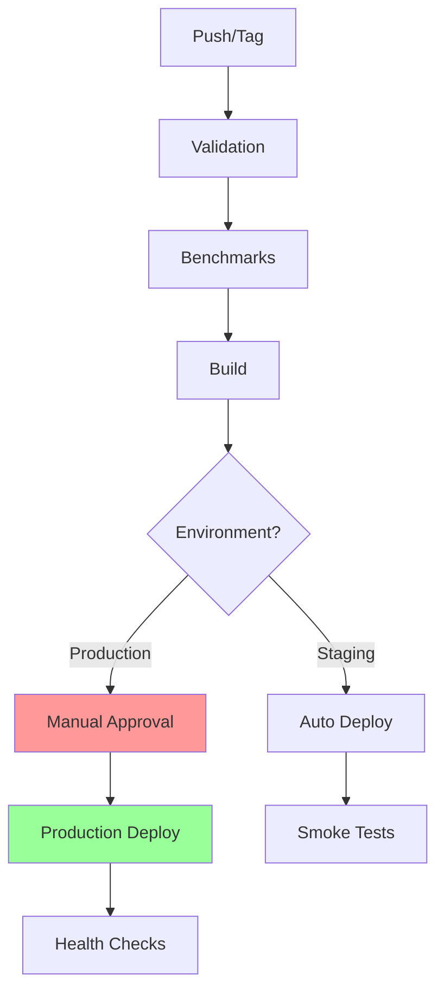

# CNS GitHub Actions Workflows

## Overview

The CNS project uses GitHub Actions for continuous integration and deployment with enterprise-grade best practices.

## Workflows

### 1. **CNS Continuous Integration** (`cns-ci.yml` / `cns-ci-enhanced.yml`)

Runs on every push and pull request to ensure code quality.

**Features:**
- ✅ Multi-version Python testing (3.10, 3.11, 3.12)
- ✅ Dependency caching for faster builds
- ✅ Code quality checks (ruff, formatting)
- ✅ Security scanning (Trivy, gitleaks)
- ✅ Performance benchmarking with PR comments
- ✅ Test result artifacts
- ✅ Concurrency control to prevent duplicate runs

**Jobs:**
- `lint` - Code quality and formatting
- `test` - Test suite across Python versions
- `security` - Vulnerability and secret scanning
- `performance` - Benchmark tests with thresholds
- `integration` - OTEL and pipeline validation

### 2. **CNS Production Deployment** (`cns-deploy.yml` / `cns-deploy-enhanced.yml`)

Handles staging and production deployments with safety gates.

**Features:**
- ✅ Manual approval for production
- ✅ Automated staging deployments
- ✅ Performance threshold enforcement
- ✅ Deployment artifacts with 90-day retention
- ✅ Rollback capabilities
- ✅ Health checks and smoke tests
- ✅ Deployment records for audit trail

**Environments:**
- `staging` - Automatic deployment for testing
- `production` - Requires manual approval

### 3. **Local Runner Setup** (`local-runner.yml`)

Documentation workflow for local GitHub Actions execution.

## Best Practices Implemented

### 🔒 Security
- Trivy vulnerability scanning
- Gitleaks secret detection
- SARIF upload to Security tab
- Dependabot for automated updates

### 🚀 Performance
- Dependency caching (uv, Python packages)
- Parallel job execution
- Build artifact caching
- Concurrency groups to prevent duplicates

### 📊 Quality Gates
- Minimum performance score: 80/100
- 100% OTEL validation required
- Test failures block deployment
- Manual approval for production

### 🔄 Automation
- PR performance comments
- Artifact uploads for debugging
- Deployment records for audit
- Automated dependency updates

## Running Locally

Use `act` to run GitHub Actions locally:

```bash
# Install act
brew install act

# Run CI workflow
act -j test

# Run deployment workflow
act workflow_dispatch -j deploy

# With secrets
act -s GITHUB_TOKEN=$GITHUB_TOKEN
```

## Environment Variables

Required secrets:
- `CODECOV_TOKEN` - For coverage reporting
- `GITHUB_TOKEN` - Automatically provided

## Caching Strategy

1. **uv installation**: Cached by workflow file hash
2. **Python dependencies**: Cached by Python version and lock files
3. **Build artifacts**: Cached by commit SHA
4. **Benchmark results**: Cached for performance comparison

## Deployment Flow



## Monitoring

- Performance scores tracked per PR
- Deployment history in artifacts
- Health checks after deployment
- Rollback capability for failures

## Adding New Workflows

When adding new workflows:
1. Include dependency caching
2. Add concurrency controls
3. Upload relevant artifacts
4. Include error handling
5. Add to this documentation

Built for reliability. Designed to last.