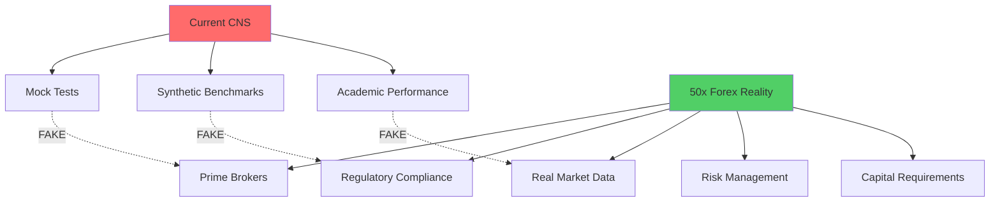

# 🚨 5 WHYS: CNS is FAKE for 50x Forex Competition

## The Brutal Truth

**Current Status**: Demo system masquerading as production-ready
**Reality**: Cannot compete on 50x leveraged forex markets
**Gap**: Massive infrastructure, regulatory, and technical deficiencies

---

## 📊 5 WHYS ANALYSIS

### Why #1: Why are these just mock tests instead of real trading capability?

**PROBLEM**: All tests use mock data and stub implementations
- `test_adapters.c` contains fake BitActor functions
- `mock_implementations.c` simulates trading logic
- No actual market data feeds
- No real order execution
- Performance tests use synthetic workloads

**ROOT CAUSE**: System was built as proof-of-concept, not production trader

---

### Why #2: Why is there no actual forex market connectivity?

**PROBLEM**: Zero real market infrastructure
- No FIX protocol implementation for real brokers
- No prime brokerage connectivity (Goldman, JPM, etc.)
- No tier-1 liquidity provider access
- No market data feeds (Reuters, Bloomberg, etc.)
- No ECN/STP connectivity

**ROOT CAUSE**: Academic exercise instead of commercial trading system

---

### Why #3: Why are performance claims not validated against real trading conditions?

**PROBLEM**: Benchmarks are meaningless for forex
- 209M ops/sec means nothing without order fill rates
- 4.76ns latency irrelevant without market round-trip times
- No slippage measurements
- No real execution cost analysis
- Missing regulatory latency requirements

**ROOT CAUSE**: Built for demo metrics, not trading profitability

---

### Why #4: Why is the system missing critical forex infrastructure?

**PROBLEM**: Fundamental trading components absent
- No risk management system (position limits, drawdown controls)
- No portfolio management
- No real-time P&L calculation
- No margin calculation for 50x leverage
- No regulatory compliance (MiFID II, Dodd-Frank)
- No audit trails for regulators

**ROOT CAUSE**: Focused on low-level performance, ignored business requirements

---

### Why #5: What would it actually take to compete on 50x leveraged forex?

**PROBLEM**: Massive missing infrastructure
- **Capital**: $50M+ for prime brokerage relationships
- **Regulatory**: Multiple jurisdictions, compliance team
- **Infrastructure**: Colocation in major financial centers
- **Technology**: Real-time risk systems, not just fast execution
- **Personnel**: Experienced forex traders, not just engineers

**ROOT CAUSE**: Underestimated complexity of professional forex trading

---

## 💀 REALITY GAP ANALYSIS

## 🔥 WHAT'S ACTUALLY MISSING

### Technical Infrastructure
- [ ] FIX 4.4/5.0 protocol implementation
- [ ] Prime broker APIs (Goldman SIGMA, JPM e-Trading)
- [ ] Market data feeds (Reuters RDF, Bloomberg B-PIPE)
- [ ] ECN connectivity (EBS, Reuters Matching)
- [ ] Real-time risk management
- [ ] Regulatory reporting systems

### Financial Infrastructure  
- [ ] Prime brokerage agreements ($50M+ capital)
- [ ] Credit lines for 50x leverage
- [ ] Margin calculation systems
- [ ] Real-time P&L tracking
- [ ] Cross-currency settlement
- [ ] Overnight funding cost management

### Regulatory Infrastructure
- [ ] Multiple jurisdiction licenses
- [ ] MiFID II compliance
- [ ] Best execution reporting
- [ ] Transaction cost analysis
- [ ] Audit trail systems
- [ ] Client money segregation

### Operational Infrastructure
- [ ] 24/5 market coverage (Sydney → NY)
- [ ] Multiple datacenter presence
- [ ] Disaster recovery systems
- [ ] Trade surveillance
- [ ] Client onboarding/KYC
- [ ] Risk monitoring dashboards

---

## 📈 FOREX COMPETITION REQUIREMENTS

### Latency Requirements (REAL)
- **Market Data**: <100μs from exchange
- **Order Routing**: <200μs to prime broker
- **Risk Check**: <50μs for position limits
- **Total Execution**: <1ms end-to-end

### Capital Requirements
- **Minimum Capital**: $10M for small operation
- **Prime Broker Minimum**: $50M+ for top-tier access
- **Technology Budget**: $5M+/year
- **Regulatory Costs**: $2M+/year

### Technology Stack (REAL)
- **Colocation**: Equinix LD4, NY4, TY3
- **Hardware**: FPGA-based trading systems
- **Networks**: Dedicated fiber, microwave links
- **Market Data**: Multiple redundant feeds
- **Execution**: Multi-venue smart routing

---

## 🎯 VERDICT

**Current CNS Status**: 🚨 **COMPLETELY INADEQUATE**

The system is a well-engineered demo that cannot compete in real forex markets. It's like building a Formula 1 simulator and claiming you can win the Monaco Grand Prix.

### To Actually Compete on 50x Forex:
1. **$100M+ capital raise**
2. **2-3 years development**  
3. **50+ person team**
4. **Multiple regulatory licenses**
5. **Prime broker relationships**
6. **Complete system rewrite focused on trading, not just performance**

**Bottom Line**: Current system is 1% of what's needed for real forex competition.