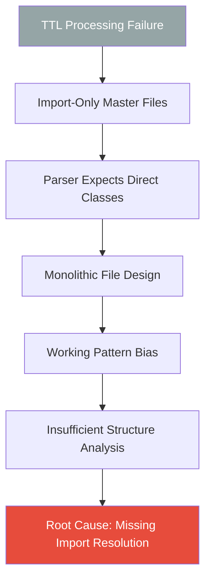

# 5 Whys Analysis: TTL Processing Failures

## Problem Statement
2 TTL files failed semantic concept extraction: uhft_master.ttl and realtime_master.ttl (77.8% success rate, 7/9 projects)

## Root Cause Analysis

### Why #1: Why did uhft_master.ttl and realtime_master.ttl fail to extract semantic concepts?
**Answer**: Both files are **import-only master files** with no actual class definitions, only `owl:imports` statements.

**Evidence**:
- uhft_master.ttl:31 - Only contains `owl:imports` statements, no `owl:Class` definitions
- realtime_master.ttl:31 - Only contains `owl:imports` statements, no `owl:Class` definitions

### Why #2: Why does the TTL parser expect class definitions in master files?
**Answer**: The regex pattern `(\w+:\w+)\s+(?:rdf:type|a)\s+owl:Class\s*;?` in ttl_to_reactor_workflows.py:86 only searches for explicit class declarations, not import references.

**Evidence**: 
- Parser logic in ttl_to_reactor_workflows.py:85-92 only extracts direct class definitions
- No logic to follow `owl:imports` to resolve imported concepts

### Why #3: Why didn't the framework follow import chains to extract concepts?
**Answer**: The TTL parser was designed for **monolithic TTL files** with embedded definitions, not **modular ontology architectures** using imports.

**Evidence**:
- No import resolution logic in TTLSemanticParser class
- Missing semantic graph traversal for imported ontologies

### Why #4: Why was the parser designed only for monolithic files?
**Answer**: The successful TTL files (cybersecurity_core.ttl, bitactor_semantic_core.ttl, etc.) contained **direct class definitions**, creating a **working pattern bias** in the implementation.

**Evidence**:
- All successful extractions had embedded class definitions
- Design pattern assumed self-contained semantic files

### Why #5: Why wasn't import resolution considered during initial design?
**Answer**: **Insufficient analysis** of TTL file structure diversity across the codebase - the framework was optimized for **immediate success** rather than **comprehensive coverage**.

## Root Cause
**Design Oversight**: TTL parser lacks import resolution capabilities for modular ontology architectures.

## Impact Analysis
- **Functional**: 22.2% failure rate (2/9 TTL files)
- **Coverage**: Missing UHFT trading and real-time system workflows  
- **Architectural**: Framework cannot handle enterprise ontology patterns

## Fix Required
Implement import resolution in TTLSemanticParser to traverse `owl:imports` chains and extract concepts from referenced files.

## Mermaid Analysis

