# 🔍 ADVERSARIAL TESTING - ACTUAL TEST RESULTS & OTEL

## Test Execution Flow & Results

```mermaid
graph TD
    A[BitActor Adversarial Testing] --> B[Level 1: Input Validation - 48 tests]
    A --> C[Level 2: Resource Exhaustion - 8 tests]  
    A --> D[Levels 3-7: Security & Performance - 7 tests]
    
    B --> B1[TTL Fuzzing: 7 tests]
    B --> B2[Injection Attacks: 15 tests]
    B --> B3[Boundary Tests: 11 tests]
    B --> B4[Encoding Attacks: 11 tests]
    B --> B5[Buffer Overflow: 4 tests]
    
    B1 --> B1R[✅ 6 PASSED<br/>❌ 1 FAILED: NULL byte syntax error]
    B2 --> B2R[✅ 14 PASSED<br/>❌ 1 FAILED: exec subprocess syntax]
    B3 --> B3R[✅ 8 PASSED<br/>❌ 3 FAILED: inf/nan values]
    B4 --> B4R[✅ 8 PASSED<br/>❌ 3 CRASHED: UTF surrogates]
    B5 --> B5R[✅ 4 PASSED: 1KB to 1MB inputs]
    
    C --> C1[Memory Bombs: 3 tests]
    C --> C2[CPU Exhaustion: 3 tests]
    C --> C3[FD Exhaustion: 1 test]
    C --> C4[Disk Flooding: 1 test]
    
    C1 --> C1R[✅ 3 PASSED<br/>Max memory: 47.7MB<br/>10K signals processed]
    C2 --> C2R[✅ 3 PASSED<br/>Max time: 0.086s<br/>Complex graphs handled]
    C3 --> C3R[❌ FAILED: /proc/self/fd not found]
    C4 --> C4R[❌ FAILED: list object error]
    
    D --> D1[Level 3: Concurrency - 2 tests]
    D --> D2[Level 4: Security - 2 tests]
    D --> D3[Level 5: Performance - 1 test]
    D --> D4[Level 6: Platform - 1 test]
    D --> D5[Level 7: CodeGen - 1 test]
    
    D1 --> D1R[❌ 1 FAILED: signal race<br/>🚨 HIGH: No atomic ops]
    D2 --> D2R[✅ 2 PASSED<br/>No SSTI or buffer overflow]
    D3 --> D3R[✅ PASSED: 1K signals<br/>Load time: 0.125s]
    D4 --> D4R[🚨 MEDIUM: Missing endianness]
    D5 --> D5R[✅ PASSED: Build system secure]

    style B1R fill:#e1f5fe
    style B2R fill:#e1f5fe
    style B3R fill:#fff3e0
    style B4R fill:#ffebee
    style B5R fill:#e8f5e8
    style C1R fill:#e8f5e8
    style C2R fill:#e8f5e8
    style C3R fill:#ffebee
    style C4R fill:#ffebee
    style D1R fill:#ffebee
    style D2R fill:#e8f5e8
    style D3R fill:#e8f5e8
    style D4R fill:#fff3e0
    style D5R fill:#e8f5e8
```



## OpenTelemetry Metrics & Traces


## Vulnerability Detection Results


## Performance Metrics Under Attack


## System Resource Usage During Attacks

```mermaid
gitgraph
    commit id: "Baseline"
    branch memory_attacks
    checkout memory_attacks
    commit id: "10K signals: +47.7MB"
    commit id: "100KB names: +40.6MB"  
    commit id: "Deep nesting: +41.7MB"
    checkout main
    merge memory_attacks
    branch cpu_attacks
    checkout cpu_attacks
    commit id: "Complex graph: 0.086s"
    commit id: "Exponential: 0.016s"
    commit id: "Recursive: 0.015s"
    checkout main
    merge cpu_attacks
```

## What Doesn't Work

```mermaid
flowchart LR
    A[❌ Failed Tests] --> B[Level 1: 8 failures]
    A --> C[Level 2: 2 failures]
    A --> D[Levels 3-7: 1 failure]
    
    B --> B1[NULL byte TTL syntax]
    B --> B2[exec subprocess parsing]
    B --> B3[inf/nan boundary values]
    B --> B4[UTF-16 surrogate encoding]
    
    C --> C1[/proc/self/fd missing on macOS]
    C --> C2[disk flooding list index error]
    
    D --> D1[signal processing race condition]
    
    style A fill:#ffcdd2
    style B1 fill:#ffcdd2
    style B2 fill:#ffcdd2
    style B3 fill:#ffcdd2
    style B4 fill:#ffcdd2
    style C1 fill:#ffcdd2
    style C2 fill:#ffcdd2
    style D1 fill:#ffcdd2
```

## Critical Security Findings

```mermaid
graph LR
    A[🚨 2 Vulnerabilities Found] --> B[HIGH: Race Condition<br/>CVSS 7.5<br/>Ring buffer lacks atomics]
    A --> C[MEDIUM: Platform Issue<br/>CVSS 4.3<br/>Missing endianness handling]
    
    B --> B1[Impact: Memory corruption<br/>Fix: Add __atomic_ operations]
    C --> C1[Impact: ARM64 crashes<br/>Fix: Add htons/ntohl functions]
    
    style A fill:#ff5252,color:#fff
    style B fill:#ff9800,color:#fff
    style C fill:#ffc107,color:#000
```



## Test Coverage by Attack Vector


**SUMMARY: What doesn't work**
- TTL parser fails on NULL bytes and infinite values
- UTF-16 surrogate encoding crashes the system  
- File descriptor testing incompatible with macOS
- Ring buffer implementation vulnerable to race conditions
- Platform endianness handling missing for ARM64