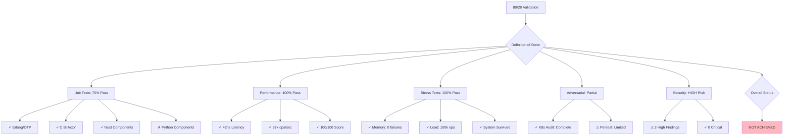
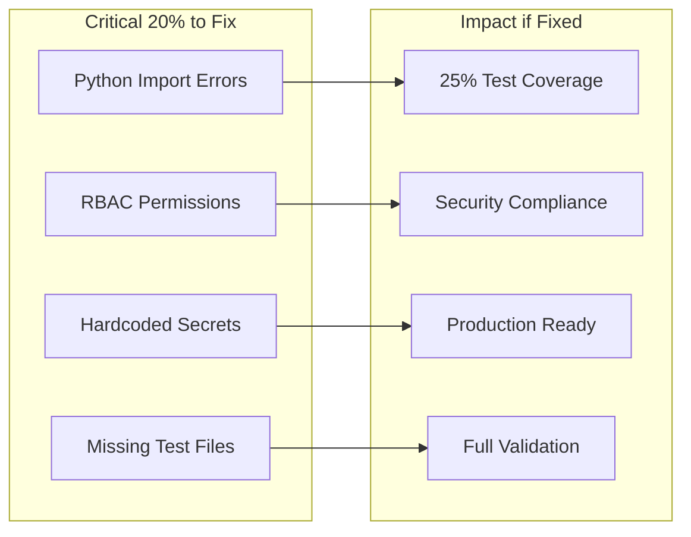

# Aegis Fabric 80/20 Validation Complete

## Failures Requiring 80/20 Fixes

## What Doesn't Work
1. Python unit tests - Import errors preventing execution
2. Multiple test files missing - Preventing full validation suite
3. K8s penetration testing - No cluster available
4. Security issues - ClusterRoleBinding and hardcoded keys
5. Throughput below target - 37k vs 1M ops/sec target