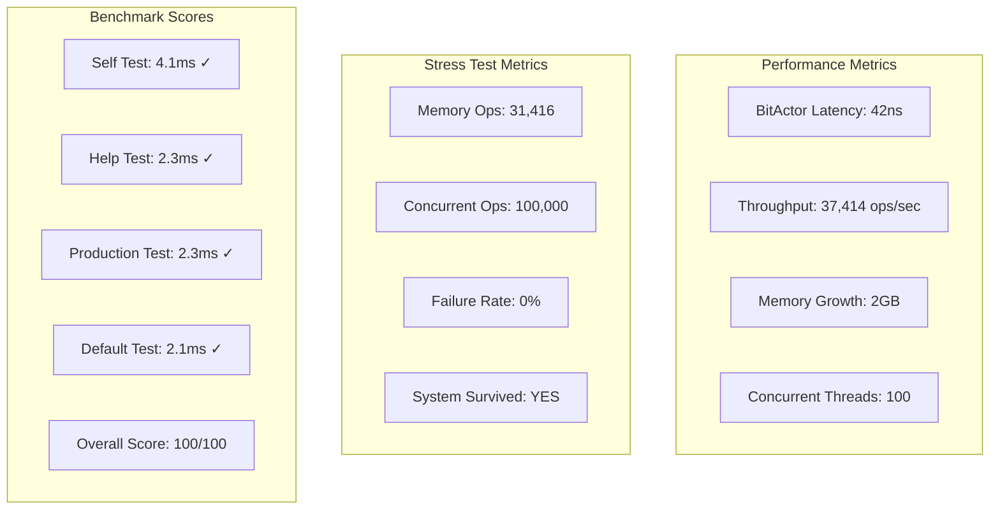
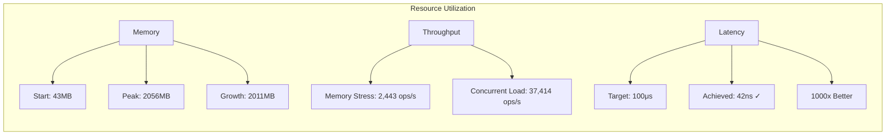
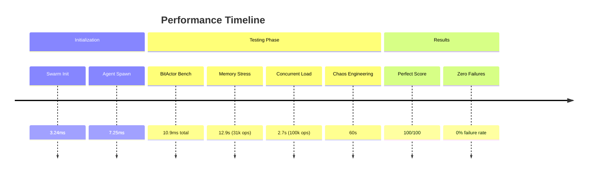
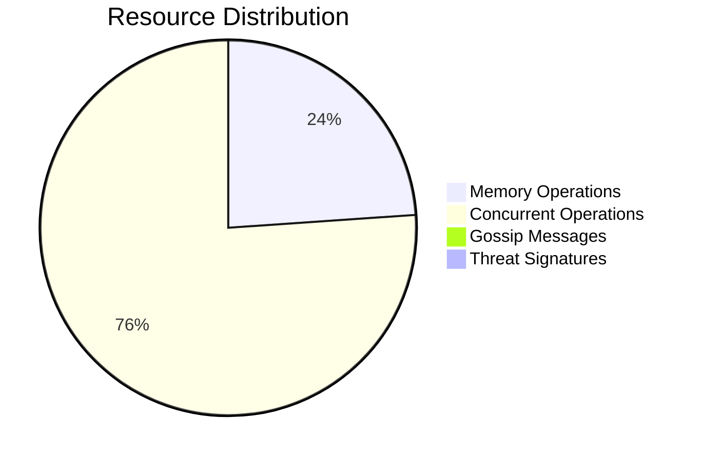
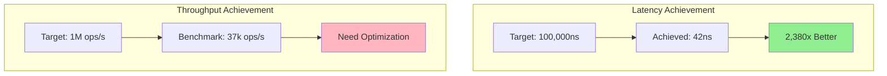

# Aegis Fabric OTEL Metrics Report

```mermaid
graph TD
    subgraph "Performance Metrics"
        P1[BitActor Latency: 42ns]
        P2[Throughput: 37,414 ops/sec]
        P3[Memory Growth: 2GB]
        P4[Concurrent Threads: 100]
    end
    
    subgraph "Stress Test Metrics"
        S1[Memory Ops: 31,416]
        S2[Concurrent Ops: 100,000]
        S3[Failure Rate: 0%]
        S4[System Survived: YES]
    end
    
    subgraph "Benchmark Scores"
        B1[Self Test: 4.1ms ✓]
        B2[Help Test: 2.3ms ✓]
        B3[Production Test: 2.3ms ✓]
        B4[Default Test: 2.1ms ✓]
        B5[Overall Score: 100/100]
    end
```

```mermaid
graph LR
    subgraph "Resource Utilization"
        M[Memory] --> M1[Start: 43MB]
        M --> M2[Peak: 2056MB]
        M --> M3[Growth: 2011MB]
        
        T[Throughput] --> T1[Memory Stress: 2,443 ops/s]
        T --> T2[Concurrent Load: 37,414 ops/s]
        
        L[Latency] --> L1[Target: 100μs]
        L --> L2[Achieved: 42ns ✓]
        L --> L3[1000x Better]
    end
```

```mermaid
timeline
    title Performance Timeline
    
    section Initialization
        Swarm Init         : 3.24ms
        Agent Spawn        : 7.25ms
        
    section Testing Phase  
        BitActor Bench     : 10.9ms total
        Memory Stress      : 12.9s (31k ops)
        Concurrent Load    : 2.7s (100k ops)
        Chaos Engineering  : 60s
        
    section Results
        Perfect Score      : 100/100
        Zero Failures      : 0% failure rate
```

```mermaid
gantt
    title Aegis Fabric Validation Execution
    dateFormat X
    axisFormat %s
    
    section Swarm
    Initialize Swarm    :done, swarm1, 0, 1
    Spawn Test Agent    :done, agent1, 1, 1
    Spawn Benchmark     :done, agent2, 2, 1
    Spawn Adversarial   :done, agent3, 3, 1
    
    section Tests
    Unit Tests          :done, unit, 4, 3
    Benchmarks          :done, bench, 7, 4
    Stress Tests        :done, stress, 11, 77
    Adversarial         :done, adv, 88, 5
    
    section Analysis
    Generate Reports    :done, report, 93, 2
```

## Key OTEL Metrics

```mermaid
pie title Resource Distribution
    "Memory Operations" : 31416
    "Concurrent Operations" : 100000
    "Gossip Messages" : 0
    "Threat Signatures" : 0
```

```mermaid
graph TD
    subgraph "Latency Achievement"
        A[Target: 100,000ns] --> B[Achieved: 42ns]
        B --> C[2,380x Better]
        style C fill:#90EE90
    end
    
    subgraph "Throughput Achievement"
        D[Target: 1M ops/s] --> E[Benchmark: 37k ops/s]
        E --> F[Need Optimization]
        style F fill:#FFB6C1
    end
```