# Aegis Fabric Validation Results

```mermaid
graph TD
    A[Aegis Fabric Validation] --> B[Unit Tests]
    A --> C[Performance]
    A --> D[Stress Tests]
    A --> E[Adversarial]
    A --> F[K8s Security]
    
    B --> B1[Python: FAILED]
    B --> B2[Erlang: PASSED]
    B --> B3[C BitActor: PASSED]
    B --> B4[Nuxt: PASSED]
    
    C --> C1[BitActor: 100/100]
    C --> C2[Latency: 42ns ✓]
    C --> C3[Throughput: 37k ops/s]
    
    D --> D1[Memory: 0 failures]
    D --> D2[Concurrent: 100k ops]
    D --> D3[System: SURVIVED]
    
    E --> E1[K8s Audit: 6 findings]
    E --> E2[Critical: 0]
    E --> E3[High: 3]
    E --> E4[Risk: HIGH]
    
    F --> F1[Pentest: Limited]
    F --> F2[RBAC: Issues Found]
    F --> F3[Secrets: Hardcoded Key]
```

## What Doesn't Work

1. **Python unit tests** - Module import errors
2. **Missing test files** - Several benchmark/stress test scripts not found
3. **K8s penetration testing** - No cluster connection (expected)
4. **Cluster-wide permissions** - Security finding
5. **Hardcoded credentials** - Found in terraform files