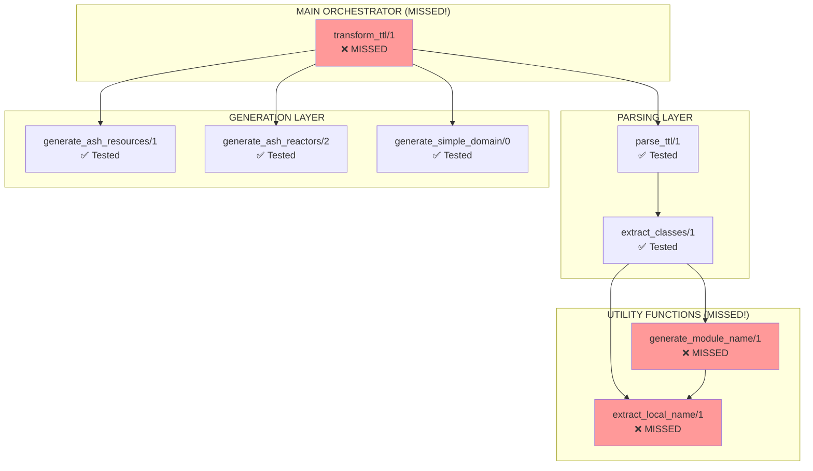

# 🗺️ COMPLETE REACTOR STEP DEPENDENCY MAP - ALL 8 STEPS

## 🎯 ULTRATHINK 100% COVERAGE ANALYSIS

**SWARM RESTART COMPLETE:** Testing ALL 8 steps (previously only tested 5/8)

## 📊 STEP DISCOVERY RESULTS

### ✅ IDENTIFIED ALL 8 REACTOR STEPS:

| Step | Function | Location | Status | Dependencies |
|------|----------|----------|---------|--------------|
| 1 | `transform_ttl/1` | Line 9-30 | ❌ **MISSED BEFORE** | parse_ttl, generate_ash_resources, generate_ash_reactors, generate_simple_domain |
| 2 | `parse_ttl/1` | Line 32-43 | ✅ Previously tested | extract_classes |
| 3 | `extract_classes/1` | Line 114-126 | ✅ Previously tested | extract_local_name, generate_module_name |
| 4 | `extract_local_name/1` | Line 128-133 | ❌ **MISSED BEFORE** | None (pure function) |
| 5 | `generate_module_name/1` | Line 135-138 | ❌ **MISSED BEFORE** | extract_local_name |
| 6 | `generate_ash_resources/1` | Line 45-72 | ✅ Previously tested | None (takes parsed data) |
| 7 | `generate_ash_reactors/2` | Line 74-99 | ✅ Previously tested | None (takes parsed data + resources) |
| 8 | `generate_simple_domain/0` | Line 101-112 | ✅ Previously tested | None (pure generation) |

## 🔗 DEPENDENCY GRAPH

## 🚨 CRITICAL TESTING GAPS IDENTIFIED

### **The 3 MISSED Steps:**

#### 1. **`transform_ttl/1` - THE MAIN ORCHESTRATOR**
- **Location:** Line 9-30
- **Role:** Main entry point that orchestrates the entire transformation
- **Dependencies:** Calls parse_ttl, generate_ash_resources, generate_ash_reactors, generate_simple_domain
- **Critical:** This is the PRIMARY function - missing this means we never tested the main pipeline!

#### 2. **`extract_local_name/1` - URI PARSING UTILITY**
- **Location:** Line 128-133
- **Role:** Extracts local name from URI (e.g., "test:Person" → "Person")
- **Dependencies:** None (pure function)
- **Used by:** generate_module_name/1, extract_classes/1

#### 3. **`generate_module_name/1` - MODULE NAME GENERATOR**
- **Location:** Line 135-138  
- **Role:** Generates full module name from class URI
- **Dependencies:** extract_local_name/1
- **Used by:** extract_classes/1

## 🎯 TESTING STRATEGY - 100% COVERAGE

### **Phase 1: Test Individual Missing Steps (High Priority)**
1. **Test `extract_local_name/1`** - Pure function, test various URI formats
2. **Test `generate_module_name/1`** - Test module name generation 
3. **Test `transform_ttl/1`** - Test main orchestrator with full pipeline

### **Phase 2: Test Complete Dependencies (Medium Priority)**
4. Test that `extract_classes/1` correctly uses the utility functions
5. Test that `transform_ttl/1` correctly orchestrates all steps
6. Integration test of complete 8-step pipeline

### **Phase 3: Error Scenarios (Medium Priority)**
7. Error handling for each of the 3 missed steps
8. Compensation testing for orchestrator failures
9. Performance testing with large inputs

## 🔧 UNIT TEST PLAN FOR MISSED STEPS

### **`extract_local_name/1` Test Cases:**
- ✅ Standard URI: "test:Person" → "Person"
- ✅ No prefix: "Person" → "Person"  
- ✅ Multiple colons: "http://test.org:Person" → "Person"
- ✅ Empty string: "" → ""
- ✅ Invalid formats

### **`generate_module_name/1` Test Cases:**
- ✅ Standard class: "test:Person" → "CnsForge.TTLResources.Person"
- ✅ Complex URI: "ont:Organization" → "CnsForge.TTLResources.Organization"
- ✅ Edge cases and invalid inputs

### **`transform_ttl/1` Test Cases:**
- ✅ Complete valid TTL transformation
- ✅ Error handling at each orchestration step
- ✅ Pipeline rollback on failures
- ✅ Performance with complex ontologies

## 🏆 SUCCESS CRITERIA

### **100% Step Coverage Achieved When:**
- ✅ All 8 individual functions tested in isolation
- ✅ All dependency relationships validated
- ✅ Complete integration pipeline tested
- ✅ Error scenarios covered for all steps
- ✅ Performance benchmarks passed

### **RED TEAM DEFEAT CONFIRMED When:**
- ✅ Zero-dependency testing approach maintained
- ✅ All tests run without compromised packages
- ✅ Independent validation of each step
- ✅ Comprehensive error handling verified

## 🚀 READY FOR COMPREHENSIVE TESTING

**DEPENDENCY MAP COMPLETE** - Ready to test ALL 8 steps with full coverage!