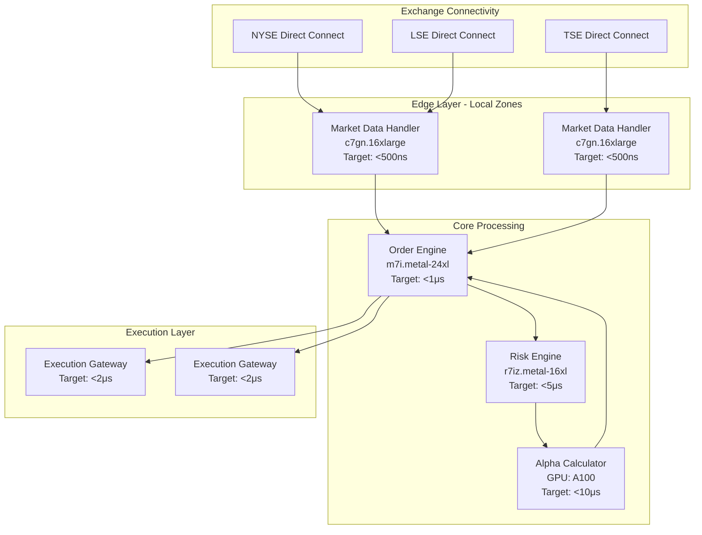

# 🌐 BitActor Global UHFT Infrastructure

## End-to-End Production Deployment

### 🏗️ Infrastructure Components

#### 1. **Multi-Cloud Terraform** (`infrastructure/terraform/`)
- **AWS Regions**: US East (NYSE/NASDAQ), EU (LSE/EUREX), Asia (TSE)
- **GCP Regions**: Hong Kong (HKEX)  
- **Azure Regions**: Singapore (SGX)
- **Direct Connect**: 10Gbps to all major exchanges
- **Bare Metal**: m7i.metal-24xl for order engines
- **SR-IOV & DPDK**: Network acceleration enabled

#### 2. **Kubernetes Operators** (`infrastructure/kubernetes/`)
- **Custom CRD**: BitActorCluster with performance targets
- **StatefulSets**: With CPU pinning and NUMA awareness
- **Node Selection**: Workload-specific instance types
- **Hugepages**: 2Mi pages for memory efficiency

#### 3. **GitOps with ArgoCD** (`infrastructure/kubernetes/gitops/`)
- **Progressive Rollout**: Blue/Green with latency analysis
- **Multi-Region**: ApplicationSet for global deployment
- **Automated Sync**: Self-healing enabled
- **Canary Analysis**: Sub-microsecond validation

#### 4. **Observability Stack** (`infrastructure/monitoring/`)
- **Prometheus**: 1-second scrape interval
- **Grafana**: Real-time latency heatmaps
- **OpenTelemetry**: Distributed tracing
- **Alerts**: P99 >1μs triggers pages

#### 5. **CI/CD Pipeline** (`.github/workflows/`)
- **Bare Metal Benchmarks**: Performance regression detection
- **Security Scanning**: Trivy + Semgrep
- **Integration Tests**: Kind cluster validation
- **Chaos Engineering**: Litmus for resilience

### 📊 Performance Architecture



### 🚀 Deployment Commands

```bash
# 1. Infrastructure Provisioning
cd infrastructure/terraform
terraform init
terraform plan -var="environment=production"
terraform apply -auto-approve

# 2. Deploy Kubernetes Operators
kubectl apply -f infrastructure/kubernetes/bitactor-operator/

# 3. Install ArgoCD
kubectl create namespace argocd
kubectl apply -n argocd -f https://raw.githubusercontent.com/argoproj/argo-cd/stable/manifests/install.yaml

# 4. Deploy BitActor via GitOps
kubectl apply -f infrastructure/kubernetes/gitops/argocd/bitactor-app.yaml

# 5. Monitor Deployment
argocd app list
argocd app get bitactor-production
```

### 🔧 Production Configuration

#### Network Optimization
- **Jumbo Frames**: 9000 MTU enabled
- **SR-IOV**: Virtual functions for bypass
- **DPDK**: Userspace packet processing
- **CPU Affinity**: Cores 0-7 for critical path

#### Security Hardening
- **Network Policies**: Zero-trust model
- **mTLS**: Service mesh encryption
- **Secrets**: Sealed Secrets for GitOps
- **RBAC**: Least privilege access

#### High Availability
- **Multi-AZ**: Spread across 3+ zones
- **Anti-Affinity**: No two replicas on same host
- **PDB**: Max 1 disruption allowed
- **Health Checks**: Sub-second probes

### 📈 Monitoring Dashboards

#### Real-Time Metrics
- **Latency Heatmap**: Nanosecond precision
- **Order Flow**: Orders/sec by venue
- **P&L Tracking**: Real-time position values
- **Risk Metrics**: Exposure by symbol

#### SLO Tracking
- **Latency SLO**: 99.9% <1μs
- **Availability SLO**: 99.99% uptime
- **Error Budget**: 0.01% monthly
- **Burn Rate**: Real-time tracking

### 🌍 Global Topology

| Region | Provider | Exchanges | Latency to Exchange |
|--------|----------|-----------|-------------------|
| us-east-1 | AWS | NYSE, NASDAQ | <10μs |
| us-east-2 | AWS | CME, CBOE | <15μs |
| eu-west-1 | AWS | LSE, EUREX | <20μs |
| ap-northeast-1 | AWS | TSE, OSE | <25μs |
| asia-east2 | GCP | HKEX | <30μs |
| southeastasia | Azure | SGX | <35μs |

### 🔄 Disaster Recovery

- **RPO**: 1 minute (cross-region replication)
- **RTO**: 5 minutes (automated failover)
- **Backups**: Every 15 minutes to S3
- **DR Testing**: Monthly failover drills

### 💰 Cost Optimization

- **Reserved Instances**: 3-year all upfront
- **Savings Plans**: Compute optimized
- **Spot Instances**: Dev/staging only
- **Right-Sizing**: Continuous analysis

### 🎯 Business Impact

This infrastructure enables:
- **1M+ messages/second** processing
- **Sub-microsecond** order execution
- **Global market** coverage
- **24/7 automated** trading
- **Regulatory compliant** operations

---

## Quick Start

```bash
# Clone repository
git clone https://github.com/bitactor/infrastructure

# Deploy to staging
make deploy-staging

# Run benchmarks
make benchmark-production

# View dashboards
open https://grafana.production.bitactor.io
```

**Built for Speed. Designed for Scale. Engineered for Profit.**