# CNS Forge Backwards Validation - OTEL and Test Results

## 🔍 What Doesn't Work

### Critical Path Traceability Results

### Path Validation Summary

### Maturity Matrix Coverage Issues

## 📊 OTEL Test Results

### System Performance Metrics

```mermaid
graph TB
    subgraph "Performance Validation - PASSED"
        P1[Generation Time<br/>1000ms ✅]
        P2[Throughput<br/>51K RPS ✅]
        P3[Latency p99<br/>6.5ms ✅] 
        P4[Memory Usage<br/>75MB ✅]
        P5[AOT Speedup<br/>80.5x ✅]
    end
    
    style P1 fill:#2ecc71
    style P2 fill:#2ecc71
    style P3 fill:#2ecc71
    style P4 fill:#2ecc71
    style P5 fill:#2ecc71
```

### Component Integration Status

### Backwards Trace Analysis

## ❌ Summary

**Critical Path Traceability: 16.7% (1/6 paths)**  
**Maturity Dimension Coverage: 21.4%**  
**Explicit File References: Missing in generated code**

Generated files lack direct source references in code content, breaking backwards traceability despite functional correctness.