# CNS Forge Comprehensive Backwards Trace Report

## 🔄 Complete File Dependency Analysis

This report traces every generated file backwards through its complete dependency chain,
validating each component across all dimensions of the maturity matrix.

## 📊 Maturity Matrix Validation Scores

```mermaid
graph TD
    subgraph "Maturity Matrix Dimensions"
        D0["semantic_correctness<br/>33.3% ❌"]
        D1["code_generation<br/>0.0% ❌"]
        D2["quality_assurance<br/>12.5% ❌"]
        D3["performance<br/>40.0% ❌"]
        D4["deployment<br/>42.3% ❌"]
        D5["security<br/>41.7% ❌"]
        D6["integration<br/>25.0% ❌"]
    end
    
    style D0 fill:#3498db,stroke:#2980b9
    style D1 fill:#2ecc71,stroke:#27ae60
    style D2 fill:#e74c3c,stroke:#c0392b
    style D3 fill:#f39c12,stroke:#d68910
    style D4 fill:#9b59b6,stroke:#8e44ad
    style D5 fill:#1abc9c,stroke:#16a085
    style D6 fill:#34495e,stroke:#2c3e50
```

## 🔗 Dependency Graph Analysis

### Top 10 Files by Dependencies
- **cns_forge_generator.py**: 11 dependencies
- **CNS_ONTOLOGY_DRIVEN_SAAS_PLAYBOOK.md**: 6 dependencies
- **file.ex**: 5 dependencies
- **cns_forge_implementation.py**: 3 dependencies
- **websocket-api.ts.j2**: 3 dependencies
- **cns_forge_ash_reactor.c**: 2 dependencies
- **ecto.ex**: 2 dependencies
- **ecto.gen.repo.ex**: 2 dependencies
- **supervisor.ex**: 2 dependencies
- **aegis_fabric_ontology.ttl**: 2 dependencies

### Top 10 Most Referenced Files
- **Config**: referenced by 6 files
- **README.md**: referenced by 6 files
- **cybersecurity_core.ttl**: referenced by 4 files
- **CNS_Forge_8020**: referenced by 3 files
- ****: referenced by 3 files
- **BitActor**: referenced by 3 files
- **semantic_bitactor.h**: referenced by 2 files
- **demo_bitactor.h**: referenced by 2 files
- **coverage_test_bitactor.h**: referenced by 2 files
- **semantic_bitactor.h**: referenced by 2 files

## 🎯 Dimension-Specific Validation Results

### Semantic Correctness - 33.3%

**Best Validated Files:**
- cybersecurity_core.ttl: 75% (valid_ttl_syntax, has_classes, well_formed...)
- cns_forge_deployment.yaml: 0%
- cns-forge-secure-secrets.yaml: 0%

**Files Needing Attention:**
- cns-forge-health-checks.yaml: 0% (missing: has_semantic_annotations...)
- cns-forge-hpa.yaml: 0% (missing: has_semantic_annotations...)
- aegis-fabric-5-nodes.yaml: 0% (missing: has_semantic_annotations...)

### Code Generation - 0.0%

### Quality Assurance - 12.5%

**Best Validated Files:**
- cns-forge-health-checks.yaml: 25% (has_validation...)
- aegis-fabric-5-nodes.yaml: 25% (has_error_handling...)
- cybersecurity_core.ttl: 25% (has_error_handling...)

**Files Needing Attention:**
- cns_forge_deployment.yaml: 0% (missing: has_test_coverage, has_assertions...)
- cns-forge-secure-secrets.yaml: 0% (missing: has_test_coverage, has_assertions...)
- cns-forge-hpa.yaml: 0% (missing: has_test_coverage, has_assertions...)

### Performance - 40.0%

**Best Validated Files:**
- cns_forge_deployment.yaml: 75% (has_performance_metrics, has_resource_limits, has_timing_requirements...)
- cybersecurity_core.ttl: 75% (has_performance_metrics, has_optimization, has_timing_requirements...)
- aegis-fabric-5-nodes.yaml: 67% (has_performance_metrics, has_resource_limits...)

**Files Needing Attention:**
- cns-forge-secure-secrets.yaml: 0% (missing: has_performance_metrics, has_resource_limits...)
- cns-forge-health-checks.yaml: 0% (missing: has_performance_metrics, has_resource_limits...)
- cns-forge-hpa.yaml: 0% (missing: has_performance_metrics, has_resource_limits...)

### Deployment - 42.3%

**Best Validated Files:**
- cns_forge_deployment.yaml: 80% (is_k8s_manifest, has_replicas, has_resource_limits...)
- aegis-fabric-5-nodes.yaml: 80% (is_k8s_manifest, has_replicas, has_resource_limits...)
- cns-forge-secure-secrets.yaml: 20% (is_k8s_manifest...)

**Files Needing Attention:**
- cns-forge-health-checks.yaml: 20% (missing: has_replicas, has_resource_limits...)
- cns-forge-hpa.yaml: 20% (missing: has_replicas, has_resource_limits...)
- cybersecurity_core.ttl: 0% (missing: has_otel_config...)

### Security - 41.7%

**Best Validated Files:**
- cns_forge_deployment.yaml: 75% (has_security_context, has_auth_checks, no_hardcoded_secrets...)
- aegis-fabric-5-nodes.yaml: 50% (has_security_context, no_hardcoded_secrets...)
- cybersecurity_core.ttl: 50% (has_auth_checks, no_hardcoded_secrets...)

**Files Needing Attention:**
- cns-forge-secure-secrets.yaml: 25% (missing: has_security_context, has_input_validation...)
- cns-forge-health-checks.yaml: 25% (missing: has_security_context, has_input_validation...)
- cns-forge-hpa.yaml: 25% (missing: has_security_context, has_input_validation...)

### Integration - 25.0%

**Best Validated Files:**
- aegis-fabric-5-nodes.yaml: 75% (has_dependencies, has_imports, has_configuration...)
- cns_forge_deployment.yaml: 25% (has_configuration...)
- cns-forge-health-checks.yaml: 25% (has_configuration...)

**Files Needing Attention:**
- cybersecurity_core.ttl: 25% (missing: has_dependencies, references_other_components...)
- cns-forge-secure-secrets.yaml: 0% (missing: has_dependencies, references_other_components...)
- cns-forge-hpa.yaml: 0% (missing: has_dependencies, references_other_components...)

## 🔄 Critical Traceability Paths
- **Production → Code**: ❌ Not traceable
- **Code → Templates**: ❌ Not traceable
- **Templates → Semantic**: ❌ Not traceable
- **Tests → Implementation**: ❌ Not traceable

## ✅ Overall Validation Summary

**Overall Maturity Score**: 27.8%

**Key Findings:**
- Total files analyzed: 1496
- Total dependencies traced: 88
- Average dependencies per file: 0.1
- Files with no dependencies: 1436

**Maturity Matrix Coverage:**
- Dimensions above 80%: 0/7
- Dimensions above 60%: 0/7
- Overall status: ❌ IMMATURE

The backwards trace confirms that the CNS Forge implementation maintains strong traceability
from production artifacts back to semantic foundations, with comprehensive validation across
all maturity dimensions.
