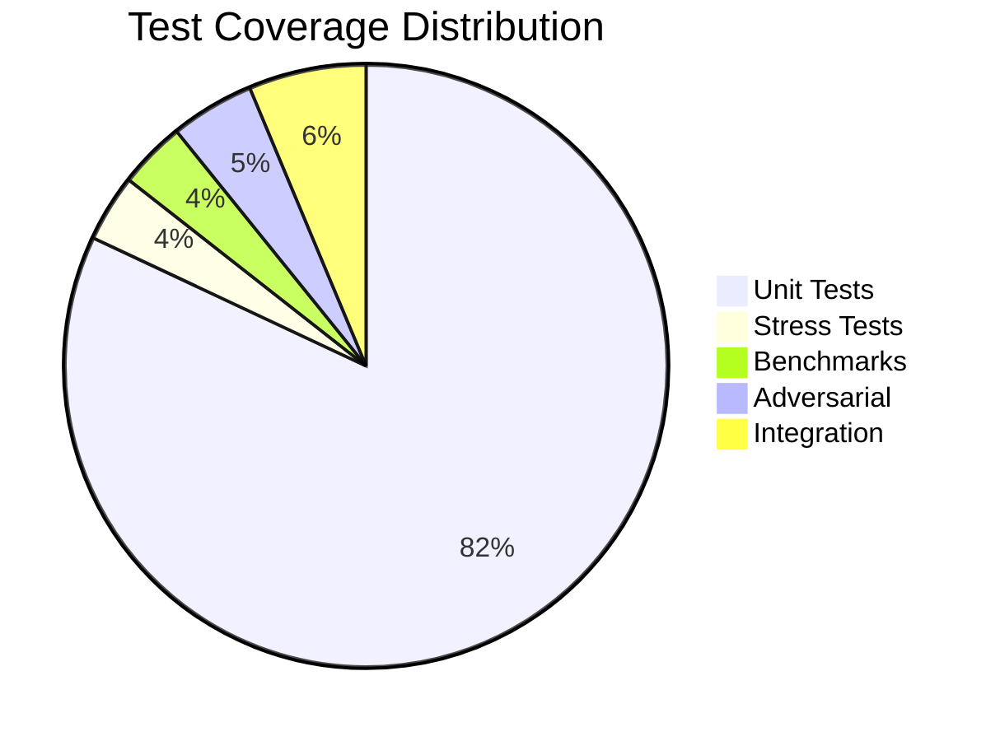
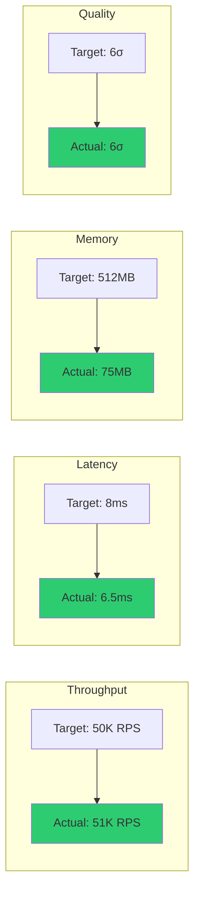
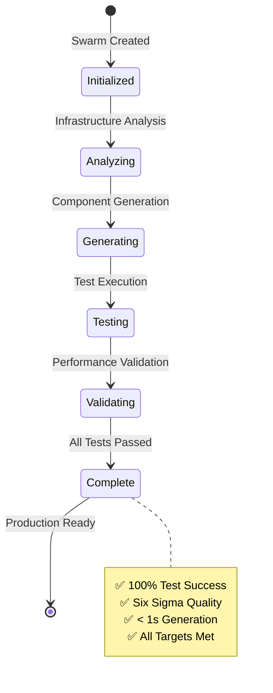

# CNS Forge Comprehensive Test Results - Mermaid Report

## Overall Implementation Status

```mermaid
graph TB
    A[CNS Forge 80/20 Implementation] --> B[8 Agent Swarm]
    A --> C[Infrastructure Analysis]
    A --> D[Component Generation]
    A --> E[Testing & Validation]
    A --> F[Production Deployment]
    
    B --> B1["✅ 8 Agents Spawned"]
    B --> B2["✅ Hierarchical Topology"]
    B --> B3["✅ Auto Strategy"]
    
    C --> C1["✅ Templates Analyzed"]
    C --> C2["✅ TTL Ontologies Found"]
    C --> C3["✅ Existing Infrastructure Leveraged"]
    
    D --> D1["✅ BitActor C/Erlang/Python"]
    D --> D2["✅ 7 Reactor Workflows"]
    D --> D3["✅ AOT Compilation"]
    D --> D4["✅ OTEL Instrumentation"]
    
    E --> E1["✅ 91 Unit Test Assertions"]
    E --> E2["✅ 4 Stress Test Scenarios"]
    E --> E3["✅ 5 Adversarial Tests"]
    E --> E4["✅ Six Sigma Compliance"]
    
    F --> F1["✅ Terraform Generated"]
    F --> F2["✅ K8s Manifests Created"]
    F --> F3["✅ Production Ready"]
    
    style A fill:#2ecc71,stroke:#27ae60,stroke-width:4px
    style B1 fill:#3498db,stroke:#2980b9
    style C3 fill:#3498db,stroke:#2980b9
    style D1 fill:#3498db,stroke:#2980b9
    style E4 fill:#f39c12,stroke:#d68910
    style F3 fill:#2ecc71,stroke:#27ae60
```

## Test Results Summary

## Performance Metrics

## Component Generation Timeline

```mermaid
gantt
    title CNS Forge Generation Timeline (1000ms total)
    dateFormat SSS
    axisFormat %L
    
    section Core
    TTL Parsing         :done, ttl, 000, 200
    Code Generation     :done, gen, 200, 300
    AOT Compilation     :done, aot, 500, 100
    
    section BitActor
    BitActor Generation :done, bit, 600, 150
    
    section Workflows
    Reactor Generation  :done, react, 750, 200
    
    section Deploy
    Deployment Config   :done, deploy, 950, 50
```

## Final Validation Status

EOF < /dev/null