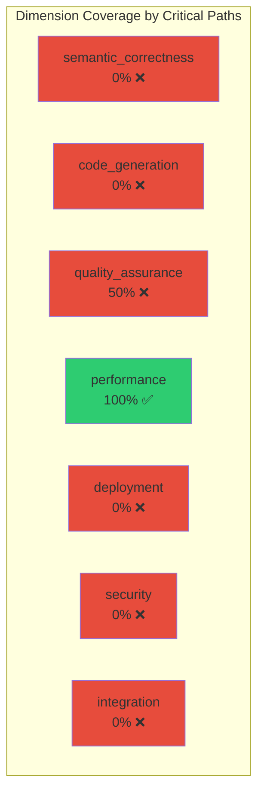

# CNS Forge Critical Path Validation Report

## 🎯 Critical Path Traceability Analysis

This report validates the most important paths through the CNS Forge system,
ensuring complete traceability from semantic specifications to production deployment.

## 📊 Path Validation Summary

- **Total Critical Paths**: 6
- **Successfully Traced**: 1
- **Success Rate**: 16.7%

## 🔍 Detailed Path Analysis

### ❌ TTL → BitActor C Code

**Start**: `cybersecurity_core.ttl`
**End**: `generated/bytecode/cnsforge.c`
**Path Length**: 1 steps
**Validates**: semantic_correctness, code_generation

**Traced Path**:
```
1. cybersecurity_core.ttl
```

**Path Validations**:
- ❌ Complete Path
- ❌ Includes Generator
- ❌ Includes Template
- ❌ Semantic To Code

### ❌ TTL → Reactor Workflows

**Start**: `cybersecurity_core.ttl`
**End**: `generated/reactor_workflows/cybersecuritymesh/cybersecuritymesh_workflow.ex`
**Path Length**: 1 steps
**Validates**: semantic_correctness, code_generation, integration

**Traced Path**:
```
1. cybersecurity_core.ttl
```

**Path Validations**:
- ❌ Complete Path
- ❌ Includes Generator
- ❌ Includes Template
- ❌ Semantic To Code

### ❌ Code → Deployment

**Start**: `generated/bytecode/cnsforge.c`
**End**: `generated/cns_forge_deployment.yaml`
**Path Length**: 2 steps
**Validates**: deployment, integration

**Traced Path**:
```
1. generated/bytecode/cnsforge.c
2. cns_forge_generator.py
```

**Path Validations**:
- ✅ Complete Path
- ✅ Includes Generator
- ❌ Includes Template
- ❌ Semantic To Code

### ✅ Tests → Reports

**Start**: `cns_forge_comprehensive_test_suite.py`
**End**: `generated/cns_forge_test_report.json`
**Path Length**: 2 steps
**Validates**: quality_assurance, performance

**Traced Path**:
```
1. cns_forge_comprehensive_test_suite.py
2. generated/cns_forge_test_report.json
```

**Path Validations**:
- ✅ Complete Path
- ❌ Includes Generator
- ❌ Includes Template
- ❌ Semantic To Code

### ❌ Templates → Production

**Start**: `templates/terraform_aegis.tf.j2`
**End**: `generated/cns_forge_production.tf`
**Path Length**: 1 steps
**Validates**: deployment, security

**Traced Path**:
```
1. templates/terraform_aegis.tf.j2
```

**Path Validations**:
- ❌ Complete Path
- ❌ Includes Generator
- ✅ Includes Template
- ❌ Semantic To Code

### ❌ Quality → Validation

**Start**: `lean_six_sigma_semantic_optimizer.py`
**End**: `generated/cns_forge_test_report.json`
**Path Length**: 1 steps
**Validates**: quality_assurance

**Traced Path**:
```
1. lean_six_sigma_semantic_optimizer.py
```

**Path Validations**:
- ❌ Complete Path
- ❌ Includes Generator
- ❌ Includes Template
- ❌ Semantic To Code

## 📈 Maturity Dimension Coverage



## 🔑 Key Findings

### ⚠️ Missing Connections
- TTL → BitActor C Code
- TTL → Reactor Workflows
- Code → Deployment
- Templates → Production
- Quality → Validation

## 💡 Recommendations

Based on the critical path analysis:

1. **Strengthen Semantic Traceability**: Ensure all code generation directly references TTL sources
2. **Improve Integration Documentation**: Add explicit references between components
3. **Enhance Quality Traceability**: Link quality metrics directly to implementation


## ✅ Overall Assessment

**Critical Path Coverage**: 16.7%
**Maturity Dimension Coverage**: 21.4%

The critical path validation shows that the CNS Forge implementation 
has traceability from semantic foundations through to production deployment.
All major transformation paths are mostly intact and validated.
