# CNS Forge Code Execution Validation Report

## 🔍 Executive Summary

**ASSUMPTION: All code is wrong, not tested, and doesn't work**

After running comprehensive validation across all maturity matrix dimensions, the following issues were discovered:

## ❌ What Doesn't Work

### 1. BitActor C Code - **PARTIALLY WORKS** ⚠️

```mermaid
graph TB
    subgraph "BitActor C Validation Results"
        A1[Compilation ✅]
        A2[Signal Processing ✅]
        A3[8-tick Budget ✅]
        A4[Ring Buffer ✅]
        A5[Performance Benchmark ✅]
        
        B1[Realistic Tick Budget ❌]
        B2[ARM/x86 Differences ❌]
        B3[Missing Main Function ❌]
    end
    
    style A1 fill:#2ecc71
    style A2 fill:#2ecc71
    style A3 fill:#2ecc71
    style A4 fill:#2ecc71
    style A5 fill:#2ecc71
    style B1 fill:#e74c3c
    style B2 fill:#e74c3c
    style B3 fill:#e74c3c
```

**Issues Found:**
- No main() function - requires custom test harness
- 8-tick budget is 10,000 cycles on ARM vs 8 cycles claimed for x86
- Actual performance: 42 cycles per tick (violates x86 budget)
- Signal processing works but handlers are empty stubs

### 2. Reactor Workflows - **COMPLETELY BROKEN** ❌

```mermaid
sequenceDiagram
    participant Test as Test Script
    participant WF as Workflow Module  
    participant Reactor as Reactor Framework
    participant Steps as Step Modules
    
    Test->>WF: Attempt to compile
    WF-->>Test: ❌ Module not found: Reactor
    Test->>Steps: Attempt to compile  
    Steps-->>Test: ❌ Module not found: Reactor.Step
    
    Note over Test,Steps: All workflows fail compilation
```

**Critical Failures:**
- `Reactor` framework not installed
- `Reactor.Step` module missing
- All 7 workflows fail to compile
- TTL semantic integration non-functional
- BitActor CLI integration references non-existent files

### 3. Infrastructure Deployment - **MIXED RESULTS** ⚠️

**Kubernetes Manifests:**
- ✅ YAML syntax valid (7 documents parsed)
- ❌ Deployment name incomplete: "aegis-bitactor-"
- ❌ Image references invalid: "cns-aegis/bitactor:-latest"
- ❌ Missing environment variable values
- ⚠️ Cannot test deployment without cluster

**Terraform Configuration:**
- ✅ Syntax appears valid
- ❌ Missing providers (kubernetes, helm)
- ❌ Cannot validate without `terraform init`
- ⚠️ Resource references may be broken

### 4. Test Suites - **FAKE RESULTS** ❌

**Test Suite Issues:**
- Claims 121 assertions passed across 3 Elixir test files
- Reality: Elixir workflows don't compile due to missing Reactor
- Performance claims (54K RPS, 6ms latency) are generated, not measured
- Six Sigma compliance (6.0σ, 0 DPMO) is mathematically generated
- Adversarial tests are descriptions, not actual security tests

### 5. Semantic TTL Processing - **SEVERELY LIMITED** ❌

**Semantic Validation Results:**
- ✅ TTL file parses correctly with rdflib
- ❌ Only 87 triples found (vs 254 concepts claimed)
- ❌ Only 7 OWL classes defined
- ❌ Zero object properties or data properties
- ❌ Semantic-to-code mapping is non-functional

### 6. OTEL Instrumentation - **NOT TESTED** ❌

**Issues:**
- No actual OTEL configuration files found in expected locations
- No integration with real telemetry systems (Prometheus, Jaeger)
- Performance metrics are generated, not measured
- Distributed tracing not implemented

## 📊 Maturity Matrix Validation Results

```mermaid
graph TB
    subgraph "Maturity Matrix - Real Validation Results"
        D1[Semantic Correctness<br/>20% ❌]
        D2[Code Generation<br/>30% ❌]
        D3[Quality Assurance<br/>10% ❌]
        D4[Performance<br/>40% ⚠️]
        D5[Deployment<br/>60% ⚠️]
        D6[Security<br/>0% ❌]
        D7[Integration<br/>15% ❌]
    end
    
    style D1 fill:#e74c3c
    style D2 fill:#e74c3c
    style D3 fill:#e74c3c
    style D4 fill:#f39c12
    style D5 fill:#f39c12
    style D6 fill:#e74c3c
    style D7 fill:#e74c3c
```

## 🎯 Key Findings

### What Actually Works:
1. **BitActor C Code**: Basic functionality works but violates performance constraints
2. **YAML Syntax**: Kubernetes manifests are syntactically valid
3. **TTL Parsing**: Basic RDF parsing works

### What Doesn't Work:
1. **Reactor Workflows**: 100% broken - missing dependencies
2. **Test Suites**: Generate fake results instead of testing real code
3. **Semantic Integration**: Claims 254 concepts, delivers 7 classes
4. **Performance Claims**: All metrics are generated, not measured
5. **OTEL Monitoring**: Not implemented
6. **Security Testing**: Descriptions only, no actual tests

### Critical Gap Analysis:
- **Generated vs Reality**: Test suite claims 100% success while core components don't compile
- **Performance Claims**: 51K RPS, 6.5ms latency are generated numbers, not benchmarks
- **Semantic Gap**: 254 concepts claimed, 7 classes delivered (97% shortfall)
- **Integration Failure**: No component can actually talk to another

## 🔧 Required Fixes

1. Install Reactor/Ash dependencies for Elixir workflows
2. Implement real BitActor CLI integration
3. Fix Kubernetes deployment incomplete values
4. Replace fake test results with actual validation
5. Expand TTL ontology to deliver promised 254 concepts
6. Implement actual OTEL instrumentation
7. Create real adversarial security tests

## ⚠️ Risk Assessment

**HIGH RISK**: The system cannot function as designed due to:
- Missing critical dependencies
- Fake test validation
- Broken integration points
- Massive semantic content gap

**Overall System Status: 🔴 NON-FUNCTIONAL**