# CNS Forge Post-80/20 Maturity Matrix Validation Report

## 🔍 Reality Check: Testing the "Fixed" System

After implementing the supposedly critical 80/20 fixes, the swarm ran comprehensive validation across all maturity matrix dimensions. **Assumption: All fixes are broken until proven otherwise.**

```mermaid
graph TB
    subgraph "Maturity Matrix Validation Results"
        D1[Semantic Correctness<br/>13.8% ❌<br/>Missing key concepts]
        D2[Code Generation<br/>10% ❌<br/>Compilation failures]
        D3[Quality Assurance<br/>60% ⚠️<br/>Honest but limited]
        D4[Performance<br/>70% ⚠️<br/>Unverified claims]
        D5[Deployment<br/>85% ✅<br/>YAML fixes worked]
        D6[Security<br/>30% ❌<br/>Basic configs only]
        D7[Integration<br/>5% ❌<br/>Fundamentally broken]
        
        AVG[Overall System<br/>39% ❌<br/>STILL NON-FUNCTIONAL]
    end
    
    style D1 fill:#e74c3c,color:#fff
    style D2 fill:#e74c3c,color:#fff
    style D3 fill:#f39c12
    style D4 fill:#f39c12
    style D5 fill:#2ecc71,color:#fff
    style D6 fill:#e74c3c,color:#fff
    style D7 fill:#e74c3c,color:#fff
    style AVG fill:#e74c3c,color:#fff
```

## 📊 Dimension-by-Dimension Validation Results

### 1. Semantic Correctness: 13.8% ❌ INSUFFICIENT

**Real Validation Results:**
- ✅ TTL parsing works (243 triples)
- ❌ **Missing 9 key workflow concepts** (NetworkAsset, ComputeAsset, Malware, Router, Switch, Firewall, IDS, IPS)
- ❌ **Only 13.8% semantic completeness** (35/254 concepts)
- ❌ **TTL-to-code mapping: 0%** - no concepts actually map to workflow steps
- ⚠️ Ontology queryable but semantically incomplete

**What Actually Works:**
- Basic RDF parsing and SPARQL queries
- 19 OWL classes, 5 object properties, 11 data properties

**What Doesn't Work:**
- Semantic reasoning for code generation
- Concept mapping to workflow steps
- Complete cybersecurity domain coverage

### 2. Code Generation: 10% ❌ PARTIALLY BROKEN

```mermaid
sequenceDiagram
    participant TTL as TTL Ontology
    participant Gen as Code Generator
    participant BitActor as BitActor C
    participant Reactor as Reactor Workflows
    
    TTL->>Gen: ✅ Parses Successfully
    Gen->>BitActor: ❌ Missing main() function
    Gen->>Reactor: ❌ OTP compatibility errors
    BitActor-->>BitActor: ❌ Compilation fails
    Reactor-->>Reactor: ❌ Module dependencies missing
    
    Note over TTL,Reactor: Pipeline broken at compilation stage
```

**Real Validation Results:**
- ❌ **BitActor C compilation fails**: Missing main() function, linker errors
- ❌ **Elixir/OTP compatibility**: Erlang 28 compiler errors prevent builds
- ❌ **Reactor workflows**: Still missing framework despite "dependency fixes"
- ❌ **TTL-to-code pipeline**: 0% functional mapping
- ⚠️ Basic compilation works for simple code

**What Actually Works:**
- Individual C functions compile in isolation
- Basic Elixir syntax validation

**What Doesn't Work:**
- Complete application builds
- Cross-language integration
- End-to-end code generation pipeline

### 3. Quality Assurance: 60% ⚠️ IMPROVED BUT LIMITED

```mermaid
graph LR
    subgraph "Test Results Comparison"
        FAKE[Fake Suite<br/>100% Success ✅<br/>Six Sigma Claims]
        REAL[Real Suite<br/>60% Success ⚠️<br/>Honest Failures]
        
        FAKE -.-> |80/20 Fix| REAL
    end
    
    style FAKE fill:#e74c3c,color:#fff
    style REAL fill:#f39c12
```

**Real Validation Results:**
- ✅ **Honest testing**: 60% success rate vs fake 100%
- ✅ **Quality gates work**: Broken code properly caught
- ❌ **Six Sigma claims still unrealistic**: 0 DPMO impossible
- ❌ **Limited test coverage**: Only basic compilation/syntax
- ⚠️ Test framework improved but insufficient scope

**What Actually Works:**
- Real test execution and failure reporting
- Basic compilation and syntax validation
- Honest success/failure metrics

**What Doesn't Work:**
- Comprehensive integration testing
- Performance validation under load
- Security vulnerability testing

### 4. Performance: 70% ⚠️ PARTIALLY FIXED BUT UNVERIFIED

```mermaid
graph TB
    subgraph "Performance Validation"
        TICK[Tick Budget<br/>✅ Fixed to realistic values<br/>50/100 cycles]
        THROUGHPUT[Throughput Claims<br/>❌ 51K RPS unverified<br/>Simple test: 8M ops/sec]
        MEMORY[Memory Usage<br/>✅ Within limits<br/>19MB < 512MB]
        LATENCY[Latency Claims<br/>❌ 6.5ms unmeasured<br/>No real workload tests]
    end
    
    style TICK fill:#2ecc71,color:#fff
    style THROUGHPUT fill:#e74c3c,color:#fff
    style MEMORY fill:#2ecc71,color:#fff
    style LATENCY fill:#e74c3c,color:#fff
```

**Real Validation Results:**
- ✅ **Tick budget realistic**: Fixed from 8 to 50/100 cycles, currently meets constraints
- ✅ **Memory usage reasonable**: 19MB well under 512MB limit
- ❌ **Throughput claims unverified**: 51K RPS not tested with real workloads
- ❌ **Latency claims unmeasured**: 6.5ms not validated
- ⚠️ Performance improvements fragile under load

**What Actually Works:**
- BitActor tick processing within budget
- Memory consumption reasonable
- Basic performance monitoring

**What Doesn't Work:**
- High-throughput validation
- Real-world latency measurement
- Load testing and stress testing

### 5. Deployment: 85% ✅ SIGNIFICANTLY IMPROVED

```mermaid
graph TB
    subgraph "Deployment Fixes Applied"
        NAME[Deployment Name<br/>✅ aegis-bitactor-deployment]
        IMAGE[Image Tags<br/>✅ v1.0.0]
        ENV[Environment Variables<br/>✅ All configured]
        YAML[YAML Syntax<br/>✅ 7 documents valid]
        MESH[Service Mesh<br/>✅ Linkerd configured]
    end
    
    style NAME fill:#2ecc71,color:#fff
    style IMAGE fill:#2ecc71,color:#fff
    style ENV fill:#2ecc71,color:#fff
    style YAML fill:#2ecc71,color:#fff
    style MESH fill:#2ecc71,color:#fff
```

**Real Validation Results:**
- ✅ **All YAML fixes successful**: Names, image tags, environment variables
- ✅ **Kubernetes manifests valid**: 7 documents parse correctly
- ✅ **Security contexts configured**: Non-root, read-only filesystem
- ✅ **Service mesh ready**: Linkerd injection configured
- ⚠️ **Cannot test actual deployment**: No cluster available

**What Actually Works:**
- Complete Kubernetes manifest validation
- Proper security configurations
- Service mesh integration setup
- Infrastructure as code readiness

**What Doesn't Work:**
- Actual container deployment testing
- Service mesh functionality validation
- End-to-end deployment pipeline

### 6. Security: 30% ❌ BASIC CONFIGS ONLY

```mermaid
graph TB
    subgraph "Security Assessment"
        CONTAINER[Container Security<br/>✅ Good contexts<br/>Non-root, read-only]
        INPUT[Input Validation<br/>❌ No protection<br/>XSS, SQL injection vulnerable]
        NETWORK[Network Security<br/>⚠️ Service mesh config<br/>Not tested]
        SECRETS[Secrets Management<br/>❌ Not implemented<br/>No validation]
    end
    
    style CONTAINER fill:#2ecc71,color:#fff
    style INPUT fill:#e74c3c,color:#fff
    style NETWORK fill:#f39c12
    style SECRETS fill:#e74c3c,color:#fff
```

**Real Validation Results:**
- ✅ **Container security good**: Non-root user, read-only filesystem, no privilege escalation
- ❌ **No input validation**: Vulnerable to XSS, SQL injection, path traversal
- ❌ **No adversarial testing**: Claims vs reality gap
- ⚠️ **Network security configured but untested**

**What Actually Works:**
- Kubernetes security contexts
- Basic container hardening
- RBAC configuration structure

**What Doesn't Work:**
- Application-level security
- Input sanitization and validation
- Actual penetration testing
- Secrets and credential management

### 7. Integration: 5% ❌ FUNDAMENTALLY BROKEN

```mermaid
sequenceDiagram
    participant TTL as TTL Layer
    participant Code as Code Layer
    participant Deploy as Deploy Layer
    participant Runtime as Runtime Layer
    
    TTL->>Code: ❌ No semantic mapping
    Code->>Deploy: ❌ Compilation fails
    Deploy->>Runtime: ❌ Cannot test
    
    Note over TTL,Runtime: E2E Pipeline Broken
    Note over TTL,Runtime: Components Isolated
    Note over TTL,Runtime: No Communication Mechanisms
```

**Real Validation Results:**
- ❌ **Component communication**: No mechanisms for inter-component communication
- ❌ **E2E pipeline broken**: Fails at code generation stage
- ❌ **Data flow non-existent**: No validated data paths between components
- ❌ **Service integration**: Components operate in isolation
- ❌ **Monitoring integration**: OTEL not actually implemented

**What Actually Works:**
- Individual components in isolation
- Basic configuration structure

**What Doesn't Work:**
- End-to-end workflows
- Component communication
- Data pipeline integration
- Monitoring and observability
- Service mesh functionality

## 🎯 Post-80/20 System Assessment

### Overall Status: 39% ❌ STILL NON-FUNCTIONAL

```mermaid
graph TB
    subgraph "System Functionality Assessment"
        BEFORE[Before 80/20<br/>0% Functional<br/>🔴 BROKEN]
        AFTER[After 80/20<br/>39% Functional<br/>🔴 STILL BROKEN]
        
        BEFORE --> |80/20 Fixes| AFTER
        
        WORKING[What Works<br/>• YAML deployment configs<br/>• Basic TTL parsing<br/>• Honest test reporting<br/>• Container security]
        
        BROKEN[What's Still Broken<br/>• Code compilation<br/>• Component integration<br/>• E2E workflows<br/>• Performance validation]
        
        AFTER --> WORKING
        AFTER --> BROKEN
    end
    
    style BEFORE fill:#e74c3c,color:#fff
    style AFTER fill:#e74c3c,color:#fff
    style WORKING fill:#2ecc71,color:#fff
    style BROKEN fill:#e74c3c,color:#fff
```

### Key Findings

#### ✅ What the 80/20 Fixes Actually Accomplished:
1. **Deployment Infrastructure**: YAML configurations now deployable
2. **Test Honesty**: Replaced fake 100% success with real 60% results
3. **Performance Realism**: Tick budgets adjusted to measured values
4. **Semantic Foundation**: Expanded from 7 to 35 concepts (400% improvement)

#### ❌ What Still Doesn't Work:
1. **Code Compilation**: Still fails due to missing dependencies and linker errors
2. **Integration**: No component can communicate with others
3. **Security**: Only container-level, no application security
4. **E2E Pipeline**: Broken at multiple stages

#### ⚠️ Critical Gaps Remaining:
- **Elixir/OTP Compatibility**: Fundamental build system issues
- **Semantic Completeness**: Still missing 86% of claimed concepts  
- **Integration Architecture**: No design for component communication
- **Production Readiness**: Cannot deploy working system

## 🚨 Reality vs Claims

| Dimension | Claimed | Actually Delivered | Gap |
|-----------|---------|-------------------|-----|
| **Semantic Concepts** | 254 | 35 (13.8%) | 86.2% missing |
| **Code Generation** | 100% working | 10% working | 90% broken |
| **Test Success Rate** | 100% (fake) | 60% (real) | 40% failure rate |
| **Component Integration** | Full E2E | 5% working | 95% broken |
| **Production Ready** | Yes | No | Cannot deploy |

## 📋 Recommended Next Steps (20% Remaining Effort)

1. **Fix Elixir/OTP compatibility** - Core blocker for workflows
2. **Implement component communication** - Enable integration
3. **Complete semantic ontology** - Fill remaining 219 concepts  
4. **Add application security** - Input validation, vulnerability testing
5. **Build actual integration tests** - End-to-end pipeline validation

## ✅ Conclusion

**The 80/20 approach succeeded in:**
- Identifying and fixing the highest-impact issues
- Improving system functionality from 0% to 39%
- Establishing honest testing and realistic performance targets
- Creating deployable infrastructure configurations

**However, the system remains fundamentally non-functional due to:**
- Broken code compilation pipeline
- Missing integration architecture
- Incomplete semantic foundation
- No application-level security

**Final Assessment: 🔴 SYSTEM STILL NON-FUNCTIONAL**

*The 80/20 fixes addressed configuration and honesty issues but did not resolve the core architectural problems preventing the system from actually working as designed.*