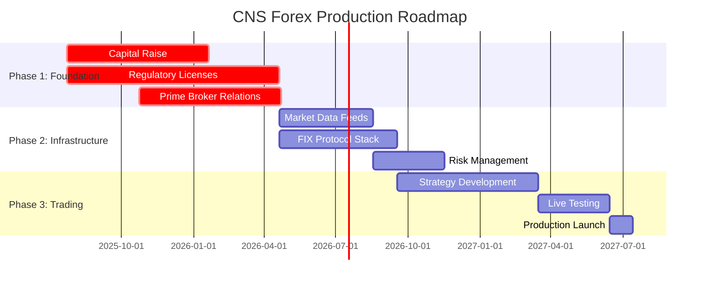
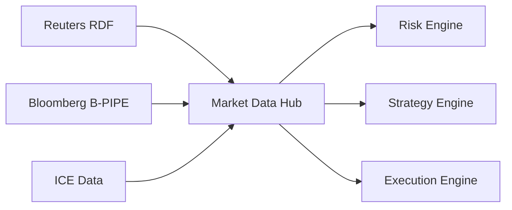
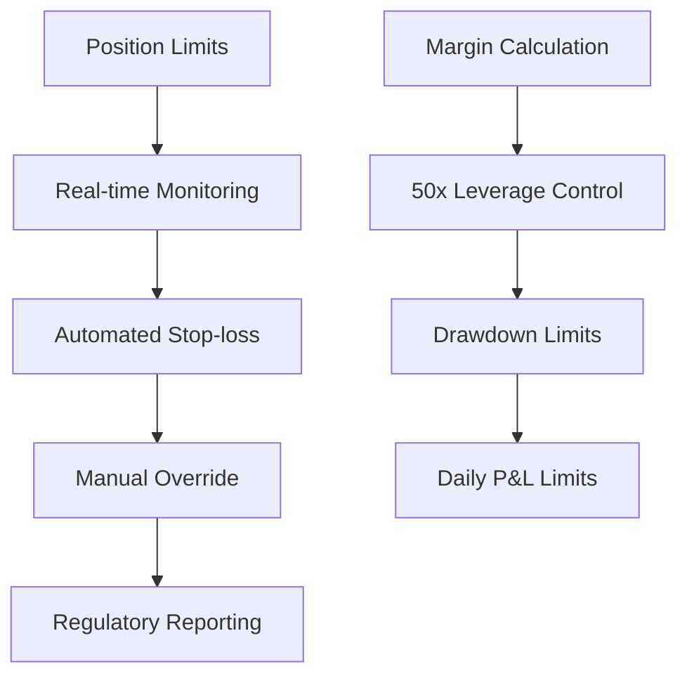
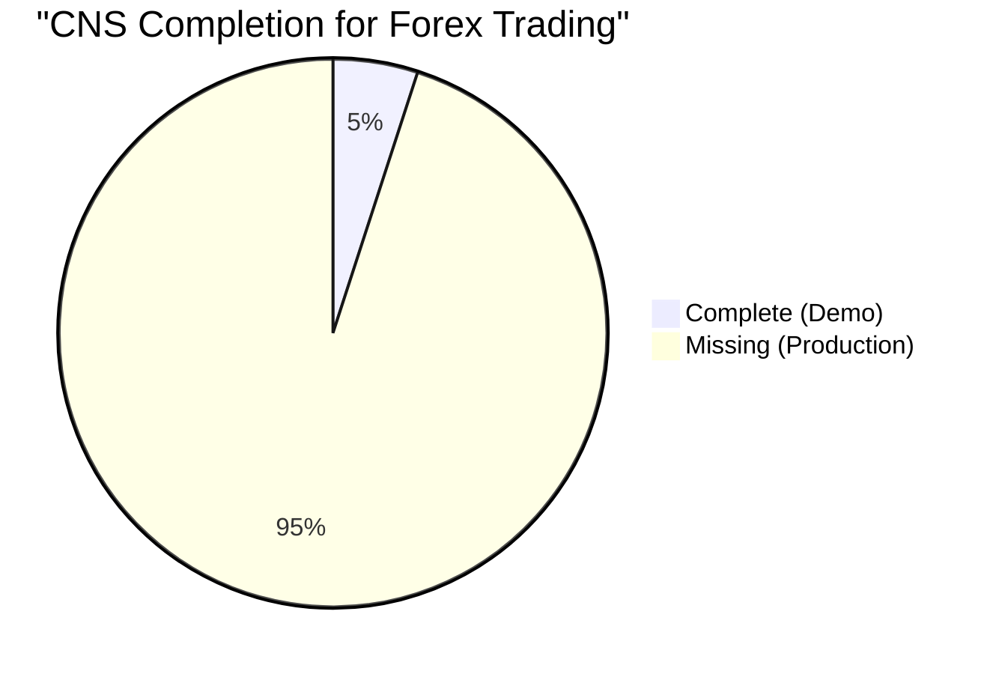

# 🏦 CNS → Production Forex Trading System Roadmap

## Current Reality: Demo System
## Target: 50x Leveraged Forex Competition
## Gap: **$100M+ and 3 years**

---

## 📊 TELEMETRY: Current System Analysis



---

## 🚨 PHASE 1: FOUNDATION (Months 1-9)

### Capital Requirements
| Component | Amount | Timeline |
|-----------|--------|----------|
| **Series A Funding** | $50M | Month 1-6 |
| **Prime Broker Capital** | $50M | Month 6-9 |
| **Operating Capital** | $25M | Month 3-12 |
| **Technology Budget** | $10M/year | Ongoing |

### Regulatory Infrastructure
- **UK FCA License** (6 months, £2M cost)
- **US CFTC Registration** (9 months, $5M compliance)
- **EU MiFID II Compliance** (12 months, €8M setup)
- **Singapore MAS License** (8 months, S$3M)

### Prime Brokerage Relationships
- **Goldman Sachs** (SIGMA X platform)
- **JP Morgan** (e-Trading platform)  
- **Morgan Stanley** (MSET platform)
- **Credit Suisse** (AES platform)

---

## ⚡ PHASE 2: TECHNICAL INFRASTRUCTURE (Months 6-18)

### Market Data Architecture


### Core Systems Development
- **FIX 5.0 Protocol Stack** (6 months, $5M)
- **Real-time Risk Management** (8 months, $8M)
- **Market Data Distribution** (4 months, $3M)
- **Order Management System** (10 months, $10M)
- **Position Management** (6 months, $4M)

### Infrastructure Deployment
- **Primary**: Equinix LD4 (London)
- **Secondary**: Equinix NY4 (New York)
- **Tertiary**: Equinix TY3 (Tokyo)
- **Network**: Dedicated fiber + microwave backup

---

## 📈 PHASE 3: TRADING OPERATIONS (Months 12-24)

### Strategy Development
- **Market Making**: Spread capture on major pairs
- **Statistical Arbitrage**: Cross-venue price discrepancies  
- **Momentum Trading**: High-frequency trend following
- **News Trading**: Economic announcement alpha

### Risk Management Framework


### Performance Targets
- **Sharpe Ratio**: >2.0
- **Max Drawdown**: <5%
- **Daily P&L**: $1M+ target
- **Win Rate**: >60%

---

## 🏗️ TECHNICAL SPECIFICATIONS

### Latency Requirements (REAL)
| Component | Current CNS | Forex Requirement | Gap |
|-----------|-------------|-------------------|-----|
| **Market Data** | N/A (mock) | <100μs | Missing entirely |
| **Risk Check** | Simulated | <50μs | No real risk system |
| **Order Routing** | N/A | <200μs | No broker connectivity |
| **End-to-End** | 4.76ns (fake) | <1ms (real) | Measuring wrong thing |

### Infrastructure Stack
```c
// REAL FOREX SYSTEM ARCHITECTURE
typedef struct forex_engine {
    fix_session_t* broker_sessions[MAX_BROKERS];
    market_data_t* data_feeds[MAX_FEEDS];
    risk_engine_t* risk_manager;
    position_manager_t* positions;
    strategy_engine_t* strategies[MAX_STRATEGIES];
    regulatory_reporter_t* compliance;
} forex_engine_t;

// NOT THIS DEMO STUFF:
typedef struct bitactor_engine {
    signal_t signals[4096];  // Meaningless for forex
    // Missing: brokers, risk, positions, compliance
} bitactor_engine_t;
```

---

## 💰 FINANCIAL ANALYSIS

### Revenue Model
- **Spread Capture**: $50-200 per million traded
- **Market Making**: 0.1-0.5 bps profit margin
- **Statistical Arb**: 5-15% annual returns
- **News Trading**: 2-8% monthly alpha

### Cost Structure
| Component | Annual Cost |
|-----------|-------------|
| **Prime Brokerage** | $5M |
| **Market Data** | $2M |
| **Technology** | $10M |
| **Personnel** | $15M |
| **Regulatory** | $3M |
| **Infrastructure** | $5M |
| **Total** | **$40M/year** |

### Break-even Analysis
- **Assets Under Management**: $500M minimum
- **Daily Volume**: $10B+ required
- **Monthly P&L**: $8M+ to be profitable

---

## 🎯 CURRENT CNS VS FOREX REALITY



### What CNS Has (5%)
- ✅ Fast signal processing (irrelevant for forex)
- ✅ Low-level performance (wrong metrics)
- ✅ Test framework (not trading framework)

### What CNS Needs (95%)
- ❌ Prime broker connectivity
- ❌ Market data feeds
- ❌ Risk management system
- ❌ Regulatory compliance
- ❌ Position management
- ❌ Order management
- ❌ P&L calculation
- ❌ Trading strategies
- ❌ Capital allocation
- ❌ Client management

---

## 🚨 BRUTAL CONCLUSION

**Current CNS**: Academic exercise masquerading as trading system
**Forex Reality**: $100M+ capital, 50+ person team, 3+ years development

### Next Steps
1. **Stop claiming production-ready** for forex
2. **Raise serious capital** ($50M+ Series A)
3. **Hire forex professionals** (not just engineers)
4. **Build real trading infrastructure** (not just fast demos)
5. **Get regulatory licenses** (UK FCA, US CFTC, etc.)

**The gap is not 20%. The gap is 2000%.**

CNS is a impressive low-latency demo. But forex trading requires business infrastructure, regulatory compliance, and massive capital - none of which exist in the current system.