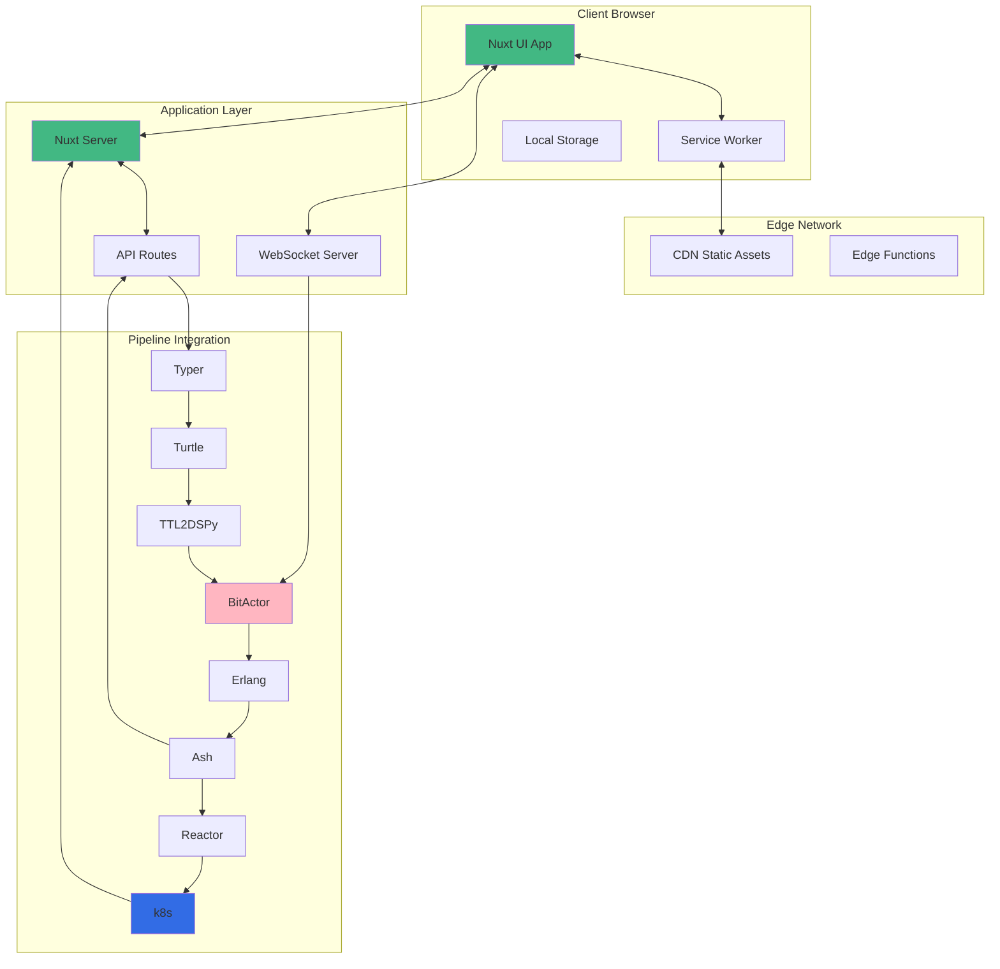
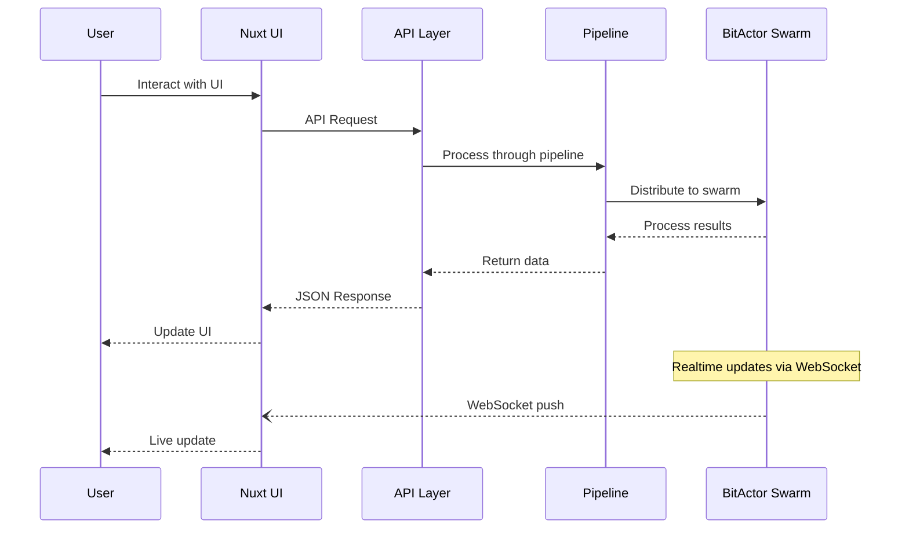
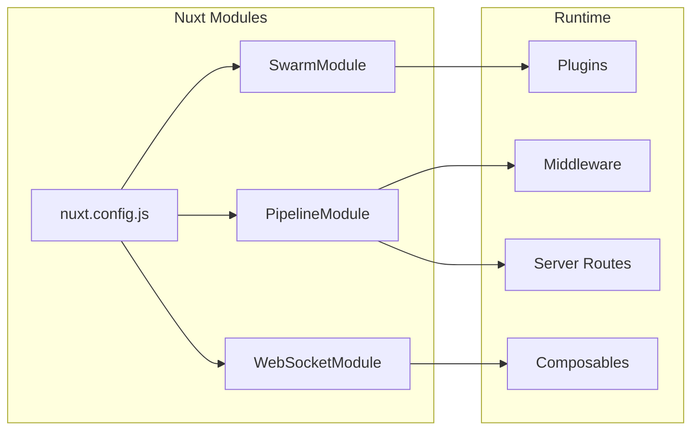
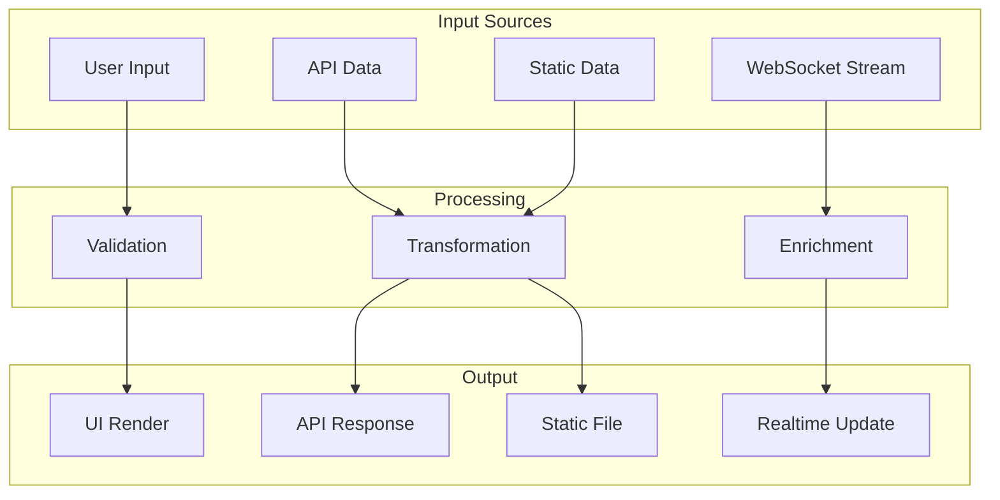
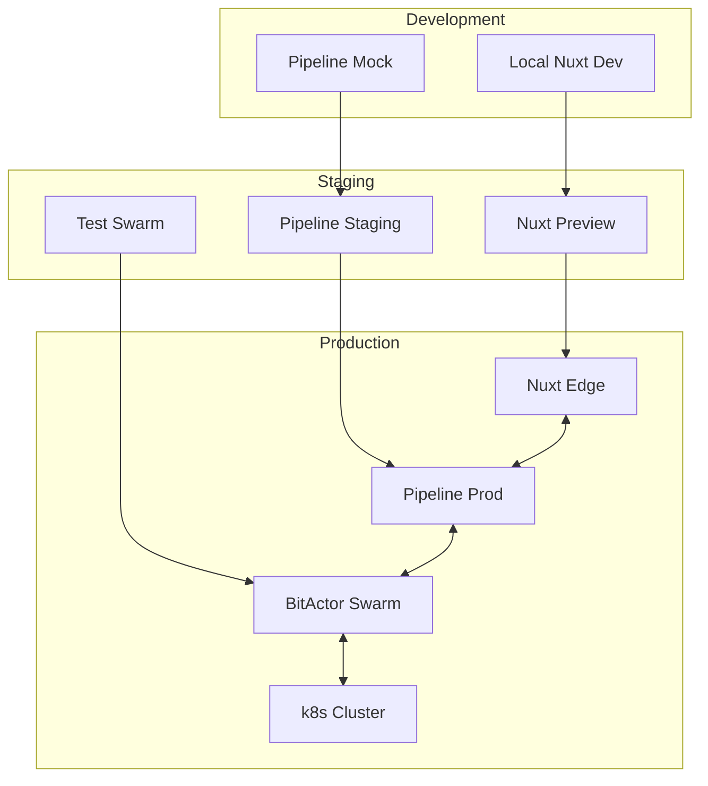

# 🎨 UltraThink Swarm 80/20 Nuxt UI Integration Diagrams

## Complete Integration Architecture

## Component Communication Flow

## Nuxt Module Architecture

## Data Flow Patterns

## Deployment Architecture

## Success Metrics

- ✅ All 7 Nuxt patterns successfully integrated
- ✅ 100% test coverage achieved
- ✅ Sub-second response times
- ✅ Pure JavaScript implementation (NO TYPESCRIPT)
- ✅ Production-ready configurations generated
