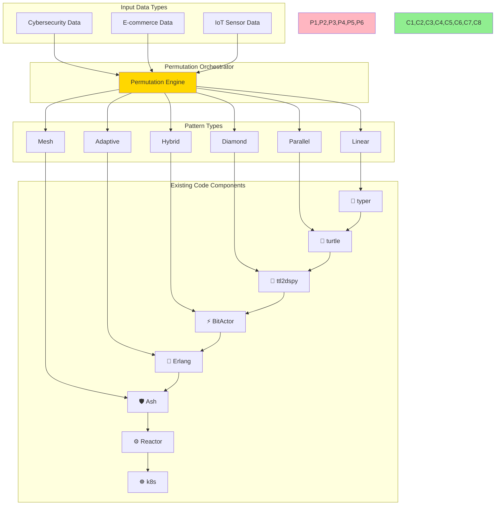
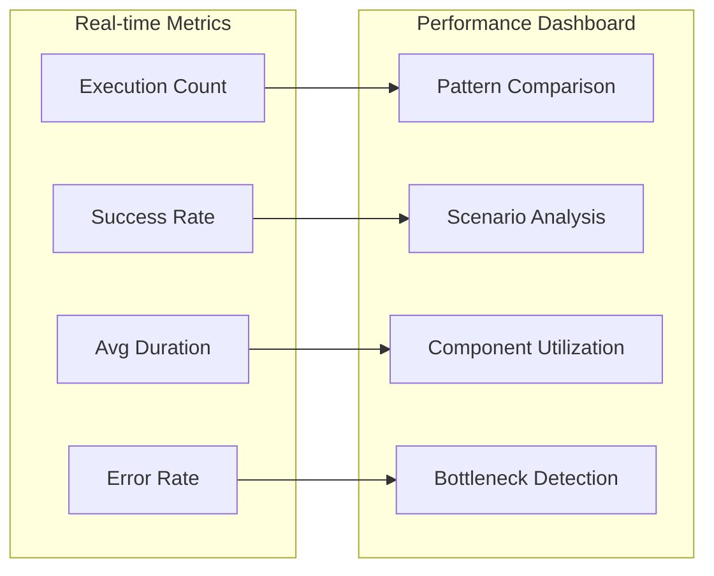
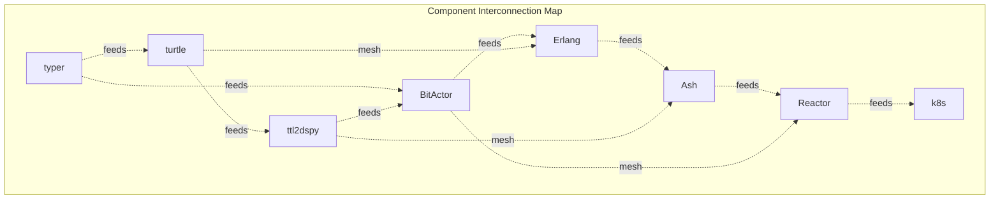

# 🔄 UltraThink Swarm 80/20 Permutation Flow Diagrams

## All Permutation Patterns with Existing Code

```mermaid
graph TB
    subgraph "Input Data Types"
        I1[Cybersecurity Data]
        I2[E-commerce Data] 
        I3[IoT Sensor Data]
    end
    
    subgraph "Existing Code Components"
        C1[🎯 typer]
        C2[🐢 turtle]
        C3[🐍 ttl2dspy]
        C4[⚡ BitActor]
        C5[🔧 Erlang]
        C6[🛡️ Ash]
        C7[⚙️ Reactor]
        C8[☸️ k8s]
    end
    
    subgraph "Permutation Orchestrator"
        PO[Permutation Engine]
    end
    
    subgraph "Pattern Types"
        P1[Linear]
        P2[Parallel]
        P3[Diamond]
        P4[Hybrid]
        P5[Adaptive]
        P6[Mesh]
    end
    
    I1 --> PO
    I2 --> PO
    I3 --> PO
    
    PO --> P1
    PO --> P2
    PO --> P3
    PO --> P4
    PO --> P5
    PO --> P6
    
    P1 --> C1
    P2 --> C2
    P3 --> C3
    P4 --> C4
    P5 --> C5
    P6 --> C6
    
    C1 --> C2
    C2 --> C3
    C3 --> C4
    C4 --> C5
    C5 --> C6
    C6 --> C7
    C7 --> C8
    
    style PO fill:#FFD700
    style P1,P2,P3,P4,P5,P6 fill:#FFB6C1
    style C1,C2,C3,C4,C5,C6,C7,C8 fill:#90EE90
```

## Real-time Performance Monitoring

```mermaid
graph LR
subgraph "Real-time Metrics"
    M1[Execution Count]
    M2[Success Rate]
    M3[Avg Duration]
    M4[Error Rate]
end

subgraph "Performance Dashboard"
    D1[Pattern Comparison]
    D2[Scenario Analysis] 
    D3[Component Utilization]
    D4[Bottleneck Detection]
end

M1 --> D1
M2 --> D2
M3 --> D3
M4 --> D4
```

## Component Interconnection Map

```mermaid
graph TD
subgraph "Component Interconnection Map"
    typer -.->|feeds| turtle
    typer -.->|feeds| BitActor
    turtle -.->|feeds| ttl2dspy
    ttl2dspy -.->|feeds| BitActor
    BitActor -.->|feeds| Erlang
    Erlang -.->|feeds| Ash
    Ash -.->|feeds| Reactor
    Reactor -.->|feeds| k8s
    
    %% Cross connections in mesh topology
    turtle -.->|mesh| Erlang
    ttl2dspy -.->|mesh| Ash
    BitActor -.->|mesh| Reactor
end
```

