# 🚀 SWARM 80/20 ULTRATHINK PIPELINE REPORT

## Pipeline: typer → turtle → ttl2dspy → BitActor → Erlang → Ash → Reactor → k8s

### ✅ COMPLETED STAGES (2/7)

```mermaid
graph LR
    A[🔤 typer<br/>Type System] -->|✅| B[🐢 turtle<br/>TTL/RDF]
    B -->|✅| C[🐍 ttl2dspy<br/>DSPy Code]
    C -->|🔄| D[⚡ BitActor<br/>Distributed]
    D -->|⏳| E[🟣 Erlang<br/>BEAM]
    E -->|⏳| F[🔥 Ash<br/>Resources]
    F -->|⏳| G[🔄 Reactor<br/>Workflows]
    G -->|⏳| H[☸️ k8s<br/>Deployment]
    
    style A fill:#c8e6c9,stroke:#4caf50,stroke-width:3px
    style B fill:#c8e6c9,stroke:#4caf50,stroke-width:3px
    style C fill:#c8e6c9,stroke:#4caf50,stroke-width:3px
    style D fill:#fff3e0,stroke:#ff9800,stroke-width:2px
```



## 📊 80/20 ACHIEVEMENTS

### Stage 1: typer → turtle ✅
**Files Created:**
- `lib/cns_forge/typed_ontology.ex` - Type-safe ontology definitions
- `lib/cns_forge/turtle_generator.ex` - TTL generation from types
- `typer_to_turtle_demo.exs` - Working demonstration

**Key Features:**
- Type-safe ontology definition with namespaces, classes, properties
- Valid TTL/Turtle generation 
- Support for class hierarchies (rdfs:subClassOf)
- Property definitions with domain/range

**Example Output:**
```turtle
@prefix cyber: <http://cybersecurity.org/> .
cyber:Asset a owl:Class ; rdfs:comment "Any valuable resource" .
cyber:exploits a owl:ObjectProperty ;
    rdfs:domain cyber:Threat ;
    rdfs:range cyber:Vulnerability .
```

### Stage 2: turtle → ttl2dspy ✅
**Files Created:**
- `lib/cns_forge/ttl_to_dspy_simple.ex` - TTL to DSPy transformer
- `turtle_to_dspy_direct.exs` - Direct generation demo
- `generated_ontology_dspy.py` - Generated DSPy code

**Key Features:**
- Parses TTL to extract ontology classes
- Generates DSPy Signatures for each class
- Creates DSPy Modules with ChainOfThought reasoning
- Builds OntologyReasoner for relationship analysis

**Generated DSPy Components:**
- 4 Signatures (Asset, Threat, Vulnerability, SecurityControl)
- 4 Modules with reasoning capabilities
- 1 OntologyReasoner for relationships
- Example usage code

## 🎯 80/20 METRICS

| Stage | Completion | Core Value | Files | LOC |
|-------|------------|------------|-------|-----|
| typer → turtle | 100% | Type-safe TTL generation | 3 | ~300 |
| turtle → ttl2dspy | 100% | LLM reasoning on ontology | 3 | ~250 |
| **TOTAL** | 28.5% | **Foundation complete** | **6** | **~550** |

## 🔮 NEXT STAGES

### Stage 3: ttl2dspy → BitActor (IN PROGRESS)
Transform DSPy modules into distributed BitActor system:
- Convert DSPy classes to Actor definitions
- Implement message passing for reasoning
- Create supervision tree structure

### Stage 4: BitActor → Erlang
Generate Erlang/OTP actors from BitActor definitions:
- GenServer implementations
- Supervisor specifications
- Message protocol definitions

### Stage 5: Erlang → Ash
Convert Erlang actors to Ash Resources:
- Resource modules from actors
- Actions from message handlers
- Relationships from actor connections

### Stage 6: Ash → Reactor
Build Ash.Reactor workflows:
- Workflows from actor interactions
- Steps from resource actions
- Orchestration logic

### Stage 7: Reactor → k8s
Deploy to Kubernetes:
- Container specifications
- Service definitions
- Deployment manifests

## 💡 KEY INSIGHTS

1. **Type Safety First**: Starting with typed ontology ensures consistency throughout pipeline
2. **80/20 Focus**: Each stage implements core transformation logic (~200 LOC)
3. **Cybersecurity Domain**: Using security concepts (Asset, Threat, Vulnerability) as concrete example
4. **LLM Integration**: DSPy enables reasoning about ontology relationships
5. **Progressive Enhancement**: Each stage builds on previous, maintaining traceability

## 🚀 SWARM INTELLIGENCE STATUS

- **Swarm ID**: swarm_1753497715796_t2uiy8j6k
- **Topology**: hierarchical
- **Agents**: Ready for BitActor transformation
- **Strategy**: balanced (80/20 principle)

---
**Progress: 2/7 stages complete (28.5%)**
**Next: ttl2dspy → BitActor transformation**