# 🚀 SWARM 80/20 ULTRATHINK PIPELINE: FINAL REPORT

## Pipeline: typer → turtle → ttl2dspy → BitActor → Erlang → Ash → Reactor → k8s

### ✅ STAGES COMPLETED: 3/7 (42.8%)

```mermaid
graph LR
    A[🔤 typer<br/>Type System] -->|✅| B[🐢 turtle<br/>TTL/RDF]
    B -->|✅| C[🐍 ttl2dspy<br/>DSPy Code]
    C -->|✅| D[⚡ BitActor<br/>Distributed]
    D -->|⏳| E[🟣 Erlang<br/>BEAM]
    E -->|⏳| F[🔥 Ash<br/>Resources]
    F -->|⏳| G[🔄 Reactor<br/>Workflows]
    G -->|⏳| H[☸️ k8s<br/>Deployment]
    
    style A fill:#c8e6c9,stroke:#4caf50,stroke-width:3px
    style B fill:#c8e6c9,stroke:#4caf50,stroke-width:3px
    style C fill:#c8e6c9,stroke:#4caf50,stroke-width:3px
    style D fill:#c8e6c9,stroke:#4caf50,stroke-width:3px
```



## 🔄 TRANSFORMATION PIPELINE FLOW

```mermaid
graph TB
    subgraph "Stage 1: typer → turtle"
        T1[TypedOntology] --> T2[Classes<br/>Properties<br/>Relationships]
        T2 --> T3["TTL/RDF<br/>@prefix cyber:"]
    end
    
    subgraph "Stage 2: turtle → ttl2dspy"
        T3 --> D1[Parse TTL]
        D1 --> D2[DSPy Signatures]
        D2 --> D3[DSPy Modules]
        D3 --> D4[OntologyReasoner]
    end
    
    subgraph "Stage 3: ttl2dspy → BitActor"
        D4 --> B1[Extract Components]
        B1 --> B2[Actor Definitions]
        B2 --> B3[Message Protocol]
        B3 --> B4[Supervisor Tree]
    end
    
    subgraph "Future Stages"
        B4 -.-> E1[Erlang GenServers]
        E1 -.-> A1[Ash Resources]
        A1 -.-> R1[Reactor Workflows]
        R1 -.-> K1[k8s Deployments]
    end
```



## 📊 PIPELINE ACHIEVEMENTS

### 🔤 Stage 1: typer → turtle ✅
**Purpose**: Type-safe ontology definition
```elixir
ontology = TypedOntology.new()
|> TypedOntology.add_class("Asset", :cyber)
|> TypedOntology.add_property("exploits", :cyber, "cyber:Threat", "cyber:Vulnerability")

# Generates valid TTL:
# cyber:Asset a owl:Class .
# cyber:exploits a owl:ObjectProperty ;
#     rdfs:domain cyber:Threat ;
#     rdfs:range cyber:Vulnerability .
```

### 🐍 Stage 2: turtle → ttl2dspy ✅  
**Purpose**: LLM reasoning capabilities
```python
# Generated DSPy components:
class AssetSignature(dspy.Signature):
    context = dspy.InputField(desc="Context about the asset")
    query = dspy.InputField(desc="Question about the asset")
    asset_info = dspy.OutputField(desc="Information about the asset")
    reasoning = dspy.OutputField(desc="Reasoning process")

class AssetModule(dspy.Module):
    def __init__(self):
        self.prog = dspy.ChainOfThought(AssetSignature)
```

### ⚡ Stage 3: ttl2dspy → BitActor ✅
**Purpose**: Distributed actor system
```elixir
# Generated BitActor specification:
## AssetActor
- Message: {:reason, context, query, from}
- State: %{reasoning_cache: %{}, request_count: 0}
- Supervision: :permanent with exponential backoff

# Router for distribution
BitActorRouter.reason("asset", "cybersecurity context", "What are key characteristics?")
```

## 🎯 80/20 METRICS

| Stage | Files | LOC | Core Value | Completion |
|-------|-------|-----|------------|------------|
| typer → turtle | 3 | ~300 | Type-safe TTL | 100% |
| turtle → ttl2dspy | 3 | ~250 | LLM reasoning | 100% |
| ttl2dspy → BitActor | 2 | ~350 | Distributed actors | 100% |
| **TOTAL** | **8** | **~900** | **Foundation → Reasoning → Distribution** | **42.8%** |

## 💡 KEY INSIGHTS

1. **Progressive Enhancement**: Each stage builds on previous output
   - Types → Serialization → Intelligence → Distribution
   
2. **80/20 Focus**: Core transformation logic in ~300 LOC per stage
   - Minimal viable implementations
   - Clear value at each step
   
3. **Domain Consistency**: Cybersecurity ontology throughout
   - Asset, Threat, Vulnerability, SecurityControl
   - Relationships: exploits, protects
   
4. **Technology Bridge**: Python (DSPy) → Elixir (BitActor)
   - Leveraging best tools for each domain
   - Clean interfaces between stages

## 🔮 REMAINING PIPELINE

### Stage 4: BitActor → Erlang (NEXT)
- Convert actor specs to GenServer implementations
- Message handling in Erlang/OTP
- Supervision tree in Erlang

### Stage 5: Erlang → Ash
- Transform GenServers to Ash Resources
- Actions from message handlers
- Relationships from actor connections

### Stage 6: Ash → Reactor  
- Build workflows from resource interactions
- Steps from actions
- Orchestration logic

### Stage 7: Reactor → k8s
- Container specifications
- Service definitions  
- Deployment manifests

## 🏆 SWARM INTELLIGENCE ANALYSIS

The pipeline demonstrates:
- **Type Safety**: Starting with typed definitions ensures consistency
- **Semantic Preservation**: Ontology meaning maintained across transformations
- **Progressive Intelligence**: From data → reasoning → distribution
- **Technology Agnostic**: Clean abstractions between stages
- **80/20 Principle**: Maximum value with minimal complexity

## 📈 PIPELINE STATUS

```
Progress: ████████████████████░░░░░░░░░░░░░░░░░░░░ 42.8%
Stages:   [✅][✅][✅][⏳][⏳][⏳][⏳]
Files:    8 created
LOC:      ~900 total
Value:    Type Safety → LLM Reasoning → Distribution
```

---
**🚀 ULTRATHINK SWARM 80/20: 3/7 STAGES COMPLETE**
**Next: BitActor → Erlang transformation**