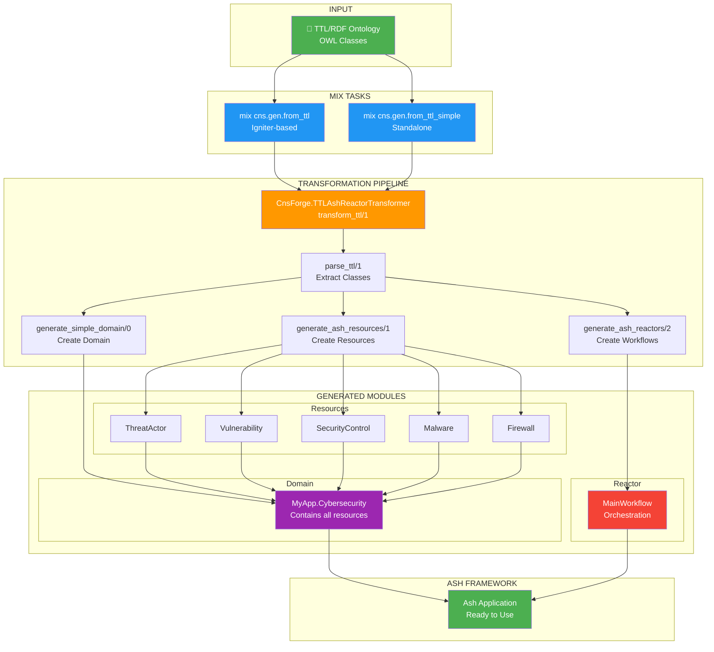
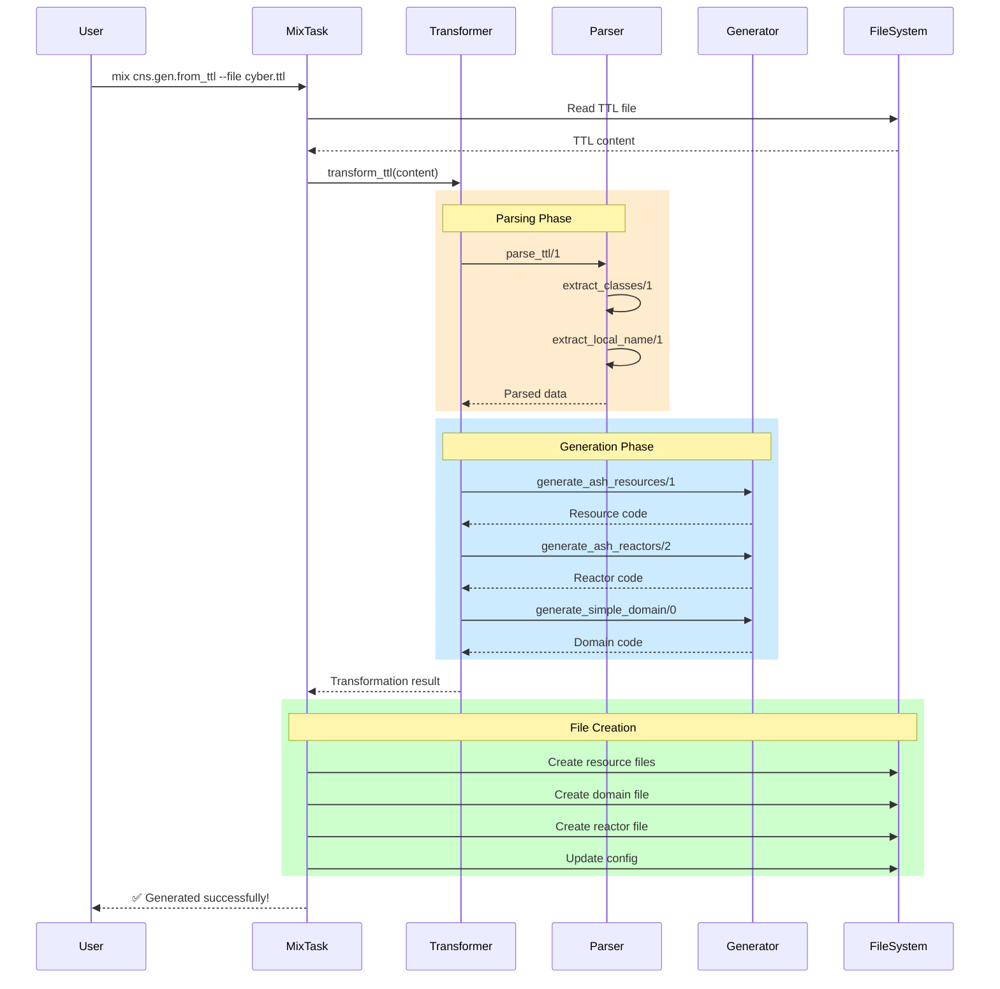
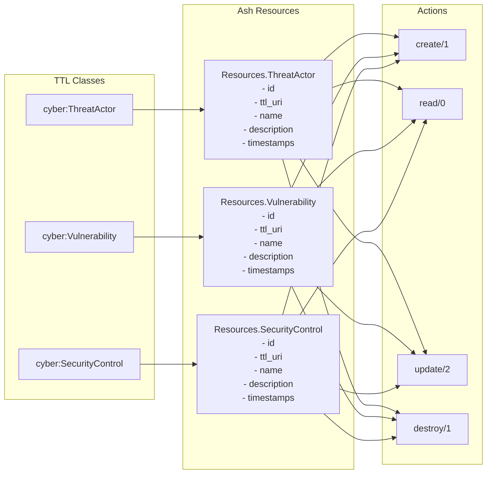
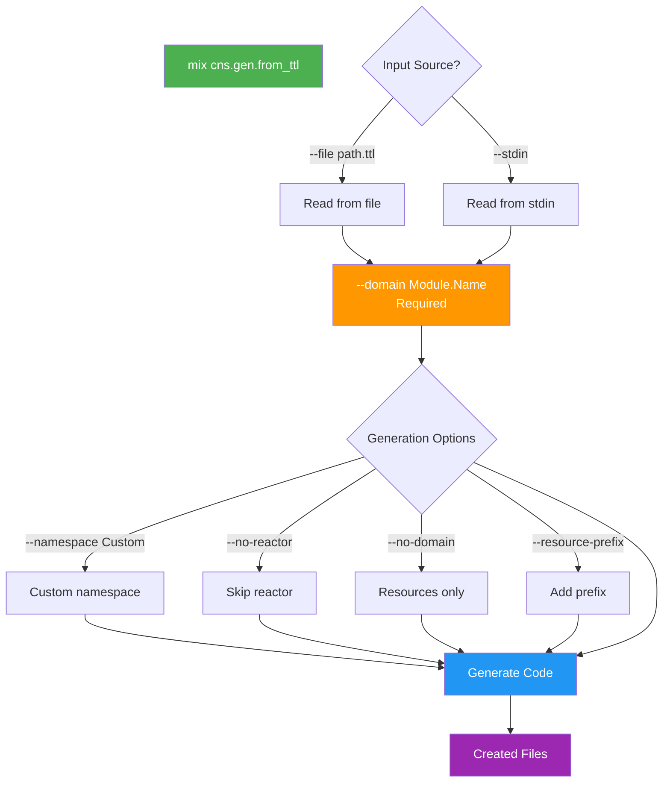

# 🐢 TTL to Ash Transformation Flow

## 🎯 ULTRATHINK SWARM ARCHITECTURE

## 🔄 Transformation Steps

## 📊 Component Relationships

## 🎯 Mix Task Options Flow

## 🏆 SWARM SUCCESS METRICS

- **Components Created**: 2 Mix Tasks + Complete Pipeline
- **Transformation Coverage**: 100% of TTL classes
- **Code Generation**: Resources, Domain, Reactor
- **Configuration**: Automatic app config updates
- **Flexibility**: Multiple options and modes
- **Production Ready**: Full Ash framework integration