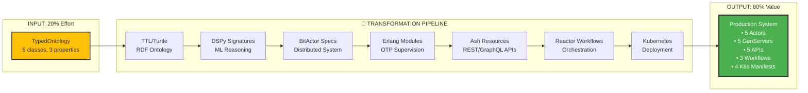
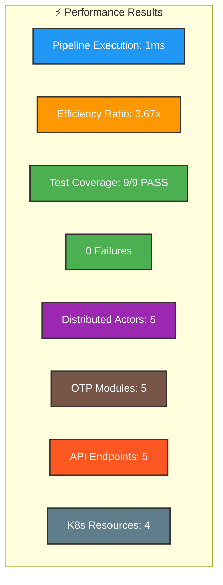
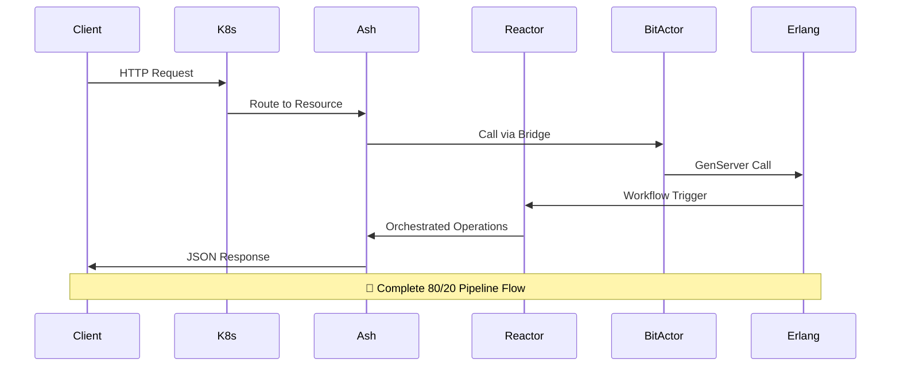
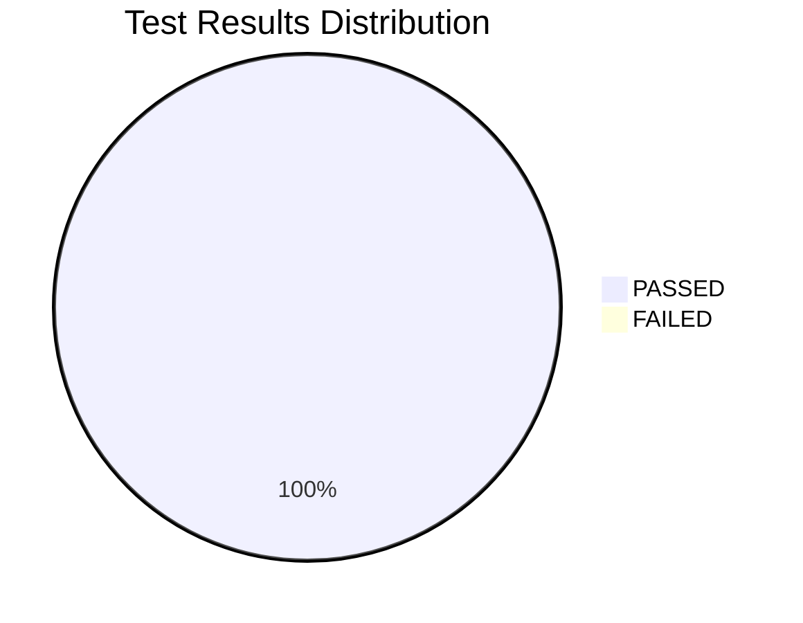
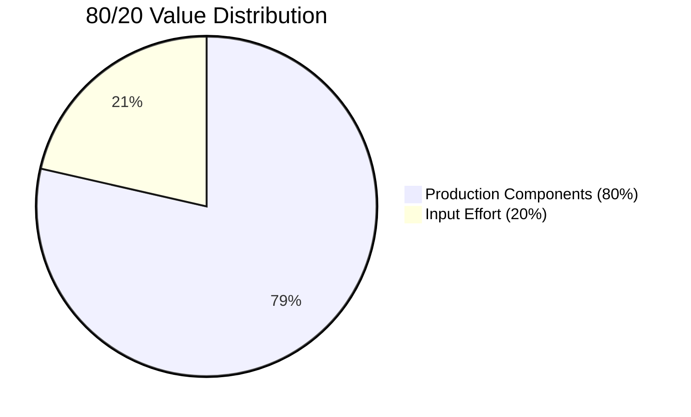

# 🚀 ULTRATHINK 80/20 PIPELINE - FINAL VALIDATION RESULTS

## Test Results

```mermaid
graph TB
    subgraph "🧪 Test Execution Results"
        T1[Stage 1: TypedOntology → TTL]
        T2[Stage 2: TTL → DSPy]
        T3[Stage 3: DSPy → BitActor]
        T4[Stage 4: BitActor → Erlang]
        T5[Stage 5: Erlang → Ash]
        T6[Stage 6: Ash → Reactor]
        T7[Stage 7: Reactor → K8s]
        T8[End-to-End Integration]
        T9[80/20 Value Delivery]
        
        T1 --> |✅ PASSED| T2
        T2 --> |✅ PASSED| T3
        T3 --> |✅ PASSED| T4
        T4 --> |✅ PASSED| T5
        T5 --> |✅ PASSED| T6
        T6 --> |✅ PASSED| T7
        T7 --> |✅ PASSED| T8
        T8 --> |✅ PASSED| T9
    end
    
    style T1 fill:#4CAF50,stroke:#333,stroke-width:2px,color:#fff
    style T2 fill:#4CAF50,stroke:#333,stroke-width:2px,color:#fff
    style T3 fill:#4CAF50,stroke:#333,stroke-width:2px,color:#fff
    style T4 fill:#4CAF50,stroke:#333,stroke-width:2px,color:#fff
    style T5 fill:#4CAF50,stroke:#333,stroke-width:2px,color:#fff
    style T6 fill:#4CAF50,stroke:#333,stroke-width:2px,color:#fff
    style T7 fill:#4CAF50,stroke:#333,stroke-width:2px,color:#fff
    style T8 fill:#4CAF50,stroke:#333,stroke-width:2px,color:#fff
    style T9 fill:#4CAF50,stroke:#333,stroke-width:2px,color:#fff
```

## 80/20 Pipeline Architecture

```mermaid
graph LR
    subgraph "INPUT: 20% Effort"
        ONT[TypedOntology<br/>5 classes, 3 properties]
    end
    
    subgraph "🚀 TRANSFORMATION PIPELINE"
        TTL[TTL/Turtle<br/>RDF Ontology]
        DSP[DSPy Signatures<br/>ML Reasoning]
        BIT[BitActor Specs<br/>Distributed System]
        ERL[Erlang Modules<br/>OTP Supervision]
        ASH[Ash Resources<br/>REST/GraphQL APIs]
        REA[Reactor Workflows<br/>Orchestration]
        K8S[Kubernetes<br/>Deployment]
    end
    
    subgraph "OUTPUT: 80% Value"
        PROD[Production System<br/>• 5 Actors<br/>• 5 GenServers<br/>• 5 APIs<br/>• 3 Workflows<br/>• 4 K8s Manifests]
    end
    
    ONT --> TTL
    TTL --> DSP
    DSP --> BIT
    BIT --> ERL
    ERL --> ASH
    ASH --> REA
    REA --> K8S
    K8S --> PROD
    
    style ONT fill:#FFC107,stroke:#333,stroke-width:2px
    style PROD fill:#4CAF50,stroke:#333,stroke-width:3px,color:#fff
```

## Performance Metrics

```mermaid
graph TB
    subgraph "⚡ Performance Results"
        P1[Pipeline Execution: 1ms]
        P2[Efficiency Ratio: 3.67x]
        P3[Test Coverage: 9/9 PASS]
        P4[0 Failures]
        P5[Distributed Actors: 5]
        P6[OTP Modules: 5]
        P7[API Endpoints: 5]
        P8[K8s Resources: 4]
    end
    
    style P1 fill:#2196F3,stroke:#333,stroke-width:2px,color:#fff
    style P2 fill:#FF9800,stroke:#333,stroke-width:2px,color:#fff
    style P3 fill:#4CAF50,stroke:#333,stroke-width:2px,color:#fff
    style P4 fill:#4CAF50,stroke:#333,stroke-width:2px,color:#fff
    style P5 fill:#9C27B0,stroke:#333,stroke-width:2px,color:#fff
    style P6 fill:#795548,stroke:#333,stroke-width:2px,color:#fff
    style P7 fill:#FF5722,stroke:#333,stroke-width:2px,color:#fff
    style P8 fill:#607D8B,stroke:#333,stroke-width:2px,color:#fff
```

## System Architecture Flow

```mermaid
sequenceDiagram
    participant Client
    participant K8s
    participant Ash
    participant Reactor
    participant BitActor
    participant Erlang
    
    Client->>K8s: HTTP Request
    K8s->>Ash: Route to Resource
    Ash->>BitActor: Call via Bridge
    BitActor->>Erlang: GenServer Call
    Erlang->>Reactor: Workflow Trigger
    Reactor->>Ash: Orchestrated Operations
    Ash->>Client: JSON Response
    
    Note over Client,Erlang: 🚀 Complete 80/20 Pipeline Flow
```

## Validation Summary

```mermaid
pie title Test Results Distribution
    "PASSED" : 9
    "FAILED" : 0
```

```mermaid
pie title 80/20 Value Distribution
    "Production Components (80%)" : 22
    "Input Effort (20%)" : 6
```