# 🔄 ULTRATHINK 80/20 PIPELINE PERMUTATIONS & COMBINATIONS - COMPLETE RESULTS

## New Permutation Patterns

```mermaid
graph LR
    subgraph "🎭 HYBRID MULTI-PATH PERMUTATION"
        H1[TTL Input] --> H2[DSPy→BitActor Path]
        H1 --> H3[Direct Ash Path]
        H1 --> H4[Native Reactor Path]
        H2 --> H5[Hybrid Integration Layer]
        H3 --> H5
        H4 --> H5
        H5 --> H6[Unified K8s Deployment]
    end
    
    style H2 fill:#E91E63,stroke:#333,stroke-width:2px,color:#fff
    style H3 fill:#3F51B5,stroke:#333,stroke-width:2px,color:#fff
    style H4 fill:#009688,stroke:#333,stroke-width:2px,color:#fff
    style H5 fill:#FF9800,stroke:#333,stroke-width:3px,color:#fff
```

```mermaid
graph TB
    subgraph "🧠 DYNAMIC ROUTING PERMUTATION"
        D1[Workload Profile Analysis] --> D2[Path Selection Algorithm]
        D2 --> D3[High Performance Path]
        D2 --> D4[Secondary Backup Paths]
        D3 --> D5[Primary Processing]
        D4 --> D6[Secondary Processing]
        D5 --> D7[Dynamic Load Balancer]
        D6 --> D7
        D7 --> D8[Adaptive K8s Manifests]
    end
    
    style D1 fill:#795548,stroke:#333,stroke-width:2px,color:#fff
    style D2 fill:#607D8B,stroke:#333,stroke-width:2px,color:#fff
    style D7 fill:#FF5722,stroke:#333,stroke-width:3px,color:#fff
```

```mermaid
graph TB
    subgraph "🌟 HUB-AND-SPOKE ORCHESTRATION PERMUTATION"
        HS1[Central Hub Orchestrator]
        HS1 --> HS2[High-Performance BitActor Spoke]
        HS1 --> HS3[High-Security BitActor Spoke]
        HS1 --> HS4[High-Reliability BitActor Spoke]
        HS1 --> HS5[GraphQL-Optimized Ash Spoke]
        HS1 --> HS6[REST-Optimized Ash Spoke]
        HS1 --> HS7[Workflow-Optimized Reactor Spoke]
        HS2 --> HS8[Coordinated Results]
        HS3 --> HS8
        HS4 --> HS8
        HS5 --> HS8
        HS6 --> HS8
        HS7 --> HS8
        HS8 --> HS9[Hub-Centric K8s]
    end
    
    style HS1 fill:#FF9800,stroke:#333,stroke-width:3px,color:#fff
    style HS8 fill:#4CAF50,stroke:#333,stroke-width:2px,color:#fff
```

## Permutation Performance Results

## Comprehensive Pipeline Architecture

```mermaid
graph LR
    subgraph "INPUT: 20% Effort"
        I1[TypedOntology<br/>3 classes, 2 properties]
    end
    
    subgraph "🔄 PERMUTATION MATRIX"
        subgraph "Original Linear"
            L1[TTL] --> L2[DSPy] --> L3[BitActor] --> L4[Erlang] --> L5[Ash] --> L6[Reactor] --> L7[K8s]
        end
        
        subgraph "Parallel Processing"
            PP1[Performance Path]
            PP2[Security Path]  
            PP3[Reliability Path]
        end
        
        subgraph "Feedback Loop"
            FL1[Metrics Analysis] --> FL2[Optimization] --> FL3[Regeneration]
        end
        
        subgraph "Hybrid Paths"
            HP1[DSPy Path]
            HP2[Ash Path]
            HP3[Reactor Path]
        end
        
        subgraph "Dynamic Routing"
            DR1[Path Selection] --> DR2[Load Balancing] --> DR3[Adaptive Scaling]
        end
        
        subgraph "Hub-and-Spoke"
            HUB[Central Hub] --> SPOKE1[BitActor Spokes]
            HUB --> SPOKE2[Ash Spokes]
            HUB --> SPOKE3[Reactor Spokes]
        end
    end
    
    subgraph "OUTPUT: 80% Value"
        O1[Production Systems<br/>• 22+ Components<br/>• 5 Pattern Types<br/>• Multi-dimensional Optimization<br/>• Exponential Value Delivery]
    end
    
    I1 --> L1
    I1 --> PP1
    I1 --> FL1
    I1 --> HP1
    I1 --> DR1
    I1 --> HUB
    
    L7 --> O1
    PP3 --> O1
    FL3 --> O1
    HP3 --> O1
    DR3 --> O1
    SPOKE3 --> O1
    
    style I1 fill:#FFC107,stroke:#333,stroke-width:2px
    style O1 fill:#4CAF50,stroke:#333,stroke-width:3px,color:#fff
```

## Test Results Summary

## Permutation Benefits Matrix

## Execution Flow Sequence

```mermaid
sequenceDiagram
    participant User
    participant Permutations
    participant Parallel
    participant Feedback
    participant Hybrid
    participant Dynamic
    participant HubSpoke
    participant K8s
    
    User->>Permutations: Execute All Permutations
    
    par Parallel Processing
        Permutations->>Parallel: Performance Path
        Permutations->>Parallel: Security Path  
        Permutations->>Parallel: Reliability Path
        Parallel->>K8s: Multi-optimized Manifests
    and Feedback Loop
        Permutations->>Feedback: K8s Metrics Analysis
        Feedback->>Feedback: BitActor Optimization
        Feedback->>K8s: Optimized Deployment
    and Hybrid Paths
        Permutations->>Hybrid: DSPy Path
        Permutations->>Hybrid: Ash Path
        Permutations->>Hybrid: Reactor Path
        Hybrid->>K8s: Unified Deployment
    and Dynamic Routing
        Permutations->>Dynamic: Workload Analysis
        Dynamic->>Dynamic: Path Selection
        Dynamic->>K8s: Adaptive Manifests
    and Hub-and-Spoke
        Permutations->>HubSpoke: Central Orchestrator
        HubSpoke->>HubSpoke: 6 Specialized Spokes
        HubSpoke->>K8s: Hub-centric Deployment
    end
    
    K8s->>User: 5 Production-Ready Systems
    
    Note over User,K8s: 🚀 ALL PERMUTATIONS OPERATIONAL
```

