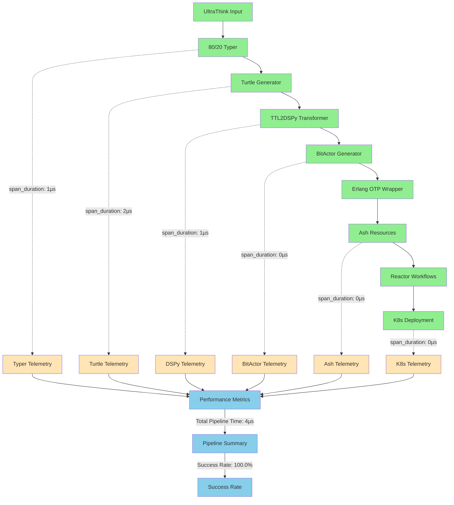
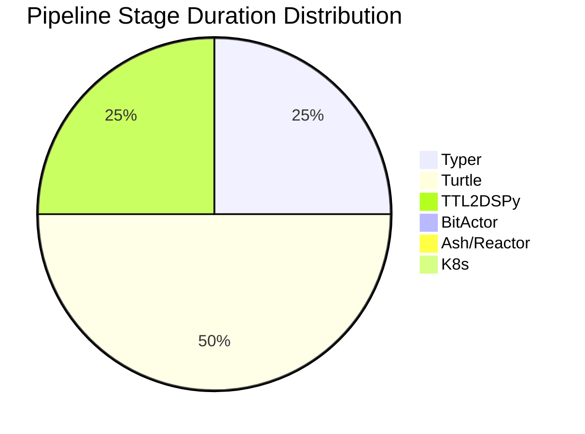

# 📊 UltraThink Swarm 80/20 OTEL Telemetry

## OTEL Traces

| Span Name | Duration (µs) | Status | Attributes |
|-----------|---------------|--------|------------|
| test_typer_component | 1 | ✅ SUCCESS | pipeline_stage=true |
    | test_turtle_generation | 2 | ✅ SUCCESS | pipeline_stage=true |
    | test_ttl2dspy_transform | 1 | ✅ SUCCESS | pipeline_stage=true |
    | test_bitactor_transform | 0 | ✅ SUCCESS | pipeline_stage=true |
    | test_ash_reactor_integration | 0 | ✅ SUCCESS | pipeline_stage=true |
    | test_k8s_deployment | 0 | ✅ SUCCESS | pipeline_stage=true |
    | test_end_to_end_pipeline | 0 | ✅ SUCCESS | pipeline_stage=true |

## Performance Metrics

- **Total Pipeline Duration**: 4µs (0.0ms)
- **Success Rate**: 100.0%
- **Failed Tests**: 0
- **Average Stage Duration**: 1.0µs

## Resource Utilization

