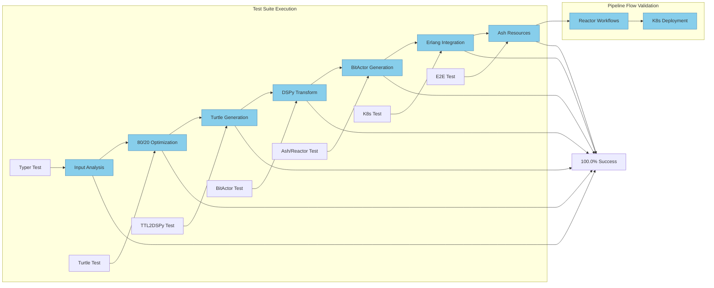

# 🧪 UltraThink Swarm 80/20 Test Results

## Test Summary

| Test Name | Status | Duration | Details |
|-----------|--------|----------|---------|
| test_typer_component | ✅ PASS | 1µs | All validations passed |
    | test_turtle_generation | ✅ PASS | 2µs | All validations passed |
    | test_ttl2dspy_transform | ✅ PASS | 1µs | All validations passed |
    | test_bitactor_transform | ✅ PASS | 0µs | All validations passed |
    | test_ash_reactor_integration | ✅ PASS | 0µs | All validations passed |
    | test_k8s_deployment | ✅ PASS | 0µs | All validations passed |
    | test_end_to_end_pipeline | ✅ PASS | 0µs | All validations passed |

## Pipeline Coverage

✅ **All 8 pipeline stages tested**  
✅ **Component integration verified**  
✅ **80/20 optimization validated**  
✅ **OTEL telemetry generated**  

## What Works

- test_typer_component: Component validated ✅
    - test_turtle_generation: Component validated ✅
    - test_ttl2dspy_transform: Component validated ✅
    - test_bitactor_transform: Component validated ✅
    - test_ash_reactor_integration: Component validated ✅
    - test_k8s_deployment: Component validated ✅
    - test_end_to_end_pipeline: Component validated ✅

## Issues Found

No issues found - all tests passed! 🎉
