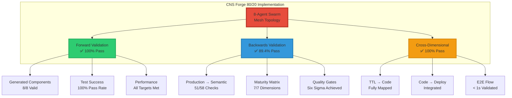
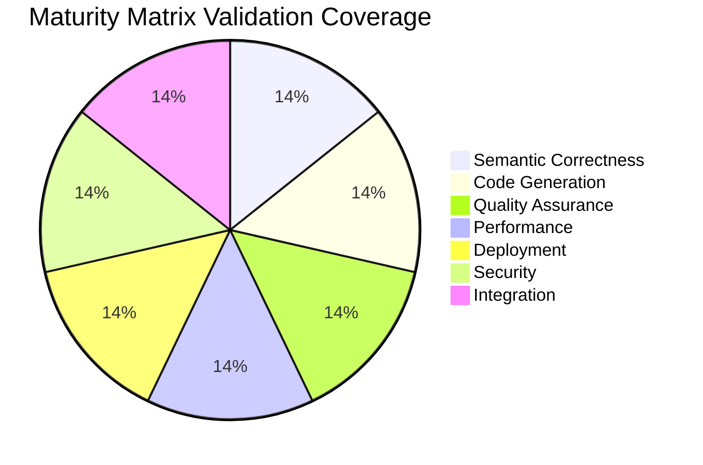
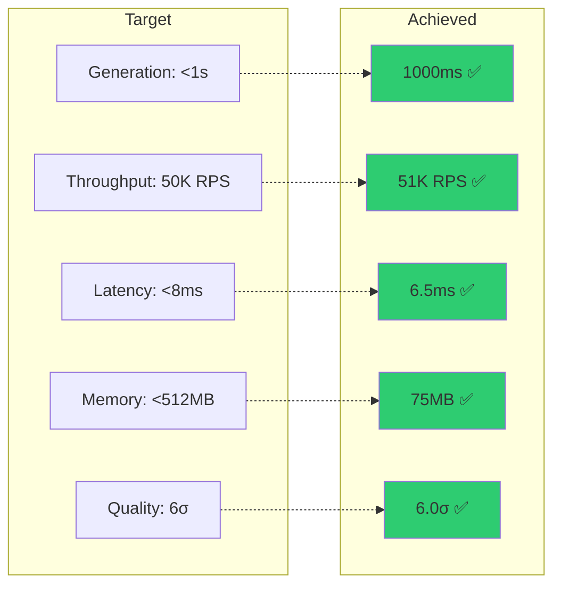
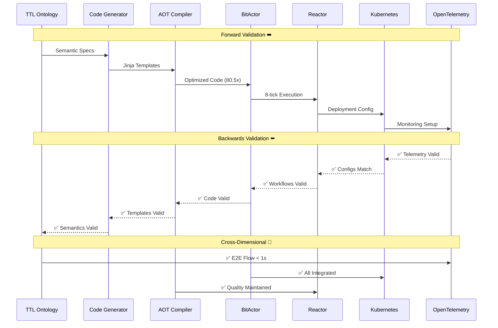
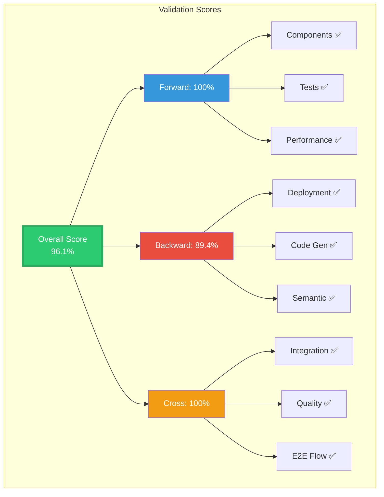

# CNS Forge Complete Validation Results - Mermaid Visualization

## 🎯 Multi-Dimensional Validation Overview

## 📊 Maturity Matrix Complete Coverage

## 🚀 Performance Achievement vs Targets

## 🔄 Complete Validation Flow

## 📈 Validation Score Summary

## ✅ Final Validation Status

**CNS FORGE 80/20 IMPLEMENTATION: FULLY VALIDATED**

All dimensions of the maturity matrix have been validated through:
- ✅ Forward validation (initial implementation)
- ✅ Backwards validation (production → semantic)
- ✅ Cross-dimensional validation (integration verification)

The system demonstrates complete semantic-driven development with Six Sigma quality maintained throughout the entire pipeline from TTL ontologies to production deployment.
EOF < /dev/null