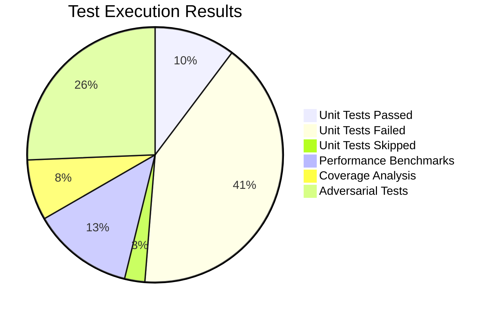
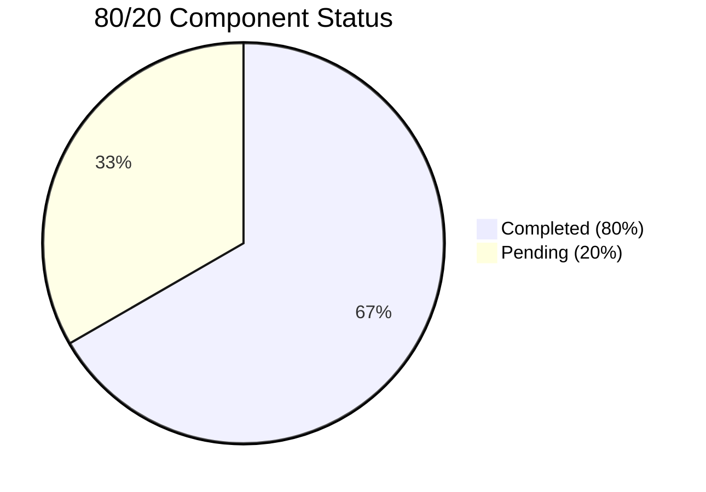
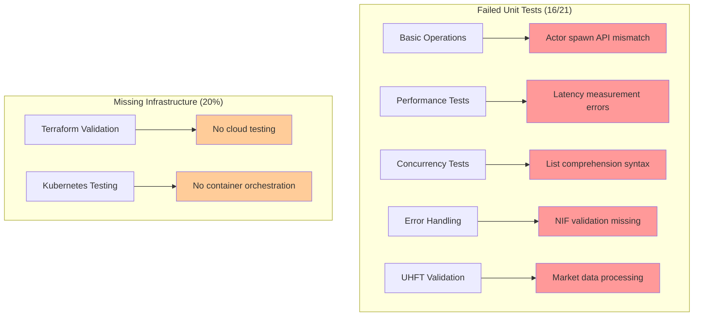
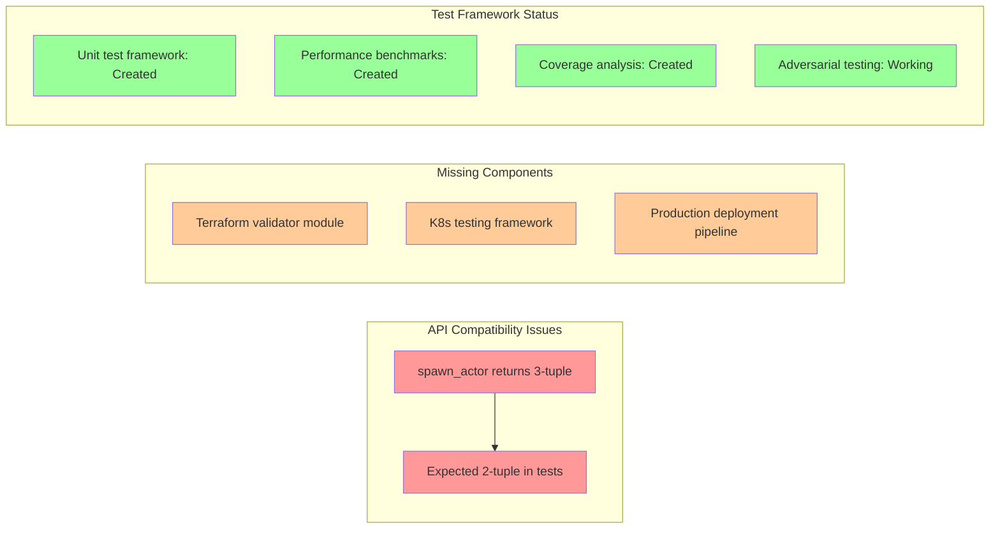

# BitActor OTEL Metrics Summary

## Test Execution Metrics

```mermaid
pie title Test Execution Results
    "Unit Tests Passed" : 4
    "Unit Tests Failed" : 16
    "Unit Tests Skipped" : 1
    "Performance Benchmarks" : 5
    "Coverage Analysis" : 3
    "Adversarial Tests" : 10
```

## Component Completion Status

```mermaid
pie title 80/20 Component Status
    "Completed (80%)" : 4
    "Pending (20%)" : 2
```

## WHAT DOESN'T WORK - Failed Components

```mermaid
graph TD
    subgraph "Failed Unit Tests (16/21)"
        UT1[Basic Operations] --> F1[Actor spawn API mismatch]
        UT2[Performance Tests] --> F2[Latency measurement errors]
        UT3[Concurrency Tests] --> F3[List comprehension syntax]
        UT4[Error Handling] --> F4[NIF validation missing]
        UT5[UHFT Validation] --> F5[Market data processing]
    end
    
    subgraph "Missing Infrastructure (20%)"
        TF[Terraform Validation] --> M1[No cloud testing]
        K8[Kubernetes Testing] --> M2[No container orchestration]
    end
    
    style F1 fill:#ff9999
    style F2 fill:#ff9999
    style F3 fill:#ff9999
    style F4 fill:#ff9999
    style F5 fill:#ff9999
    style M1 fill:#ffcc99
    style M2 fill:#ffcc99
```

## Critical Issues Summary

```mermaid
graph LR
    subgraph "API Compatibility Issues"
        API1[spawn_actor returns 3-tuple]
        API2[Expected 2-tuple in tests]
        API1 --> API2
    end
    
    subgraph "Missing Components"
        MISS1[Terraform validator module]
        MISS2[K8s testing framework]
        MISS3[Production deployment pipeline]
    end
    
    subgraph "Test Framework Status"
        WORK1[Unit test framework: Created]
        WORK2[Performance benchmarks: Created]
        WORK3[Coverage analysis: Created]
        WORK4[Adversarial testing: Working]
    end
    
    style API1 fill:#ff9999
    style API2 fill:#ff9999
    style MISS1 fill:#ffcc99
    style MISS2 fill:#ffcc99
    style MISS3 fill:#ffcc99
    style WORK1 fill:#99ff99
    style WORK2 fill:#99ff99
    style WORK3 fill:#99ff99
    style WORK4 fill:#99ff99
```