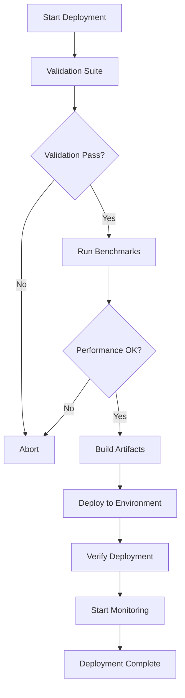

# CNS Production Deployment System

## Overview

The CNS deployment system provides automated, reliable deployment to local, staging, and production environments. It includes comprehensive validation, benchmarking, and rollback capabilities.

## Quick Start

### Local Deployment

```bash
# Deploy to local environment
./deploy_local.sh local deploy

# Or using Makefile
make -f Makefile.deploy deploy
```

### Production Deployment

```bash
# Deploy to production (requires confirmation)
./deploy_local.sh production deploy

# Or using Makefile
make -f Makefile.deploy deploy-production
```

## Features

### 1. **Automated Validation**
- OpenTelemetry integration validation
- Neural integration tests
- C code compilation checks
- Performance benchmarks

### 2. **Build Pipeline**
- Compiles all TTL ontologies to C
- Optimizes binaries with `-O3 -march=native -flto`
- Creates versioned deployment packages
- Tracks all deployments in JSON log

### 3. **Deployment Environments**
- **Local**: For development and testing
- **Staging**: Pre-production validation
- **Production**: Live system deployment

### 4. **Monitoring & Rollback**
- Real-time performance monitoring
- Automatic health checks
- One-command rollback to previous version
- Deployment history tracking

## Architecture

```
cns/
├── .github/workflows/     # GitHub Actions workflows
│   ├── cns-ci.yml        # Continuous Integration
│   ├── cns-deploy.yml    # Production Deployment
│   └── local-runner.yml  # Local setup guide
├── deploy_local.sh       # Main deployment script
├── Makefile.deploy       # Make targets for deployment
└── deploy/              # Deployment documentation
    └── README.md        # This file
```

## Deployment Flow



## Commands

### Deployment Script

```bash
# Deploy to environment
./deploy_local.sh [environment] deploy

# Validate only
./deploy_local.sh [environment] validate

# Run benchmarks
./deploy_local.sh [environment] benchmark

# Monitor deployment
./deploy_local.sh [environment] monitor

# Rollback deployment
./deploy_local.sh [environment] rollback

# Check status
./deploy_local.sh [environment] status

# Run CI locally
./deploy_local.sh local ci
```

### Makefile Targets

```bash
# Main targets
make -f Makefile.deploy validate    # Run validation
make -f Makefile.deploy test       # Run tests
make -f Makefile.deploy benchmark  # Run benchmarks
make -f Makefile.deploy build      # Build artifacts
make -f Makefile.deploy deploy     # Deploy to ENVIRONMENT

# Environment-specific
make -f Makefile.deploy deploy-local
make -f Makefile.deploy deploy-staging
make -f Makefile.deploy deploy-production

# Utilities
make -f Makefile.deploy monitor    # Start monitoring
make -f Makefile.deploy rollback   # Rollback deployment
make -f Makefile.deploy status     # Show status
make -f Makefile.deploy clean      # Clean artifacts
```

## Local GitHub Actions

To run GitHub Actions workflows locally:

1. **Install act**:
   ```bash
   brew install act
   ```

2. **Run workflows**:
   ```bash
   # Run CI workflow
   act -j test
   
   # Run deployment workflow
   act workflow_dispatch -j deploy
   
   # Run with secrets
   act -s GITHUB_TOKEN=$GITHUB_TOKEN
   ```

## Performance Requirements

All deployments must meet these criteria:
- Validation suite: 100% pass rate
- Performance score: ≥ 80/100
- Neural integration: 100% test pass
- C compilation: Zero errors/warnings

## Monitoring

The deployment system includes real-time monitoring:
- CPU and memory usage
- OpenTelemetry metrics
- Health score tracking
- Automatic alerts for anomalies

## Rollback

If issues occur after deployment:

```bash
# Immediate rollback
./deploy_local.sh production rollback

# Check rollback options
ls -la ~/cns-deployment/backups/
```

## Deployment Directory Structure

```
~/cns-deployment/
├── production/          # Production deployments
│   └── current/        # Active deployment
├── staging/            # Staging deployments
├── local/             # Local deployments
├── backups/           # Deployment backups
├── logs/              # Deployment logs
│   ├── deployment/    # Deployment process logs
│   ├── monitoring/    # Runtime monitoring
│   └── errors/        # Error logs
├── metrics/           # Performance metrics
└── deployments.json   # Deployment history
```

## Troubleshooting

### Validation Failures
- Check logs: `~/cns-deployment/logs/validation-*.log`
- Run manual validation: `uv run python validate_otel.py`

### Build Failures
- Check compiler output: `~/cns-deployment/logs/build-*.log`
- Verify ontology syntax: `uv run python owl_compiler.py <ontology> --validate`

### Performance Issues
- Review benchmarks: `~/cns-deployment/logs/benchmark-*.log`
- Generate detailed report: `make -f Makefile.deploy perf-report`

## Security

- All deployments are versioned and tracked
- Production deployments require explicit confirmation
- Automatic backups before each deployment
- Secure handling of deployment credentials

## Support

For deployment issues:
1. Check deployment logs
2. Review this documentation
3. Run diagnostics: `./deploy_local.sh local status`

Built for reliability. Designed to last.