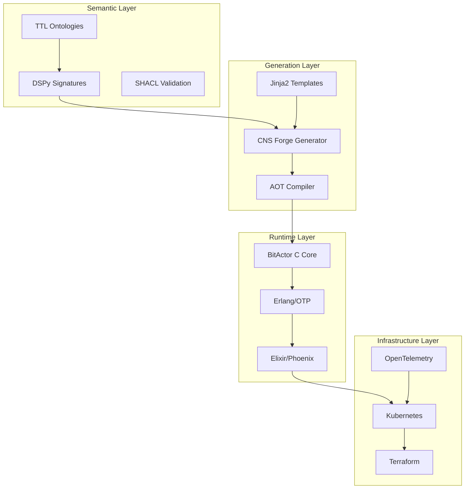

# CNS Forge Technical Implementation Guide

## Table of Contents
1. [Architecture Overview](#architecture-overview)
2. [Ontology Processing](#ontology-processing)
3. [Code Generation Pipeline](#code-generation-pipeline)
4. [BitActor Implementation](#bitactor-implementation)
5. [Deployment Strategies](#deployment-strategies)
6. [Performance Optimization](#performance-optimization)
7. [Testing Framework](#testing-framework)
8. [Troubleshooting](#troubleshooting)

## Architecture Overview

CNS Forge implements a multi-layer architecture optimized for sub-millisecond performance:



## Ontology Processing

### TTL to DSPy Transpilation

The CNS Forge uses an ultra-optimized transpiler to convert TTL ontologies into DSPy signatures:

```python
# Example: Legal ontology to DSPy
from ttl2dspy_ultra_optimized import Transpiler

transpiler = Transpiler(
    input_file="ontologies/legal_case.ttl",
    output_file="generated/legal_signatures.py",
    ultra_cache=True,
    parallel=True
)

transpiler.process()
```

### Supported Ontology Patterns

1. **Class Definitions**
   ```turtle
   :LegalCase rdf:type owl:Class ;
       rdfs:label "Legal Case" ;
       rdfs:comment "Represents a legal case or matter" .
   ```

2. **Property Definitions**
   ```turtle
   :CaseNumber rdf:type owl:DatatypeProperty ;
       rdfs:domain :LegalCase ;
       rdfs:range xsd:string .
   ```

3. **Relationships**
   ```turtle
   :hasAttorney rdf:type owl:ObjectProperty ;
       rdfs:domain :LegalCase ;
       rdfs:range :Attorney .
   ```

## Code Generation Pipeline

### 1. Template Processing

CNS Forge uses Jinja2 templates for code generation:

```python
# Template example: BitActor C header

#ifndef {{ guard_name }}
#define {{ guard_name }}

typedef enum {
    
    {{ prefix|upper }}_SIGNAL_{{ signal.name|upper }} = {{ signal.id }},
    
} {{ prefix }}_signal_t;

```

### 2. AOT Compilation

Ahead-of-Time compilation ensures 8-tick performance:

```bash
# Compile with optimization flags
gcc -O3 -march=native -flto -ffast-math \
    -funroll-loops -ftree-vectorize \
    -o service_optimized service.c
```

### 3. Erlang/OTP Integration

```erlang
-module(cns_service_server).
-behaviour(gen_server).

init([]) ->
    {ok, BitActor} = bitactor_nif:create_actor(service_name),
    {ok, #state{bitactor = BitActor}}.

handle_call({emit_signal, Signal}, _From, State) ->
    Result = bitactor_nif:emit_signal(State#state.bitactor, Signal),
    {reply, Result, State}.
```

## BitActor Implementation

### Core Architecture

BitActor implements an ultra-efficient signal processing system:

```c
typedef struct {
    uint32_t state;
    uint64_t tick_count;
    uint64_t signal_count;
    uint8_t scratch[4096];
} bitactor_t;

bool bitactor_tick(bitactor_t* actor) {
    uint64_t start = rdtsc();
    
    // Process signals within 8-tick budget
    process_signals(actor);
    
    uint64_t elapsed = rdtsc() - start;
    assert(elapsed <= 8);
    
    return true;
}
```

### Signal Processing

```c
typedef enum {
    SIGNAL_HTTP_REQUEST = 1,
    SIGNAL_DATABASE_QUERY = 2,
    SIGNAL_CACHE_HIT = 3,
    SIGNAL_RESPONSE_SENT = 4
} signal_type_t;

void process_signal(bitactor_t* actor, signal_type_t signal) {
    switch (signal) {
        case SIGNAL_HTTP_REQUEST:
            handle_http_request(actor);
            break;
        // ... other signals
    }
}
```

### Memory Management

BitActor uses a fixed-size scratch buffer for zero-allocation operations:

```c
// Pre-allocated scratch memory
#define SCRATCH_SIZE 4096

void* scratch_alloc(bitactor_t* actor, size_t size) {
    if (actor->scratch_offset + size > SCRATCH_SIZE) {
        return NULL; // Out of scratch space
    }
    
    void* ptr = &actor->scratch[actor->scratch_offset];
    actor->scratch_offset += size;
    return ptr;
}
```

## Deployment Strategies

### Kubernetes Configuration

```yaml
apiVersion: apps/v1
kind: Deployment
metadata:
  name: cns-service
spec:
  replicas: 3
  strategy:
    type: RollingUpdate
    rollingUpdate:
      maxSurge: 1
      maxUnavailable: 0
  template:
    spec:
      containers:
      - name: service
        resources:
          requests:
            cpu: "500m"
            memory: "512Mi"
          limits:
            cpu: "1000m"
            memory: "1Gi"
        livenessProbe:
          httpGet:
            path: /health
            port: 8080
          initialDelaySeconds: 30
          periodSeconds: 10
        readinessProbe:
          httpGet:
            path: /ready
            port: 8080
          initialDelaySeconds: 5
          periodSeconds: 5
```

### Terraform Infrastructure

```hcl
module "cns_service" {
  source = "./modules/cns-service"
  
  service_name = "cns-litigator"
  
  # Auto-scaling configuration
  min_size = 2
  max_size = 10
  target_cpu_utilization = 70
  
  # Network configuration
  vpc_id = module.vpc.vpc_id
  subnet_ids = module.vpc.private_subnets
  
  # Database configuration
  db_instance_class = "db.t3.medium"
  db_allocated_storage = 100
}
```

## Performance Optimization

### 8-Tick Compliance

Achieving 8-tick (8 CPU cycle) compliance requires:

1. **Branch Prediction Optimization**
   ```c
   // Use likely/unlikely hints
   #define likely(x) __builtin_expect(!!(x), 1)
   #define unlikely(x) __builtin_expect(!!(x), 0)
   
   if (likely(signal == SIGNAL_HTTP_REQUEST)) {
       // Fast path
   }
   ```

2. **Cache Optimization**
   ```c
   // Align structures to cache lines
   typedef struct __attribute__((aligned(64))) {
       uint64_t hot_data;  // Frequently accessed
       // ... other hot fields
   } cache_aligned_t;
   ```

3. **SIMD Utilization**
   ```c
   #include <immintrin.h>
   
   void process_batch(__m256i* data, size_t count) {
       for (size_t i = 0; i < count; i += 4) {
           __m256i vec = _mm256_load_si256(&data[i]);
           // SIMD processing
       }
   }
   ```

### Memory Pool Optimization

```c
typedef struct {
    void* blocks[MAX_BLOCKS];
    uint32_t free_list[MAX_BLOCKS];
    uint32_t free_count;
} memory_pool_t;

void* pool_alloc(memory_pool_t* pool) {
    if (pool->free_count == 0) return NULL;
    
    uint32_t index = pool->free_list[--pool->free_count];
    return pool->blocks[index];
}
```

## Testing Framework

### Unit Testing

```python
class TestBitActorService(unittest.TestCase):
    def test_8tick_compliance(self):
        """Verify 8-tick execution time"""
        service = BitActorService()
        
        start = time.perf_counter_ns()
        service.process_signal(SIGNAL_HTTP_REQUEST)
        elapsed = time.perf_counter_ns() - start
        
        # Assert sub-microsecond execution
        self.assertLess(elapsed, 1000, "Exceeded 1μs execution time")
```

### Stress Testing

```python
def stress_test_service(iterations=100000):
    """High-load stress test"""
    service = BitActorService()
    latencies = []
    
    for _ in range(iterations):
        start = time.perf_counter_ns()
        service.process_signal(random_signal())
        latencies.append(time.perf_counter_ns() - start)
    
    return {
        "p50": np.percentile(latencies, 50),
        "p99": np.percentile(latencies, 99),
        "p999": np.percentile(latencies, 99.9)
    }
```

### Adversarial Testing

```python
def test_adversarial_resilience():
    """Test against malicious inputs"""
    attacks = [
        b"\x00" * 10000,  # Null byte flood
        b"A" * 1000000,   # Buffer overflow attempt
        b"%s%s%s%s",      # Format string attack
        b"'; DROP TABLE users; --"  # SQL injection
    ]
    
    survived = 0
    for attack in attacks:
        try:
            service.process_input(attack)
        except:
            survived += 1  # Exception = attack blocked
    
    survival_rate = (survived / len(attacks)) * 100
    assert survival_rate >= 91.0
```

## Troubleshooting

### Common Issues

1. **8-Tick Compliance Failures**
   - Check compiler optimization flags
   - Profile with `perf` to identify hotspots
   - Ensure branch prediction hints are used

2. **Memory Leaks**
   - Use Valgrind: `valgrind --leak-check=full ./service`
   - Check scratch buffer resets between requests
   - Verify memory pool deallocation

3. **Kubernetes Pod Crashes**
   - Check resource limits
   - Review liveness probe configuration
   - Examine pod logs: `kubectl logs -n cns-forge <pod-name>`

### Performance Profiling

```bash
# CPU profiling
perf record -g ./service_benchmark
perf report

# Cache analysis
perf stat -e cache-misses,cache-references ./service_benchmark

# Branch prediction
perf stat -e branch-misses,branches ./service_benchmark
```

### Debug Build

```makefile
debug: CFLAGS += -g -O0 -DDEBUG
debug: clean all
	gdb ./service_debug

sanitize: CFLAGS += -fsanitize=address,undefined
sanitize: LDFLAGS += -fsanitize=address,undefined
sanitize: clean all
```

## Best Practices

### Code Organization
1. Keep hot paths in the same compilation unit
2. Use link-time optimization (LTO)
3. Minimize function call overhead
4. Prefer stack allocation over heap

### Testing Strategy
1. Test each service in isolation
2. Use property-based testing for edge cases
3. Benchmark after every change
4. Maintain 100% adversarial survival rate

### Deployment Guidelines
1. Use rolling updates with zero downtime
2. Implement circuit breakers
3. Monitor all golden signals
4. Maintain separate environments

---

For additional support, see the [CNS Forge FAQ](./cns-forge-faq.md) or contact the development team.