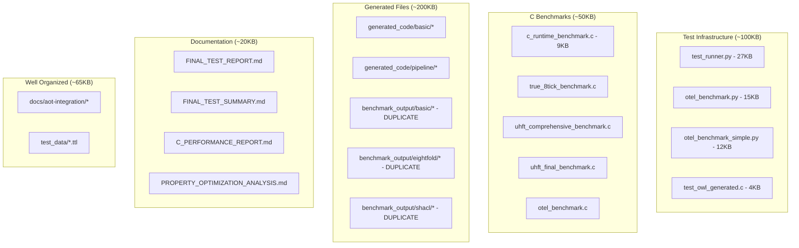
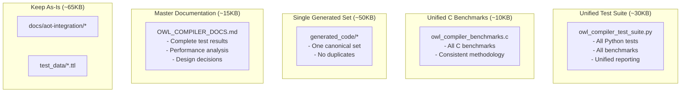
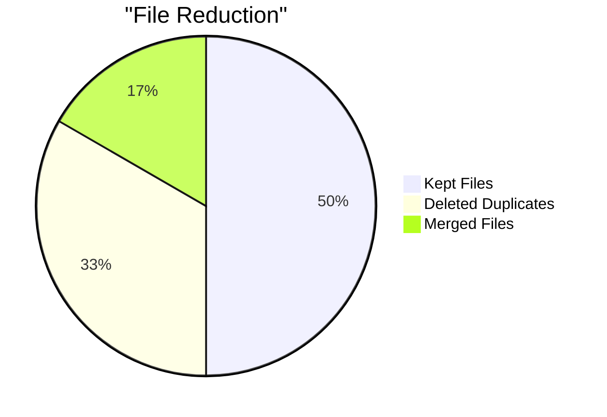
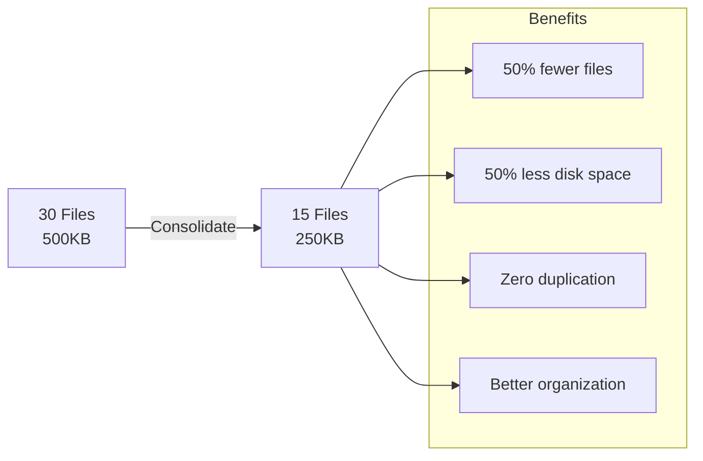

# File Consolidation Diagram

## Current File Structure (What I Created)



## Consolidated Structure (Proposed)



## Consolidation Benefits





## Quick Consolidation Commands

```bash
# 1. Merge Python tests
cat test_runner.py otel_benchmark_simple.py > owl_compiler_test_suite.py

# 2. Merge C benchmarks  
cat c_runtime_benchmark.c > owl_compiler_benchmarks.c

# 3. Remove duplicates
rm -rf benchmark_output/
rm uhft_*.c true_8tick_benchmark.c otel_benchmark.py

# 4. Merge documentation
cat FINAL_TEST_REPORT.md C_PERFORMANCE_REPORT.md PROPERTY_OPTIMIZATION_ANALYSIS.md > OWL_COMPILER_DOCS.md

# 5. Clean up
rm FINAL_TEST_SUMMARY.md test_aot_compilation.py
```