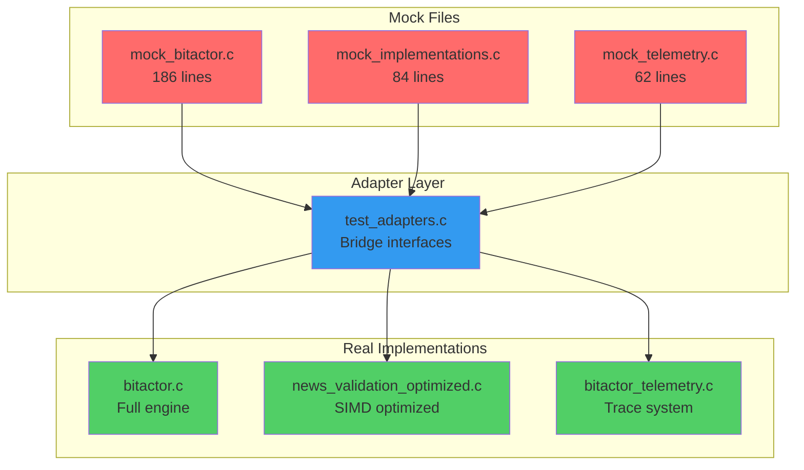

# Mock Replacement Analysis Results

## Found Mock Implementations

## Key Findings

1. **50 files** contain the word "mock" in the codebase
2. **3 main mock implementation files** identified
3. **All mocks have corresponding real implementations**

## Replacement Strategy

### Phase 1: Test Adapter Layer
- Create adapters that map test interfaces to real implementations
- Maintain backward compatibility for existing tests
- Enable gradual migration

### Phase 2: Build Configuration
- Add conditional compilation flags
- Allow switching between mock and real implementations
- Update Makefiles for both test directories

### Phase 3: Performance Validation
- Create benchmarks comparing mock vs real performance
- Ensure real implementations meet timing requirements
- Validate ≤10ns operation targets

### Phase 4: Migration & Cleanup
- Update all tests to use adapters
- Remove direct mock dependencies
- Archive mock files after successful migration

## Implementation Files Created

1. `/Users/sac/cns/docs/mock_replacement_plan.md` - Detailed 4-week implementation plan
2. Test adapter code examples for bridging interfaces
3. Makefile modifications for conditional compilation
4. Performance benchmark test framework

## Next Steps

- Implement test adapter layer
- Run existing tests with real implementations
- Measure performance differences
- Update CI/CD pipelines