# CNS Testing Documentation

**Ultra-Low Latency Test-Driven Development for Real-Time Systems**

---

## 📋 Documentation Overview

This directory contains comprehensive testing documentation for the CNS (Chatman Nano Stack) project, designed for ultra-low latency systems with ≤8 CPU tick budgets and zero heap allocation requirements.

### 📚 Available Documents

| Document | Purpose | Audience |
|----------|---------|----------|
| **[TDD_BDD_Guide.md](TDD_BDD_Guide.md)** | Complete TDD/BDD methodology for C systems | Developers, QA Engineers |
| **[Performance_Testing_Guide.md](Performance_Testing_Guide.md)** | Nanosecond-precision performance validation | Performance Engineers, Architects |
| **[CNS_Test_Coverage_Plan.md](CNS_Test_Coverage_Plan.md)** | Comprehensive test coverage strategy | Project Managers, Technical Leads |

---

## 🚀 Quick Start

### 1. Set Up Coverage Infrastructure
```bash
# Run the coverage setup script
./scripts/setup_coverage.sh

# Include coverage Makefile
echo 'include Makefile.coverage' >> Makefile
```

### 2. Run Your First Coverage Report
```bash
# Build with coverage instrumentation
make coverage-build

# Run all tests with coverage collection
make coverage-test

# Generate HTML coverage report
make coverage-report

# View results
open coverage/reports/index.html
```

### 3. Check Coverage Status
```bash
# Overall summary
make coverage-summary

# Per-file analysis
./scripts/analyze_file_coverage.sh

# Coverage gate check
make coverage-check
```

---

## 🧪 Testing Framework Architecture

### Core Components

```
CNS Testing Framework
├── 📁 bitactor/tests/          # BitActor subsystem tests
│   ├── bdd_framework.h         # Lightweight BDD framework for C
│   ├── test_harness.h          # Performance test harness
│   └── test_bitactor_*.c       # Core BitActor functionality tests
├── 📁 tests/                   # Existing codebase tests
│   ├── test_cns_pipeline_bdd.c # Quote processing pipeline
│   ├── test_tick_parallel_bdd.c# Parallel execution engine
│   └── test_news_validator_bdd.c# News validation system
└── 📁 coverage/                # Coverage reports and data
    ├── reports/                # HTML coverage reports
    ├── profiles/               # Raw coverage profiles
    └── scripts/                # Coverage analysis tools
```

### Key Features

- **Zero-Overhead Testing**: Framework adds <1 CPU tick overhead
- **Statistical Analysis**: P99.999 latency validation with 100K+ samples
- **Memory Safety**: Validates zero heap allocation requirement
- **Cycle-Accurate Timing**: Uses `rdtsc()` for nanosecond precision
- **BDD in C**: Behavior-driven development without external dependencies

---

## 📊 Coverage Standards

### Current Status
- **Files with Tests**: 4/17 (23.5%)
- **Target Coverage**: ≥95% line coverage
- **Performance Constraint**: ≤8 CPU ticks for all critical paths

### Coverage Metrics

| Metric | Target | Critical | Tool |
|--------|--------|----------|------|
| **Line Coverage** | ≥95% | ≥90% | llvm-cov |
| **Function Coverage** | ≥98% | ≥95% | llvm-cov |
| **Branch Coverage** | ≥90% | ≥85% | llvm-cov |
| **MC/DC Coverage** | ≥85% | ≥80% | clang -fcoverage-mcdc |

### Priority Files for Testing

#### 🔴 Critical Priority
1. `src/cns/bitactor.c` (187 lines) - Core BitActor engine
2. `src/cns/bitactor_integration.c` (201 lines) - Integration layer
3. `src/sparql/sparql_parser.c` (161 lines) - SPARQL parsing

#### 🟠 High Priority
4. `src/cns/bitactor_parallel.c` (137 lines) - Parallel processing
5. `src/cns/bitfiber.c` (132 lines) - Fiber scheduling
6. `src/news/news_validator_demo.c` (180 lines) - News validation examples

---

## 🔧 Development Workflow

### TDD Red-Green-Refactor Cycle

```mermaid
graph LR
    A[🔴 Red<br/>Write failing test] --> B[🟢 Green<br/>Make test pass]
    B --> C[🔵 Refactor<br/>Improve code]
    C --> A
```


### BDD Scenario Structure
```c
SCENARIO("High-frequency signals meet 8-tick budget") {
    bitactor_engine_t* engine;
    uint64_t processing_time;
    
    GIVEN("a BitActor engine is initialized",
        engine = bitactor_init();
        EXPECT(engine != NULL);
    );
    
    WHEN("a high-priority signal is processed",
        signal_t signal = BUILD_SIGNAL(.priority = 255);
        uint64_t start = rdtsc_portable();
        bitactor_tick(engine, &signal);
        processing_time = rdtsc_portable() - start;
    );
    
    THEN("processing completes within 8 ticks",
        EXPECT_LT(processing_time, 9);
    );
} END_SCENARIO
```

---

## 📈 Performance Testing

### Latency Requirements
- **P50**: ≤6 ticks
- **P99**: ≤7 ticks  
- **P99.999**: ≤8 ticks (Critical)
- **Throughput**: ≥500K signals/sec

### Memory Requirements
- **Post-initialization**: 0 bytes heap allocation
- **Total footprint**: <128KB static memory
- **Cache alignment**: All critical structures 64-byte aligned

### Measurement Techniques
```c
// Cycle-accurate timing
static inline uint64_t rdtsc_portable(void) {
#if defined(__x86_64__)
    unsigned int lo, hi;
    __asm__ __volatile__ ("rdtsc" : "=a"(lo), "=d"(hi));
    return ((uint64_t)hi << 32) | lo;
#elif defined(__aarch64__)
    uint64_t val;
    __asm__ __volatile__ ("mrs %0, cntvct_el0" : "=r" (val));
    return val;
#endif
}

// Statistical analysis with outlier filtering
latency_stats_t measure_latency_distribution(
    void (*test_func)(void), 
    int samples
);
```

---

## 🛠️ Tools and Integration

### Coverage Tools
- **Primary**: LLVM source-based coverage (`clang -fcoverage-mapping`)
- **Fallback**: GCC gcov (`gcc --coverage`)
- **Analysis**: llvm-cov, llvm-profdata
- **CI/CD**: GitHub Actions with Codecov integration

### Development Commands
```bash
# Quick file coverage check
./scripts/quick_coverage.sh bitactor.c

# Coverage diff between branches
./scripts/coverage_diff.sh master feature-branch

# Generate coverage badge
./scripts/generate_coverage_badge.sh
```

### Build System Integration
```makefile
# Include in main Makefile
include Makefile.coverage

# Available targets
coverage-build    # Build with instrumentation
coverage-test     # Run tests with coverage
coverage-report   # Generate HTML report
coverage-check    # Validate coverage gates
coverage-summary  # Text summary
```

---

## 🎯 Best Practices

### Test Design
1. **Single Responsibility**: Each test validates one behavior
2. **Performance Aware**: All tests respect 8-tick budget
3. **Memory Safe**: No heap allocation during tests
4. **Deterministic**: 100% reproducible results
5. **Statistical**: Use large sample sizes for latency tests

### Code Coverage
1. **Comprehensive**: Target 95%+ line coverage
2. **Meaningful**: Focus on critical execution paths
3. **Maintainable**: Automated coverage gate checking
4. **Actionable**: Clear reporting of uncovered areas
5. **Integrated**: Coverage validation in CI/CD pipeline

### Documentation
1. **Self-Documenting**: Tests serve as executable specifications
2. **Performance Metrics**: Document all timing constraints
3. **Coverage Reports**: Regular coverage trend analysis
4. **Risk Assessment**: Document coverage exclusions with rationale

---

## 📊 Legacy Testing Infrastructure

### Python Tests (Legacy)
- `test_pipeline_validator_crash.py` - Pipeline validator error handling
- `test_validate_otel_crash.py` - OTEL validation errors
- `test_cns_monitor_crash.py` - Performance monitor errors
- `test_crash_behavior.py` - Crash behavior verification

### C Tests (Legacy)
- `test_c_crash.c` - C error handling demonstration

### Legacy Quick Start
```bash
# Install test dependencies
uv add pytest-asyncio --dev

# Run all tests
uv run pytest

# Run crash tests specifically
uv run pytest test_*_crash.py -v
```

---

## 🔍 Troubleshooting

### Common Issues

**Coverage data not found**
```bash
# Ensure tests have been run with coverage
make coverage-test
```

**Coverage tools not found**
```bash
# Install LLVM toolchain
brew install llvm  # macOS
apt install clang llvm  # Ubuntu
```

**Tests exceed 8-tick budget**
```bash
# Check for non-optimized debug builds
make clean && make coverage-build
```

**Memory allocation detected**
```bash
# Run under Valgrind to identify allocations
valgrind --tool=massif ./test_program
```

---

## 📞 Support and Contributing

### Getting Help
- Check existing test examples in `bitactor/tests/`
- Review BDD framework documentation in `bdd_framework.h`
- Run `./scripts/analyze_file_coverage.sh` for coverage gaps

### Contributing Tests
1. Follow existing BDD patterns
2. Ensure tests meet 8-tick budget
3. Validate zero heap allocation
4. Include performance measurements
5. Update coverage documentation

---

This documentation provides everything needed to implement, maintain, and extend CNS's ultra-low latency testing infrastructure while achieving comprehensive test coverage.