# Test-Driven Development (TDD) & Behavior-Driven Development (BDD) Guide

## CNS High-Performance Systems Testing

**Version:** 1.0  
**Date:** July 23, 2025  
**Audience:** CNS Development Team

---

## 📋 Table of Contents

1. [Introduction](#introduction)
2. [TDD Fundamentals](#tdd-fundamentals)
3. [BDD Fundamentals](#bdd-fundamentals)
4. [CNS Implementation](#cns-implementation)
5. [Performance Testing](#performance-testing)
6. [Best Practices](#best-practices)
7. [Tools & Frameworks](#tools--frameworks)
8. [Examples](#examples)

---

## Introduction

This guide covers Test-Driven Development (TDD) and Behavior-Driven Development (BDD) as implemented in the CNS (Chatman Nano Stack) project. CNS has unique requirements:

- **Ultra-low latency**: ≤8 CPU tick budget
- **Zero allocation**: No heap usage post-initialization
- **Deterministic execution**: Predictable, branchless code paths
- **Real-time constraints**: Hard deadlines with no jitter

### Why TDD/BDD for High-Performance Systems?

Traditional testing approaches often fail in high-performance scenarios because:
- Heavy frameworks introduce overhead
- Mocking libraries allocate memory
- Test runners add unpredictable delays
- Assertions can cause branches

Our lightweight approach solves these problems while maintaining the benefits of test-driven development.

---

## TDD Fundamentals

### The Red-Green-Refactor Cycle

```mermaid
graph LR
    A[🔴 Red<br/>Write failing test] --> B[🟢 Green<br/>Make test pass]
    B --> C[🔵 Refactor<br/>Improve code]
    C --> A
```



### TDD Principles for CNS

1. **Write tests first** - Define behavior before implementation
2. **Minimal code** - Write just enough to pass the test
3. **Refactor safely** - Tests provide safety net
4. **Fast feedback** - Tests run in microseconds, not seconds

### TDD Test Structure

```c
bool test_8tick_budget_enforcement(char* error_msg) {
    // Arrange
    bitactor_context_t ctx;
    bitactor_init(&ctx);
    signal_t signal = {.kind = 0x01, .payload = 0xDEAD};
    
    // Act
    uint64_t start = rdtsc();
    result_t result = bitactor_tick(&ctx, &signal);
    uint64_t ticks = rdtsc() - start;
    
    // Assert
    TEST_ASSERT_LE(ticks, 8, "Execution exceeded 8-tick budget");
    TEST_ASSERT_EQ(result.status, STATUS_SUCCESS, "Operation failed");
    
    return true;
}
```

### TDD Benefits for CNS

- **Performance Validation**: Each test verifies tick budget compliance
- **Memory Safety**: Tests catch allocation violations immediately
- **Regression Prevention**: Changes can't break existing guarantees
- **Documentation**: Tests serve as executable specifications

---

## BDD Fundamentals

### The Three Amigos

BDD involves collaboration between:
- **Business Analyst**: Defines requirements
- **Developer**: Implements features
- **Tester**: Validates behavior

### BDD Language: Gherkin Style

```gherkin
Feature: BitActor Signal Processing
  As a CNS system operator
  I want signals processed deterministically
  So that I can guarantee real-time behavior

  Scenario: Process signal within tick budget
    Given a BitActor engine is initialized
    When I send a high-priority signal
    Then processing completes in 8 ticks or less
    And the result contains valid execution metadata
```

### BDD in C Implementation

```c
FEATURE(BitActor_Signal_Processing) {
    
    SCENARIO("Process signal within tick budget") {
        bitactor_engine_t* engine;
        signal_t signal;
        result_t result;
        uint64_t ticks;
        
        GIVEN("a BitActor engine is initialized",
            engine = bitactor_init();
            EXPECT(engine != NULL);
        );
        
        WHEN("I send a high-priority signal",
            signal = BUILD_SIGNAL(.priority = 255, .payload = 0xCAFE);
            uint64_t start = rdtsc_portable();
            result = bitactor_tick(engine, &signal);
            ticks = rdtsc_portable() - start;
        );
        
        THEN("processing completes in 8 ticks or less",
            EXPECT_LT(ticks, 9);
            EXPECT_EQ(result.status, BITACTOR_OK);
        );
    } END_SCENARIO
}
```

---

## CNS Implementation

### Test Architecture

```
CNS Testing Framework
├── Core TDD Tests (bitactor/tests/)
│   ├── test_bitactor_core.c      # Functional requirements
│   ├── test_compiler.c           # Compilation pipeline
│   ├── test_telemetry.c          # Trace reversibility
│   ├── test_memory.c             # Zero-allocation verification
│   └── test_performance.c        # Latency benchmarks
├── BDD Specifications (bitactor/tests/)
│   ├── test_bitactor_bdd.c       # Core behavior
│   ├── test_performance_bdd.c    # Performance requirements
│   └── test_telemetry_bdd.c      # Audit specifications
└── Existing Code Tests (tests/)
    ├── test_cns_pipeline_bdd.c   # Quote processing
    ├── test_tick_parallel_bdd.c  # Execution engine
    └── test_news_validator_bdd.c # News validation
```

### Custom Test Framework

We built a lightweight framework optimized for CNS requirements:

```c
// Zero-overhead test runner
#define RUN_TEST(test_func) do { \
    test_result_t* result = &results[test_count]; \
    result->start_ticks = rdtsc(); \
    result->passed = test_func(&result->message[0]); \
    result->end_ticks = rdtsc(); \
    /* Process results */ \
} while(0)

// BDD macros with inline execution
#define GIVEN(desc, ...) \
    printf("   Given %s\n", desc); \
    __VA_ARGS__;

#define WHEN(desc, ...) \
    printf("   When %s\n", desc); \
    __VA_ARGS__;

#define THEN(desc, ...) \
    printf("   Then %s\n", desc); \
    __VA_ARGS__;
```

### Performance Measurement

```c
// Cycle-accurate timing
static inline uint64_t rdtsc_portable(void) {
#if defined(__x86_64__) || defined(__i386__)
    unsigned int lo, hi;
    __asm__ __volatile__ ("rdtsc" : "=a"(lo), "=d"(hi));
    return ((uint64_t)hi << 32) | lo;
#elif defined(__aarch64__)
    uint64_t val;
    __asm__ __volatile__ ("mrs %0, cntvct_el0" : "=r" (val));
    return val;
#endif
}

// Statistical analysis
void analyze_latency_distribution(uint64_t* samples, int count) {
    // Sort and calculate percentiles
    uint64_t p50 = samples[count / 2];
    uint64_t p99 = samples[(int)(count * 0.99)];
    uint64_t p999 = samples[(int)(count * 0.999)];
    uint64_t p9999 = samples[(int)(count * 0.9999)];
    uint64_t p99999 = samples[count - 1];
    
    // Verify all meet requirements
    assert(p99999 <= 8); // P99.999 within 8 ticks
}
```

---

## Performance Testing

### Latency Requirements

| Metric | Target | Validation Method |
|--------|--------|-------------------|
| P50 Latency | ≤ 6 ticks | Statistical sampling |
| P99 Latency | ≤ 7 ticks | 10,000 sample analysis |
| P99.999 Latency | ≤ 8 ticks | Critical requirement |
| Throughput | ≥ 500K signals/sec | Sustained load testing |
| Memory | 0 bytes post-init | Valgrind verification |

### Performance Test Example

```c
SCENARIO("P99.999 latency remains under 8 CPU ticks") {
    bitactor_engine_t* engine;
    uint64_t* samples;
    uint64_t p99999;
    
    GIVEN("a warmed-up BitActor engine",
        engine = bitactor_init();
        samples = malloc(LATENCY_SAMPLES * sizeof(uint64_t));
        
        // Warmup phase
        for (int i = 0; i < 1000; i++) {
            signal_t warmup = BUILD_SIGNAL(.kind = 0x01);
            bitactor_tick(engine, &warmup);
        }
    );
    
    WHEN("10,000 signal processing latencies are measured",
        for (int i = 0; i < LATENCY_SAMPLES; i++) {
            signal_t sig = BUILD_SIGNAL(.kind = i % 4, .payload = i);
            
            uint64_t start = rdtsc_portable();
            bitactor_tick(engine, &sig);
            uint64_t end = rdtsc_portable();
            
            samples[i] = end - start;
        }
        
        sort_samples(samples, LATENCY_SAMPLES);
        p99999 = samples[LATENCY_SAMPLES - 1];
    );
    
    THEN("P99.999 latency meets strict requirements",
        printf("     P99.999: %lu ticks\n", p99999);
        EXPECT_LT(p99999, 9); // Critical requirement
    );
} END_SCENARIO
```

### Memory Verification

```c
SCENARIO("Zero heap allocation after initialization") {
    size_t heap_before, heap_after;
    
    GIVEN("memory usage is tracked before initialization",
        heap_before = get_heap_usage();
    );
    
    WHEN("BitActor processes 10,000 signals",
        bitactor_engine_t* engine = bitactor_init();
        
        for (int i = 0; i < 10000; i++) {
            signal_t sig = BUILD_SIGNAL(.payload = i);
            bitactor_tick(engine, &sig);
        }
        
        heap_after = get_heap_usage();
    );
    
    THEN("no additional heap memory is allocated",
        EXPECT_EQ(heap_after - heap_before, 0);
    );
} END_SCENARIO
```

---

## Best Practices

### TDD Best Practices

1. **Start with failing tests**
   ```c
   // Write this first - it should fail
   TEST_ASSERT_LT(process_signal(), 8);
   ```

2. **Keep tests focused**
   ```c
   // Good: Tests one thing
   bool test_signal_validation(char* error_msg) {
       signal_t invalid = {.price = 0};
       EXPECT_EQ(validate_signal(&invalid), INVALID);
   }
   
   // Bad: Tests multiple things
   bool test_everything(char* error_msg) {
       // Tests validation, processing, formatting, etc.
   }
   ```

3. **Use descriptive names**
   ```c
   // Good
   bool test_invalid_quotes_are_rejected_immediately(char* error_msg)
   
   // Bad
   bool test_quotes(char* error_msg)
   ```

4. **Test edge cases**
   ```c
   // Test boundary conditions
   TEST_ASSERT_EQ(process_max_price(UINT64_MAX), SUCCESS);
   TEST_ASSERT_EQ(process_zero_volume(0), INVALID);
   ```

### BDD Best Practices

1. **Use business language**
   ```c
   SCENARIO("High-frequency trading orders are processed immediately")
   // Not: "Function returns 0 when input is valid"
   ```

2. **Focus on behavior, not implementation**
   ```c
   THEN("the order is sent to the exchange")
   // Not: "the tx_ring buffer contains the order data"
   ```

3. **Keep scenarios independent**
   ```c
   GIVEN("a fresh engine instance") // Don't rely on previous scenarios
   ```

4. **Use meaningful test data**
   ```c
   signal_t trading_signal = BUILD_SIGNAL(
       .symbol = "AAPL",
       .price = 150000,  // $1500.00
       .volume = 100
   );
   ```

### Performance Testing Best Practices

1. **Warm up before measuring**
   ```c
   // CPU cache warm-up
   for (int i = 0; i < 1000; i++) {
       bitactor_tick(engine, &warmup_signal);
   }
   ```

2. **Use statistical analysis**
   ```c
   // Don't just test once
   for (int i = 0; i < 10000; i++) {
       samples[i] = measure_latency();
   }
   analyze_distribution(samples, 10000);
   ```

3. **Test under realistic load**
   ```c
   // Simulate burst traffic
   for (int i = 0; i < 1000; i++) {
       bitactor_enqueue(engine, &signals[i]);
   }
   uint64_t start = rdtsc();
   bitactor_drain(engine, 1000);
   uint64_t duration = rdtsc() - start;
   ```

4. **Verify determinism**
   ```c
   // Same input should produce same output
   result_t result1 = process_signal(&signal);
   result_t result2 = process_signal(&signal);
   EXPECT_EQ(result1.hash, result2.hash);
   ```

---

## Tools & Frameworks

### CNS Test Framework

**Location**: `bitactor/tests/bdd_framework.h`

**Key Features**:
- Zero runtime overhead
- Inline macro execution
- Cycle-accurate timing
- Statistical analysis
- Memory tracking

**Usage**:
```c
#include "bdd_framework.h"

FEATURE(My_Component) {
    SCENARIO("Behavior description") {
        GIVEN("preconditions", /* setup code */);
        WHEN("action occurs", /* test action */);
        THEN("expected result", /* assertions */);
    } END_SCENARIO
}
```

### Build System Integration

**Makefile targets**:
```makefile
# Traditional TDD tests
test: $(TESTS)
	./run_tests.sh

# BDD specifications  
test-bdd: $(BDD_TESTS)
	@for test in $(BDD_TESTS); do ./$$test; done

# Performance validation
test-perf: test_performance
	./test_performance | grep "P99.999 <= 8"

# Memory verification
test-memory: test_bitactor_core
	valgrind --tool=massif ./test_bitactor_core
```

### CI/CD Integration

**GitHub Actions** (`.github/workflows/bitactor-ci.yml`):
```yaml
- name: Run TDD Tests
  run: |
    cd bitactor/tests
    make test

- name: Run BDD Specifications  
  run: |
    cd bitactor/tests
    make test-bdd

- name: Performance Gate Check
  run: |
    if ! ./test_performance | grep -q "P99.999=[0-8]"; then
      echo "❌ P99.999 latency exceeds 8 ticks!"
      exit 1
    fi
```

### External Tools

**Recommended tools**:
- **Valgrind**: Memory analysis (`--tool=massif`)
- **Perf**: CPU profiling (`perf stat`, `perf record`)
- **objdump**: Assembly analysis (branch detection)
- **Cachegrind**: Cache performance analysis

---

## Examples

### Complete TDD Example

```c
// test_quote_validation.c
#include "test_harness.h"
#include "cns_pipeline.h"

// Test 1: Red phase - write failing test
bool test_quote_validation_rejects_zero_price(char* error_msg) {
    quote_t invalid_quote = {.symbol = 0x41414141, .price = 0, .volume = 100};
    
    op_validate_quote(&invalid_quote);
    
    TEST_ASSERT_EQ(invalid_quote.timestamp, 0, "Zero price should invalidate quote");
    return true;
}

// Test 2: Green phase - minimal implementation passes
void op_validate_quote(void* data) {
    quote_t* quote = (quote_t*)data;
    if (quote->price == 0) {
        quote->timestamp = 0;  // Mark as invalid
    }
}

// Test 3: Refactor phase - improve implementation
void op_validate_quote(void* data) {
    quote_t* quote = (quote_t*)data;
    if (quote->price == 0 || quote->volume == 0) {
        quote->timestamp = 0;  // Mark as invalid
    }
}
```

### Complete BDD Example

```c
// test_trading_pipeline_bdd.c
#include "bdd_framework.h"
#include "cns_pipeline.h"

FEATURE(Ultra_High_Frequency_Trading_Pipeline) {
    
    SCENARIO("Market maker quote generates immediate response") {
        quote_t market_quote;
        order_t generated_order;
        uint64_t processing_time;
        
        GIVEN("a valid market maker quote is received",
            market_quote = (quote_t){
                .symbol = 0x53505958,  // "SPY"
                .price = 450000,       // $4500.00
                .volume = 1000,
                .timestamp = get_market_time()
            };
        );
        
        WHEN("the quote is processed through the trading pipeline",
            uint64_t start = rdtsc_portable();
            process_quote_8tick(&market_quote);
            processing_time = rdtsc_portable() - start;
            
            generated_order = get_last_generated_order();
        );
        
        THEN("processing completes within the 8-tick budget",
            EXPECT_LT(processing_time, 9);
            printf("       Processing time: %llu ticks\n", processing_time);
        );
        
        AND("a valid trading order is generated",
            EXPECT_EQ(generated_order.symbol, market_quote.symbol);
            EXPECT_GT(generated_order.price, 0);
            EXPECT_GT(generated_order.quantity, 0);
        );
        
        AND("the order contains proper risk management flags",
            EXPECT(generated_order.flags & RISK_CHECKED);
            EXPECT(generated_order.flags & LIMIT_ORDER);
        );
    } END_SCENARIO
    
    SCENARIO("System maintains performance under market stress") {
        const int STRESS_QUOTES = 10000;
        quote_t quotes[STRESS_QUOTES];
        uint64_t max_latency = 0;
        uint64_t total_latency = 0;
        
        GIVEN("a high-volume stream of market quotes",
            for (int i = 0; i < STRESS_QUOTES; i++) {
                quotes[i] = generate_realistic_quote(i);
            }
        );
        
        WHEN("all quotes are processed under stress conditions",
            for (int i = 0; i < STRESS_QUOTES; i++) {
                uint64_t start = rdtsc_portable();
                process_quote_8tick(&quotes[i]);
                uint64_t latency = rdtsc_portable() - start;
                
                total_latency += latency;
                if (latency > max_latency) {
                    max_latency = latency;
                }
            }
        );
        
        THEN("maximum latency stays within bounds",
            printf("       Max latency: %llu ticks\n", max_latency);
            printf("       Avg latency: %llu ticks\n", total_latency / STRESS_QUOTES);
            EXPECT_LT(max_latency, 9);
        );
        
        AND("average performance remains efficient",
            uint64_t avg_latency = total_latency / STRESS_QUOTES;
            EXPECT_LT(avg_latency, 6);
        );
        
        AND("system maintains deterministic behavior",
            // Process same quote twice
            quote_t test_quote = quotes[0];
            uint64_t result1 = hash_order_result(process_quote_8tick(&test_quote));
            
            test_quote = quotes[0]; // Reset
            uint64_t result2 = hash_order_result(process_quote_8tick(&test_quote));
            
            EXPECT_EQ(result1, result2);
        );
    } END_SCENARIO
}
```

### Memory Safety Example

```c
FEATURE(Memory_Safety_Guarantees) {
    
    SCENARIO("System operates with zero heap allocation") {
        size_t heap_before, heap_after;
        bitactor_engine_t* engine;
        
        GIVEN("baseline memory usage is measured",
            heap_before = get_heap_usage();
        );
        
        WHEN("the system processes a full trading session",
            engine = bitactor_init();
            
            // Simulate 1 million operations
            for (int i = 0; i < 1000000; i++) {
                signal_t signal = generate_market_signal(i);
                bitactor_tick(engine, &signal);
                
                if (i % 100000 == 0) {
                    printf("       Processed %d signals...\n", i);
                }
            }
            
            heap_after = get_heap_usage();
        );
        
        THEN("no heap memory is allocated during operation",
            printf("       Heap before: %zu bytes\n", heap_before);
            printf("       Heap after:  %zu bytes\n", heap_after);
            EXPECT_EQ(heap_after, heap_before);
        );
        
        AND("all operations completed successfully",
            // Verify system is still responsive
            signal_t test_signal = BUILD_SIGNAL(.kind = 0x01);
            result_t result = bitactor_tick(engine, &test_signal);
            EXPECT_EQ(result.status, BITACTOR_OK);
        );
    } END_SCENARIO
}
```

---

## Conclusion

This TDD/BDD approach enables CNS to maintain both high code quality and extreme performance. The key insights are:

1. **Testing doesn't have to be slow** - Our framework adds virtually zero overhead
2. **Behavior matters more than implementation** - BDD keeps focus on user needs
3. **Performance is measurable** - Every test validates real-time constraints
4. **Safety and speed can coexist** - Comprehensive testing at nanosecond precision

The combination of TDD discipline and BDD clarity, implemented with performance-aware tooling, creates a robust foundation for ultra-high-frequency systems.

---

**Next Steps**: 
- Review existing tests for coverage gaps
- Extend BDD scenarios for new features
- Integrate performance regression detection
- Add property-based testing for edge cases