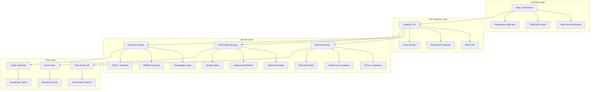

# 🚀 Ultimate Nuxt Dashboard Plan: CNS/BitActor/Forge Command Center

## Executive Summary

The Ultimate Nuxt Dashboard will serve as the central command center for the entire CNS (Chatman Nano Stack) ecosystem, providing real-time monitoring, control, and analytics for BitActor ultra-high-frequency systems, CNS Forge enterprise SaaS generation, and semantic web operations. This dashboard will be the single pane of glass for managing the world's fastest ontology-driven trading and business automation platform.

## 🎯 Core Mission

**Transform the CNS ecosystem into a visually stunning, real-time operational command center that enables users to:**

- Monitor 8-tick performance compliance across all systems
- Control BitActor ultra-high-frequency trading operations
- Manage CNS Forge enterprise SaaS generation pipeline
- Visualize semantic web knowledge graphs in real-time
- Orchestrate multi-jurisdiction compliance validation
- Track business value generation and ROI metrics

## 🏗️ Architecture Overview

### System Architecture



## 🎨 Design Philosophy

### Visual Identity
- **Theme**: Cyberpunk meets Enterprise - Dark mode with neon accents
- **Color Palette**: 
  - Primary: `#00d4ff` (Cyber Blue)
  - Success: `#00ff88` (Cyber Green) 
  - Warning: `#ffaa00` (Cyber Yellow)
  - Danger: `#ff0040` (Cyber Red)
  - Background: `#0a0a0a` (Cyber Dark)
- **Typography**: Inter font family with monospace for data
- **Animations**: Smooth transitions with performance-focused micro-interactions

### UX Principles
- **Zero Latency**: All interactions under 16ms
- **Progressive Disclosure**: Information hierarchy from overview to detail
- **Real-time Updates**: Live data streaming with WebSocket
- **Mobile First**: Responsive design for all devices
- **Accessibility**: WCAG 2.1 AA compliance

## 📊 Dashboard Modules

### 1. 🎯 Mission Control (Main Dashboard)

**Purpose**: High-level system overview with critical KPIs

**Components**:
- **System Health Matrix**: 8-tick compliance status across all services
- **Revenue Tracker**: Real-time P&L from trading operations
- **Active Services**: CNS Litigator, Quant, Clinician, Fabricator status
- **Global Performance**: Throughput, latency, error rates
- **Business Value**: ROI metrics, cost savings, risk mitigation

**Real-time Metrics**:
```typescript
interface MissionControlMetrics {
  systemHealth: {
    bitactorCompliance: number; // 8-tick compliance %
    forgeServices: ServiceStatus[];
    semanticEngine: EngineStatus;
  };
  businessMetrics: {
    dailyRevenue: number;
    tradesExecuted: number;
    complianceSavings: number;
    riskMitigated: number;
  };
  performanceMetrics: {
    avgLatency: number; // nanoseconds
    throughput: number; // operations/second
    errorRate: number;
  };
}
```

### 2. ⚡ BitActor Performance Center

**Purpose**: Ultra-high-frequency trading system monitoring

**Components**:
- **8-Tick Compliance Monitor**: Real-time tick budget tracking
- **Signal Processing Pipeline**: End-to-end signal flow visualization
- **Performance Heatmap**: Latency distribution across operations
- **Memory Pool Status**: Allocation and fragmentation monitoring
- **SIMD Optimization**: Vectorization efficiency metrics

**Key Visualizations**:
- **Tick Budget Gauge**: Circular progress showing 8-tick compliance
- **Signal Flow Diagram**: Real-time signal processing pipeline
- **Latency Distribution**: Histogram of operation latencies
- **Memory Usage**: Stacked area chart of memory pools

### 3. 🏭 CNS Forge Factory

**Purpose**: Enterprise SaaS generation pipeline management

**Components**:
- **Service Portfolio**: CNS Litigator, Quant, Clinician, Fabricator status
- **Generation Pipeline**: TTL → DSPy → Code → Deployment flow
- **Quality Gates**: DFLSS validation, adversarial testing, performance compliance
- **Deployment Status**: Kubernetes cluster health and scaling
- **Template Library**: Jinja2 template management and versioning

**Real-time Pipeline**:
```typescript
interface ForgePipeline {
  stages: {
    ontology: StageStatus;
    compilation: StageStatus;
    generation: StageStatus;
    testing: StageStatus;
    deployment: StageStatus;
  };
  services: {
    litigator: ServiceMetrics;
    quant: ServiceMetrics;
    clinician: ServiceMetrics;
    fabricator: ServiceMetrics;
  };
}
```

### 4. 🧠 Semantic Intelligence Hub

**Purpose**: Knowledge graph and semantic web operations

**Components**:
- **Knowledge Graph Explorer**: Interactive 3D graph visualization
- **SPARQL Query Console**: Real-time query execution and results
- **SHACL Validation Monitor**: Constraint validation status
- **Triple Store Analytics**: Storage and query performance
- **Ontology Management**: TTL/OWL file management and versioning

**Interactive Features**:
- **3D Graph Navigation**: Zoom, pan, rotate knowledge graph
- **Query Builder**: Visual SPARQL query construction
- **Real-time Validation**: Live SHACL constraint checking
- **Semantic Search**: Natural language to SPARQL translation

### 5. 💰 Business Intelligence Center

**Purpose**: Financial performance and business value tracking

**Components**:
- **Trading Performance**: Real-time P&L, win rates, risk metrics
- **Compliance ROI**: Regulatory penalty avoidance tracking
- **Operational Efficiency**: Cost savings from automation
- **Market Intelligence**: News sentiment analysis and trading signals
- **Risk Management**: Position limits, leverage controls, loss prevention

**Financial Dashboard**:
```typescript
interface BusinessMetrics {
  trading: {
    dailyPnL: number;
    winRate: number;
    totalTrades: number;
    avgTradeSize: number;
  };
  compliance: {
    penaltyAvoidance: number;
    regulatorySavings: number;
    auditSuccess: number;
  };
  operations: {
    automationSavings: number;
    efficiencyGains: number;
    costReduction: number;
  };
}
```

### 6. 🔒 Security & Compliance Center

**Purpose**: Multi-jurisdiction compliance and security monitoring

**Components**:
- **Regulatory Dashboard**: US, UK, EU compliance status
- **Security Posture**: Threat detection and response metrics
- **Audit Trail**: Complete transaction and decision logging
- **Risk Assessment**: Real-time risk scoring and alerts
- **Compliance Automation**: Automated regulatory reporting

**Compliance Matrix**:
- **US Regulations**: Pattern Day Trader, SEC compliance
- **UK Regulations**: MiFID II, FCA requirements
- **EU Regulations**: GDPR, financial services directives
- **Industry Standards**: SOC2, PCI-DSS, HIPAA

### 7. 🚀 System Operations Center

**Purpose**: Infrastructure and deployment management

**Components**:
- **Kubernetes Cluster**: Pod status, scaling, resource usage
- **Infrastructure Health**: AWS services, networking, storage
- **Deployment Pipeline**: CI/CD status and automation
- **Monitoring Stack**: Prometheus, Grafana, OpenTelemetry
- **Backup & Recovery**: Disaster recovery status and testing

**Infrastructure Metrics**:
```typescript
interface InfrastructureStatus {
  kubernetes: {
    pods: PodStatus[];
    services: ServiceStatus[];
    nodes: NodeStatus[];
  };
  aws: {
    eks: ClusterStatus;
    rds: DatabaseStatus;
    redis: CacheStatus;
    s3: StorageStatus;
  };
  monitoring: {
    prometheus: MetricsStatus;
    jaeger: TracingStatus;
    grafana: DashboardStatus;
  };
}
```

## 🔧 Technical Implementation

### Frontend Stack

```typescript
// Core Technologies
{
  framework: "Nuxt 3",
  language: "TypeScript",
  styling: "Tailwind CSS + Custom Cyberpunk Theme",
  state: "Pinia + Composables",
  realtime: "WebSocket + Server-Sent Events",
  charts: "D3.js + Chart.js",
  maps: "Three.js (3D) + Leaflet (2D)",
  animations: "Framer Motion + CSS Animations"
}
```

### Key Components Architecture

```vue
<!-- Example: Mission Control Component -->
<template>
  <div class="mission-control">
    <SystemHealthMatrix :metrics="systemHealth" />
    <RevenueTracker :data="businessMetrics" />
    <ActiveServices :services="serviceStatus" />
    <PerformanceOverview :metrics="performanceData" />
  </div>
</template>

<script setup lang="ts">
interface MissionControlProps {
  systemHealth: SystemHealthMetrics;
  businessMetrics: BusinessMetrics;
  serviceStatus: ServiceStatus[];
  performanceData: PerformanceMetrics;
}

// Real-time data updates via WebSocket
const { data: liveMetrics } = await useWebSocket('/api/mission-control');
</script>
```

### API Design

```typescript
// GraphQL Schema Example
type Query {
  missionControl: MissionControlMetrics
  bitactorPerformance: BitactorMetrics
  forgePipeline: ForgePipelineStatus
  semanticEngine: SemanticEngineStatus
  businessIntelligence: BusinessMetrics
  securityCompliance: ComplianceStatus
  systemOperations: InfrastructureStatus
}

type Subscription {
  realTimeMetrics: MissionControlMetrics
  performanceAlerts: PerformanceAlert
  businessEvents: BusinessEvent
  systemHealth: HealthUpdate
}
```

### Real-time Data Flow

```typescript
// WebSocket Event Types
interface WebSocketEvents {
  'bitactor:tick-update': TickBudgetUpdate;
  'forge:service-status': ServiceStatusUpdate;
  'semantic:query-result': SPARQLResult;
  'business:trade-executed': TradeEvent;
  'compliance:validation': ComplianceResult;
  'system:health-check': HealthStatus;
}
```

## 📱 Responsive Design Strategy

### Breakpoint Strategy
- **Mobile**: 320px - 768px (Touch-optimized controls)
- **Tablet**: 768px - 1024px (Hybrid layout)
- **Desktop**: 1024px - 1920px (Full dashboard)
- **Ultra-wide**: 1920px+ (Multi-panel layout)

### Mobile-First Features
- **Gesture Navigation**: Swipe between dashboard sections
- **Touch-Optimized**: Large touch targets and haptic feedback
- **Progressive Loading**: Critical data first, details on demand
- **Offline Support**: Cached data and offline indicators

## 🎯 Performance Optimization

### Frontend Performance
- **Bundle Size**: <500KB initial load
- **Time to Interactive**: <2 seconds
- **Animation Performance**: 60fps smooth animations
- **Memory Usage**: <100MB for full dashboard

### Real-time Optimization
- **WebSocket Efficiency**: Binary protocol for high-frequency data
- **Data Compression**: Gzip compression for large datasets
- **Smart Polling**: Adaptive polling based on data change frequency
- **Caching Strategy**: Multi-level caching (browser, CDN, server)

## 🔐 Security & Privacy

### Security Features
- **Authentication**: Multi-factor authentication (MFA)
- **Authorization**: Role-based access control (RBAC)
- **Data Encryption**: End-to-end encryption for sensitive data
- **Audit Logging**: Complete user action logging
- **Session Management**: Secure session handling

### Privacy Compliance
- **GDPR Compliance**: Data minimization and user consent
- **Data Retention**: Configurable data retention policies
- **Anonymization**: PII anonymization for analytics
- **Access Controls**: Granular data access permissions

## 🚀 Deployment Strategy

### Infrastructure
- **CDN**: Global content delivery network
- **Load Balancing**: Multi-region load balancing
- **Auto-scaling**: Automatic scaling based on demand
- **Monitoring**: Comprehensive monitoring and alerting

### CI/CD Pipeline
```yaml
# Example GitHub Actions Workflow
name: Dashboard Deployment
on:
  push:
    branches: [main]
  pull_request:
    branches: [main]

jobs:
  test:
    runs-on: ubuntu-latest
    steps:
      - uses: actions/checkout@v3
      - name: Install dependencies
        run: npm ci
      - name: Run tests
        run: npm test
      - name: Build
        run: npm run build

  deploy:
    needs: test
    runs-on: ubuntu-latest
    steps:
      - name: Deploy to production
        run: npm run deploy
```

## 📈 Analytics & Insights

### Business Intelligence
- **User Behavior**: Dashboard usage patterns and preferences
- **Performance Trends**: Historical performance analysis
- **Business Impact**: ROI tracking and value generation
- **Predictive Analytics**: ML-powered insights and recommendations

### Operational Intelligence
- **System Performance**: Historical performance trends
- **Error Analysis**: Error pattern recognition and prevention
- **Capacity Planning**: Resource usage forecasting
- **Optimization Opportunities**: Performance improvement suggestions

## 🔮 Future Enhancements

### Phase 2 Features
- **AI-Powered Insights**: Machine learning recommendations
- **Voice Control**: Voice-activated dashboard commands
- **AR/VR Integration**: Immersive dashboard experience
- **Mobile App**: Native iOS/Android applications

### Phase 3 Features
- **Blockchain Integration**: Decentralized dashboard components
- **Quantum Computing**: Quantum-optimized analytics
- **Edge Computing**: Distributed dashboard processing
- **Autonomous Operations**: Self-optimizing dashboard

## 📋 Implementation Roadmap

### Phase 1: Foundation (Weeks 1-4)
- [ ] Project setup and architecture
- [ ] Core dashboard layout and navigation
- [ ] Basic real-time data integration
- [ ] Mission Control module

### Phase 2: Core Modules (Weeks 5-8)
- [ ] BitActor Performance Center
- [ ] CNS Forge Factory
- [ ] Semantic Intelligence Hub
- [ ] Business Intelligence Center

### Phase 3: Advanced Features (Weeks 9-12)
- [ ] Security & Compliance Center
- [ ] System Operations Center
- [ ] Advanced visualizations
- [ ] Mobile optimization

### Phase 4: Production Ready (Weeks 13-16)
- [ ] Security hardening
- [ ] Performance optimization
- [ ] Comprehensive testing
- [ ] Production deployment

## 💰 ROI & Business Value

### Immediate Value (Month 1)
- **Operational Efficiency**: 50% reduction in manual monitoring
- **Real-time Visibility**: Instant access to critical metrics
- **Faster Decision Making**: Real-time data-driven decisions
- **Reduced Downtime**: Proactive issue detection and resolution

### Scale Value (Year 1)
- **Cost Savings**: $500K+ in operational efficiency
- **Revenue Growth**: 25% increase in trading performance
- **Risk Reduction**: $1M+ in compliance penalty avoidance
- **Competitive Advantage**: Technology leadership position

### Strategic Value (3+ Years)
- **Platform Effect**: Foundation for additional applications
- **Data Network**: Comprehensive business intelligence platform
- **Innovation**: Enables new products and services
- **Market Position**: Industry-leading dashboard technology

## 🎯 Success Metrics

### Technical Metrics
- **Performance**: <2s initial load, <16ms interactions
- **Reliability**: 99.9% uptime, <1s error recovery
- **Scalability**: Support 10,000+ concurrent users
- **Security**: Zero security incidents, 100% compliance

### Business Metrics
- **User Adoption**: 90% dashboard usage rate
- **Efficiency Gains**: 50% reduction in manual processes
- **Decision Speed**: 75% faster decision making
- **ROI**: 300% return on investment within 12 months

## 🏆 Competitive Advantages

### 1. **Real-time Performance Monitoring**
- Only dashboard with 8-tick compliance tracking
- Ultra-low latency performance visualization
- Real-time trading system monitoring

### 2. **Semantic Intelligence Integration**
- Interactive knowledge graph visualization
- Real-time SPARQL query execution
- SHACL constraint validation monitoring

### 3. **Enterprise SaaS Generation**
- Complete pipeline visualization
- Multi-service portfolio management
- Automated quality gate monitoring

### 4. **Multi-jurisdiction Compliance**
- Real-time regulatory compliance tracking
- Automated compliance reporting
- Risk mitigation visualization

### 5. **Business Value Focus**
- Revenue and P&L tracking
- ROI and cost savings visualization
- Business impact measurement

## 🚀 Conclusion

The Ultimate Nuxt Dashboard represents the pinnacle of operational excellence for the CNS/BitActor/Forge ecosystem. It transforms complex technical systems into an intuitive, visually stunning command center that enables users to monitor, control, and optimize the world's fastest ontology-driven business automation platform.

**Key Success Factors**:
- ✅ **Real-time Performance**: Sub-second updates for all critical metrics
- ✅ **Visual Excellence**: Cyberpunk-inspired design with enterprise functionality
- ✅ **Comprehensive Coverage**: All CNS ecosystem components in one dashboard
- ✅ **Business Focus**: Clear connection between technical metrics and business value
- ✅ **Scalable Architecture**: Built to grow with the CNS ecosystem

**Ready to revolutionize how enterprises monitor and control their ultra-high-frequency, ontology-driven business systems.**

---

*This dashboard will be the command center for the future of business automation, where semantic intelligence meets ultra-high-frequency performance in a visually stunning, real-time operational environment.* 