# 🧪 Ash.Reactor Execution Test Results

## TEST OBJECTIVE
**Goal**: Execute end-to-end validation: ontology → Ash.Reactor → complete deployable project  
**Method**: Attempt real execution of existing Ash.Reactor workflows  
**Test Date**: 2025-07-25

---

## 🔍 EXECUTION ATTEMPT RESULTS

### Test 1: Compilation Test
**Target**: `/Users/sac/cns/generated/cns_forge_ash/`  
**Command**: `mix compile`  
**Result**: ❌ **FAILED**

```bash
** (Mix) Could not compile dependency :telemetry
=ERROR REPORT== beam/beam_load.c(594): Error loading function
op bs_add p x i u x: please re-compile this module with an Erlang/OTP 28 compiler
```

**Finding**: Erlang/OTP 28 compatibility issues prevent Phoenix stack compilation

### Test 2: Reactor File Analysis
**Target**: `cns_litigator_reactor.ex` (147 lines)  
**Analysis**: Manual code review  
**Result**: ⚠️ **INCOMPLETE IMPLEMENTATION**

```elixir
# Current reactor contains only STUBS:
defp validate_case_intake(input) do
  # Validation logic  ← NO ACTUAL LOGIC
  :ok
end

defp process_case_intake(input) do
  # Processing logic  ← NO ACTUAL LOGIC  
  :ok
end
```

**Finding**: Reactor workflows contain placeholder functions without real implementation

### Test 3: File Generation Validation
**Method**: Check if any files are generated by Reactor execution  
**Target Files**: All files in manifest (40+ files required)  
**Result**: ❌ **ZERO FILES GENERATED**


**Finding**: Current Reactor workflows generate ZERO project files

---

## 📊 DETAILED ANALYSIS RESULTS

### Reactor Workflow Coverage Analysis

| Required Functionality | Current Implementation | Status |
|------------------------|------------------------|--------|
| **TTL Ontology Parsing** | Not implemented | ❌ MISSING |
| **Ash Resource Generation** | Not implemented | ❌ MISSING |
| **BitActor C Code Generation** | Not implemented | ❌ MISSING |
| **Test Suite Generation** | Not implemented | ❌ MISSING |  
| **Infrastructure Generation** | Not implemented | ❌ MISSING |
| **Documentation Generation** | Not implemented | ❌ MISSING |
| **Project Assembly** | Not implemented | ❌ MISSING |

**CRITICAL FINDING**: Current Ash.Reactor workflows implement 0% of required functionality!

### Execution Flow Test

```mermaid
graph LR
    subgraph "Expected Flow"
        E1[TTL Input] --> E2[Reactor Process] --> E3[Generated Files]
    end
    
    subgraph "Actual Flow"
        A1[TTL Input] --> A2[Reactor Stubs] --> A3[❌ Nothing Generated]
    end
    
    style E3 fill:#00ff00
    style A3 fill:#ff0000
```



### Performance Metrics (Where Measurable)

| Metric | Expected | Actual | Status |
|--------|----------|--------|--------|
| **Files Generated** | 40+ files | 0 files | ❌ FAILED |
| **Compilation Success** | ✅ Builds | ❌ OTP 28 errors | ❌ FAILED |
| **Workflow Execution** | Complete pipeline | Stub functions only | ❌ FAILED |
| **Project Completeness** | Deployable system | No functional output | ❌ FAILED |

---

## 🚨 CRITICAL FINDINGS

### 1. **Zero Functional Implementation**
- Ash.Reactor files exist but contain only placeholder code
- No actual TTL processing logic
- No file generation capabilities
- No integration with BitActor systems

### 2. **Compilation Blocked**  
- Erlang/OTP 28 compatibility prevents testing
- Phoenix stack cannot be compiled
- Unable to execute Reactor workflows in runtime

### 3. **Complete Implementation Gap**
- Current: 147 lines of stub code
- Required: 400+ lines of functional implementation  
- Gap: 100% of functionality missing

---

## 📋 IMPLEMENTATION STATUS

### Current Reality


### Required Implementation


---

## 🎯 TEST CONCLUSIONS

### End-to-End Test Result: **TOTAL FAILURE**

**Summary**: 
- ❌ **Compilation Failed**: Cannot execute due to OTP 28 issues
- ❌ **Implementation Missing**: Reactors contain only stub functions  
- ❌ **Zero File Generation**: No project files created by Reactor
- ❌ **Complete Gap**: 100% of required functionality not implemented

### Compliance Status: **NON-COMPLIANT**

The user's requirement for "end to end (all files required for an entire Ontology project) are generated, tested, and validated with Ash.Reactor" is **completely unfulfilled**.

---

## 🔧 REQUIRED REMEDIATION

### Phase 1: Basic Functionality Implementation
1. **Replace stub functions** with actual TTL processing logic
2. **Implement file generation** for all required project files
3. **Add validation steps** to ensure generated files are complete
4. **Fix compilation issues** to enable runtime testing

### Phase 2: Complete Workflow Development  
1. **Port Python generator logic** to Ash.Reactor steps
2. **Implement end-to-end pipeline** from TTL to deployable project
3. **Add error handling and rollback** for failed generation steps
4. **Create comprehensive testing** for all generation paths

### Phase 3: Validation and Compliance
1. **Execute full end-to-end test** with real TTL input
2. **Validate all 40+ files** are generated correctly
3. **Test deployment success** of generated project
4. **Confirm NO other generation systems** are involved

---

# 📊 FINAL VERDICT


**STATUS**: ❌ **CRITICAL IMPLEMENTATION FAILURE**  
**COMPLIANCE**: ❌ **COMPLETELY NON-COMPLIANT**  
**NEXT ACTION**: **COMPLETE REACTOR IMPLEMENTATION REQUIRED**

---

*Test Executed*: 2025-07-25  
*Method*: Manual execution + Code analysis  
*Result*: **TOTAL FAILURE** - Implementation required from scratch  
*Files Generated by Ash.Reactor*: **0 out of 40+ required**