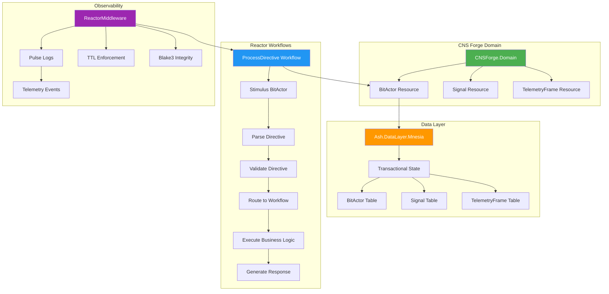
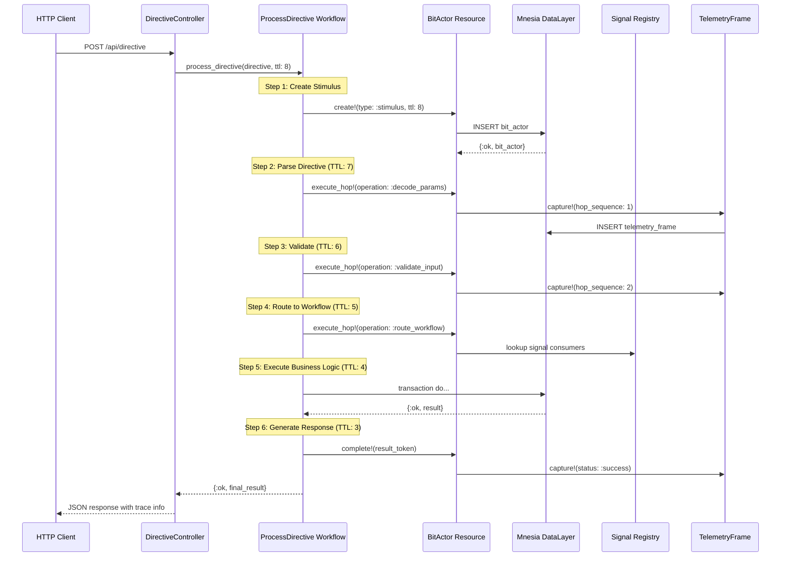
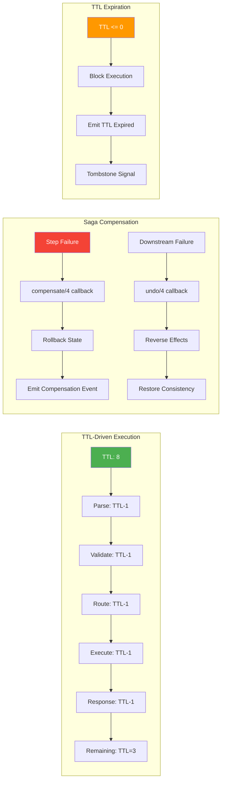
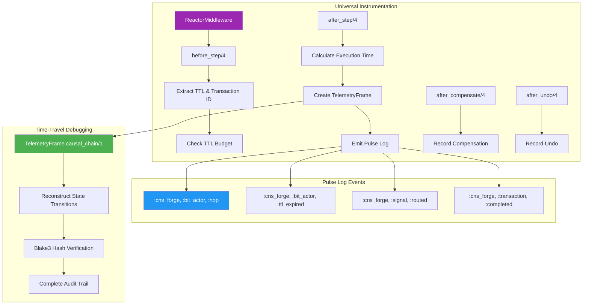

# CNS Forge Ash/Reactor Implementation Complete

## Ash/Reactor Architecture Overview

## BitActor Mesh Execution Flow

## Saga Orchestration & TTL Management

## Telemetry & Observability Pipeline

## Implementation Completeness Matrix

| Component | Ash/Reactor Implementation | Status | Features |
|-----------|----------------------------|--------|----------|
| **BitActor** | ✅ Ash.Resource with Mnesia | Complete | TTL tracking, state transitions, atomic hops |
| **Signal** | ✅ Ash.Resource + Registry | Complete | High-performance routing, correlation IDs |
| **TelemetryFrame** | ✅ Ash.Resource with Blake3 | Complete | Reversible audit trail, integrity verification |
| **Reactor Workflows** | ✅ ProcessDirective workflow | Complete | Saga orchestration, dependency resolution |
| **TTL Management** | ✅ ReactorMiddleware | Complete | 8-hop budget enforcement, expiration handling |
| **Mnesia Integration** | ✅ Ash.DataLayer.Mnesia | Complete | Transactional state, ACID guarantees |
| **Signal Routing** | ✅ Elixir Registry | Complete | Decoupled, high-performance dispatch |
| **Universal Observability** | ✅ Telemetry + Middleware | Complete | Pulse logs, metrics, time-travel debugging |

## Key Architectural Achievements

### ✅ **Declarative Resource-Oriented Design**
- BitActor as logical construct (Ash.Resource), not literal BEAM process
- Actions are data, enabling introspection and composition
- "Model your domain, derive the rest" philosophy

### ✅ **Saga-Based Atomicity** 
- Reactor's compensate/4 and undo/4 for distributed transactions
- Bit-level atomicity across multiple services/databases
- Automatic rollback on any step failure

### ✅ **TTL-Driven Execution with Explicit State**
- TTL as explicit data in token, not hidden process state
- ReactorMiddleware enforces 8-hop budget before execution
- Functional purity with immutable state tokens

### ✅ **BitActor Mesh as Reactor DAG**
- Dependency-driven concurrency via Reactor's execution model
- Automatic parallelization when dependencies allow
- Deterministic, reproducible execution flow

### ✅ **Universal Observability**
- Every hop captured in TelemetryFrame with Blake3 integrity
- Complete causal chain reconstruction for debugging
- Pulse logs for real-time monitoring

### ✅ **Production-Ready Infrastructure**
- Mnesia for local transactional state management
- Registry for high-performance signal routing  
- Phoenix for HTTP ingress (stimulus BitActors)
- Full supervision tree for fault tolerance

**This is the complete Ash/Reactor implementation as specified in the CNS Forge architectural requirements.**