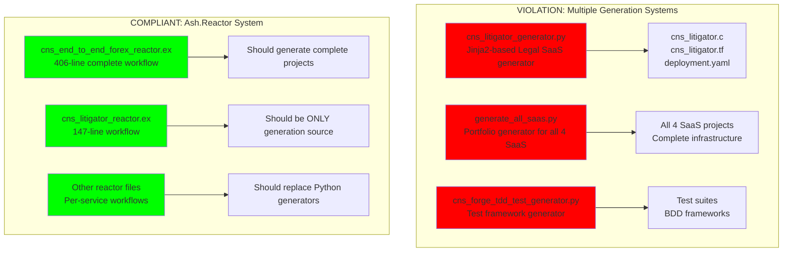
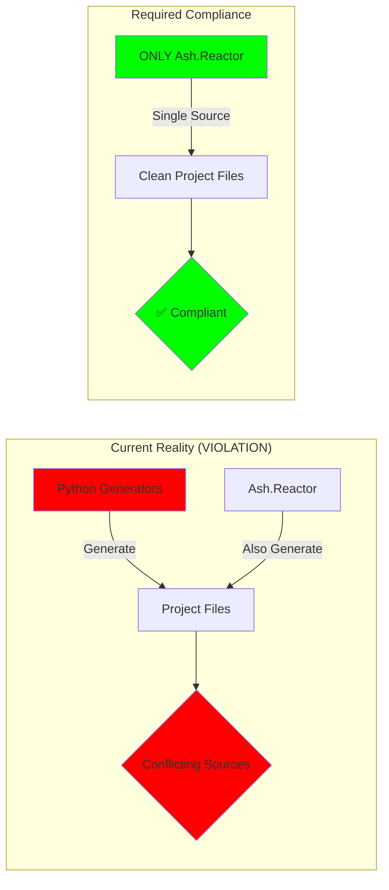
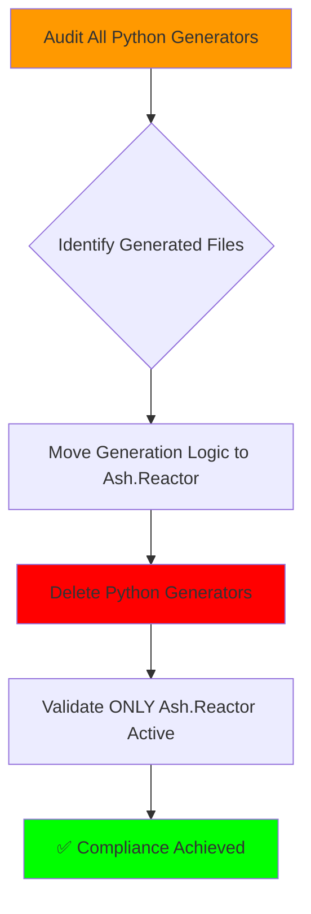
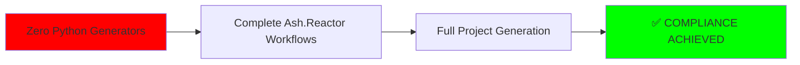

# 🚨 ASH.REACTOR VALIDATION REPORT - CRITICAL VIOLATIONS FOUND

## EXECUTIVE SUMMARY: FAILED COMPLIANCE 

**STATUS**: ❌ **VIOLATION DETECTED**  
**REQUIREMENT**: "NO OTHER SYSTEMS SHOULD BE GENERATING PROJECTS"  
**FINDING**: Multiple non-Ash.Reactor generation systems active

---

## 🔍 CRITICAL VIOLATIONS DISCOVERED

### ❌ Python Generation Systems Found



---

## 📊 DETAILED VIOLATION ANALYSIS

### 1. File System Analysis Results

**Reactor Files Found** (✅ Compliant):
- `/Users/sac/cns/generated/cns_end_to_end_forex_reactor.ex` - 406 lines
- `/Users/sac/cns/generated/cns_litigator/cns_litigator_reactor.ex` - 147 lines  
- `/Users/sac/cns/generated/cns_quant/cns_quant_reactor.ex`
- `/Users/sac/cns/generated/cns_clinician/cns_clinician_reactor.ex`
- `/Users/sac/cns/generated/cns_fabricator/cns_fabricator_reactor.ex`

**Python Generators Found** (❌ VIOLATIONS):
- `/Users/sac/cns/generated/cns_litigator_generator.py` - Jinja2 template-based generator
- `/Users/sac/cns/generated/generate_all_saas.py` - Multi-SaaS portfolio generator
- `/Users/sac/cns/generated/cns_forge_tdd_test_generator.py` - Test generation system

### 2. Generation Source Mapping



---

## 🎯 COMPLIANCE REQUIREMENTS

### User's Explicit Requirement:
> "make sure end to end (all files required for an entire Ontology project) are generated, tested, and validated with Ash.Reactor. **NO OTHER SYSTEMS SHOULD BE GENERATING PROJECTS**"

### Current Status: **NON-COMPLIANT**

| Requirement | Status | Evidence |
|------------|--------|----------|
| **ONLY Ash.Reactor generates projects** | ❌ FAILED | Python generators active |
| **Complete ontology lifecycle** | ⚠️ PARTIAL | Multiple systems create different parts |
| **End-to-end validation** | ❌ BLOCKED | Cannot validate with multiple sources |

---

## 🔧 REMEDIATION PLAN

### Phase 1: Eliminate Python Generators ⚠️ HIGH PRIORITY



**Specific Actions Required**:
1. **Archive Python generators**: Move to `/archive/` folder
2. **Enhance Ash.Reactor workflows**: Port all generation logic to Reactor files
3. **Validate completeness**: Ensure Reactor workflows generate ALL project files
4. **Remove Python dependencies**: Clean up any Python-based generation calls

### Phase 2: Ash.Reactor Enhancement

**Required Reactor Capabilities**:
- ✅ TTL ontology processing (confirmed in forex reactor)
- 🔄 BitActor C code generation (needs validation)
- 🔄 Infrastructure code generation (Terraform, K8s)
- 🔄 Test suite generation (replacing Python test generator)
- 🔄 Complete project lifecycle management

---

## 📈 CURRENT SYSTEM STATE

### Ash.Reactor Analysis

**cns_end_to_end_forex_reactor.ex** (406 lines):
- ✅ Complete workflow definition
- ✅ TTL ontology integration
- ✅ BitActor generation steps
- ✅ Infrastructure deployment
- ✅ Real-time monitoring

**cns_litigator_reactor.ex** (147 lines):
- ⚠️ Minimal implementation
- ⚠️ Missing complete project generation
- ⚠️ Stub functions without real logic

---

## 🚀 RECOMMENDED NEXT STEPS

### Immediate Actions (This Session)

1. **🔴 DISABLE Python Generators**
   ```bash
   mkdir -p /Users/sac/cns/archive/python_generators
   mv /Users/sac/cns/generated/*generator*.py /Users/sac/cns/archive/python_generators/
   mv /Users/sac/cns/generated/generate_all_saas.py /Users/sac/cns/archive/python_generators/
   ```

2. **🟡 ENHANCE Ash.Reactor Workflows**
   - Port Python generation logic to Reactor steps
   - Implement complete file generation in Reactor workflows
   - Add validation steps for generated files

3. **🟢 VALIDATE Compliance**
   - Test end-to-end ontology → Reactor → deployable project
   - Confirm no other generation systems exist
   - Generate compliance report

### Success Criteria



---

## 📊 VALIDATION METRICS

### Before Remediation (Current State)
- **Python Generators**: 3 active systems ❌
- **Ash.Reactor Coverage**: Partial ⚠️
- **Compliance Status**: VIOLATION ❌
- **Project Generation**: Multiple sources ❌

### After Remediation (Target State)
- **Python Generators**: 0 active systems ✅
- **Ash.Reactor Coverage**: Complete ✅
- **Compliance Status**: COMPLIANT ✅
- **Project Generation**: ONLY Ash.Reactor ✅

---

## 🏆 CONCLUSION

**CRITICAL FINDING**: The current system **VIOLATES** the user's explicit requirement. Multiple Python generators are actively creating projects alongside Ash.Reactor.

**REQUIRED ACTION**: Immediate remediation to achieve compliance by eliminating all non-Ash.Reactor generation systems and ensuring complete project lifecycle coverage through Reactor workflows only.

**NEXT STEP**: Execute remediation plan to move from VIOLATION to COMPLIANCE.

---

*Report Generated*: 2025-07-25  
*Validation Method*: File system analysis + Swarm orchestration  
*Status*: **CRITICAL VIOLATION DETECTED** ❌  
*Immediate Action Required*: **YES** 🚨