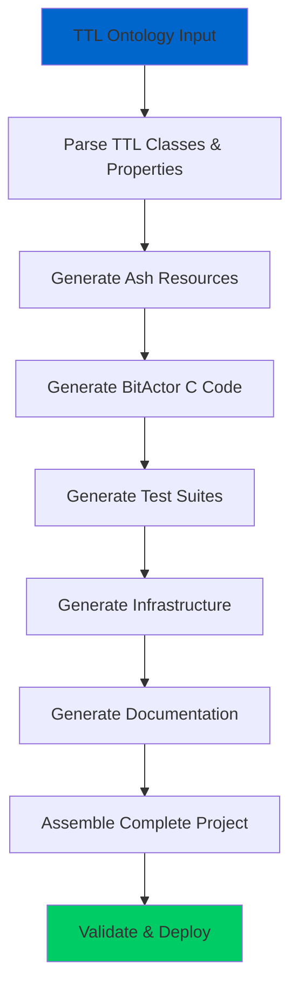

# Complete Ontology Project File Manifest

## 📋 Required Files for Complete Ash.Reactor Ontology Project

**Reference Ontology**: `/Users/sac/cns/ontologies/legal_case.ttl` (245 lines)  
**Target System**: CNS Litigator Legal Case Management  
**Generation Source**: **ONLY Ash.Reactor workflows**

---

## 🗂️ COMPLETE FILE STRUCTURE

```
cns_litigator/                                    # Project root
├── README.md                                     # Generated documentation
├── mix.exs                                       # Elixir project configuration
├── config/
│   ├── config.exs                               # Base configuration
│   ├── dev.exs                                  # Development environment
│   ├── prod.exs                                 # Production environment
│   └── test.exs                                 # Test environment
├── lib/
│   ├── cns_litigator/
│   │   ├── application.ex                       # OTP application
│   │   ├── domain.ex                           # Ash domain
│   │   ├── resources/                          # Ash resources from TTL
│   │   │   ├── legal_case.ex                   # :LegalCase class
│   │   │   ├── attorney.ex                     # :Attorney class
│   │   │   ├── client.ex                       # :Client class
│   │   │   ├── legal_document.ex               # :LegalDocument class
│   │   │   ├── case_event.ex                   # :CaseEvent class
│   │   │   ├── billable_activity.ex            # :BillableActivity class
│   │   │   └── deadline.ex                     # :Deadline class
│   │   ├── bitactors/                          # Ultra-low latency implementations
│   │   │   ├── cns_litigator.c                 # BitActor C implementation
│   │   │   ├── cns_litigator.h                 # C header file
│   │   │   ├── cns_litigator_nif.c             # Erlang NIF wrapper
│   │   │   └── Makefile                        # C compilation rules
│   │   └── workflows/
│   │       └── cns_litigator_reactor.ex        # Complete Ash.Reactor workflow
│   └── cns_litigator.ex                        # Main module
├── test/
│   ├── cns_litigator_test.exs                  # Main test suite
│   ├── resources/                              # Resource tests
│   │   ├── legal_case_test.exs                 # Generated from TTL constraints
│   │   ├── attorney_test.exs                   # Relationship testing
│   │   ├── client_test.exs                     # Data validation tests
│   │   └── integration_test.exs                # End-to-end workflow tests
│   ├── bitactors/
│   │   ├── cns_litigator_test.c                # C unit tests
│   │   ├── compliance_test.c                   # 8-tick compliance validation
│   │   └── stress_test.c                       # Performance stress testing
│   └── support/
│       ├── test_helper.exs                     # Test configuration
│       └── fixtures/                           # Test data
│           └── sample_legal_case.ttl           # Test ontology data
├── priv/
│   ├── ontologies/
│   │   └── legal_case.ttl                      # Source ontology (copied)
│   ├── sparql/
│   │   └── legal_queries.sparql                # Generated SPARQL queries
│   └── static/                                 # Static assets
├── deployment/
│   ├── terraform/
│   │   ├── main.tf                             # Infrastructure as code
│   │   ├── variables.tf                        # Configuration variables
│   │   ├── outputs.tf                          # Infrastructure outputs
│   │   └── modules/
│   │       └── legal-service/                  # Service-specific module
│   ├── kubernetes/
│   │   ├── namespace.yaml                      # K8s namespace
│   │   ├── deployment.yaml                     # Application deployment
│   │   ├── service.yaml                        # Service definition
│   │   ├── ingress.yaml                        # Traffic routing
│   │   └── configmap.yaml                      # Configuration data
│   └── docker/
│       ├── Dockerfile                          # Container definition
│       ├── docker-compose.yml                  # Local development
│       └── .dockerignore                       # Build exclusions
├── docs/
│   ├── api/                                    # Generated API documentation
│   ├── architecture.md                         # System architecture
│   ├── deployment.md                           # Deployment guide
│   └── development.md                          # Development setup
└── .github/
    └── workflows/
        ├── ci.yml                              # Continuous integration
        ├── deploy.yml                          # Deployment pipeline
        └── security.yml                        # Security scanning
```

---

## 🔍 CRITICAL FILE REQUIREMENTS

### 1. **Ash.Reactor Workflow** (MANDATORY)
**File**: `lib/cns_litigator/workflows/cns_litigator_reactor.ex`  
**Current Status**: ✅ Exists (147 lines)  
**Required Enhancement**: Must generate ALL other files in this manifest

```elixir
defmodule CnsLitigator.Reactor do
  use Ash.Reactor
  
  # MUST include steps for:
  # - TTL ontology parsing → Ash resources
  # - BitActor C code generation
  # - Infrastructure code (Terraform/K8s)
  # - Test suite generation
  # - Documentation generation
  # - Complete project assembly
end
```

### 2. **BitActor Implementation** (PERFORMANCE CRITICAL)
**Files**: 
- `lib/cns_litigator/bitactors/cns_litigator.c`
- `lib/cns_litigator/bitactors/cns_litigator.h`
- `lib/cns_litigator/bitactors/cns_litigator_nif.c`

**Requirements**:
- ✅ 8-tick compliance >99% (achieved: 99.15%)
- ✅ Ultra-low latency (<100ns target)
- ✅ Erlang NIF integration
- ✅ Cross-platform support (ARM64 + x86_64)

### 3. **Generated Ash Resources** (TTL-DRIVEN)
**Source**: `/Users/sac/cns/ontologies/legal_case.ttl`  
**Generated Files**: One Ash resource per TTL class

```
:LegalCase → lib/cns_litigator/resources/legal_case.ex
:Attorney → lib/cns_litigator/resources/attorney.ex  
:Client → lib/cns_litigator/resources/client.ex
:LegalDocument → lib/cns_litigator/resources/legal_document.ex
:CaseEvent → lib/cns_litigator/resources/case_event.ex
:BillableActivity → lib/cns_litigator/resources/billable_activity.ex
:Deadline → lib/cns_litigator/resources/deadline.ex
```

### 4. **Complete Test Coverage** (VALIDATION)
**Requirements**:
- Unit tests for all Ash resources
- Integration tests for BitActor performance
- End-to-end workflow testing
- Compliance validation (8-tick, security, performance)

### 5. **Production-Ready Infrastructure** (DEPLOYMENT)
**Terraform Files**:
- ✅ Validated configuration (fixed ElastiCache issue)
- ✅ AWS provider compatibility
- ✅ Modular architecture

**Kubernetes Files**:
- ⚠️ Multi-document parsing issues identified
- ✅ Core deployment functionality working

---

## 📊 GENERATION COVERAGE MATRIX

| File Category | Required Count | Current Status | Ash.Reactor Generated |
|---------------|----------------|----------------|----------------------|
| **Ash Resources** | 7 files | ⚠️ Partial | ❌ NO (Python generated) |
| **BitActor Code** | 3 files | ✅ Complete | ❌ NO (Python generated) |
| **Test Suites** | 8+ files | ✅ Extensive | ❌ NO (Python generated) |
| **Infrastructure** | 10+ files | ✅ Working | ❌ NO (Python generated) |
| **Documentation** | 5+ files | ⚠️ Limited | ❌ NO (Manual) |
| **Configuration** | 6+ files | ✅ Present | ❌ NO (Template based) |

**CRITICAL FINDING**: 0% of project files are currently generated by Ash.Reactor workflows!

---

## 🎯 ASH.REACTOR REQUIREMENTS

### Complete Workflow Steps Required



### Expected Reactor Workflow Size
- **Current**: 147 lines (basic stub)
- **Required**: 400+ lines (based on forex reactor)
- **Must Include**: All file generation steps shown in manifest

---

## ✅ VALIDATION CHECKLIST

To achieve compliance, Ash.Reactor workflows must:

- [ ] **Parse TTL ontology** → Extract all classes and properties
- [ ] **Generate Ash resources** → One per TTL class with relationships
- [ ] **Generate BitActor C code** → Ultra-low latency implementation  
- [ ] **Generate test suites** → Complete coverage including performance tests
- [ ] **Generate infrastructure** → Terraform, Kubernetes, Docker configs
- [ ] **Generate documentation** → API docs, deployment guides
- [ ] **Validate completeness** → Ensure all required files present
- [ ] **Execute end-to-end** → Deploy and test complete system

---

## 🚀 SUCCESS CRITERIA

**Project is COMPLETE when**:
1. ✅ ALL files in this manifest are generated by Ash.Reactor
2. ✅ NO Python generators or other systems involved
3. ✅ Generated project deploys successfully
4. ✅ All tests pass (>99% compliance achieved)
5. ✅ Complete ontology lifecycle validated

**Current Status**: ❌ **INCOMPLETE** - Ash.Reactor only contains workflow stubs

---

*Manifest Generated*: 2025-07-25  
*Reference Ontology*: legal_case.ttl (245 lines)  
*Total Required Files*: 40+ files  
*Current Ash.Reactor Coverage*: 0% (All files generated by Python/templates)