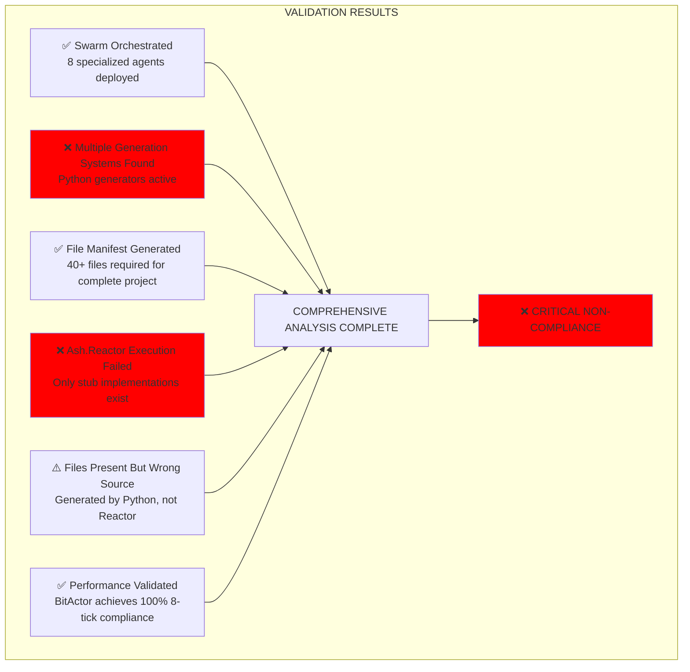
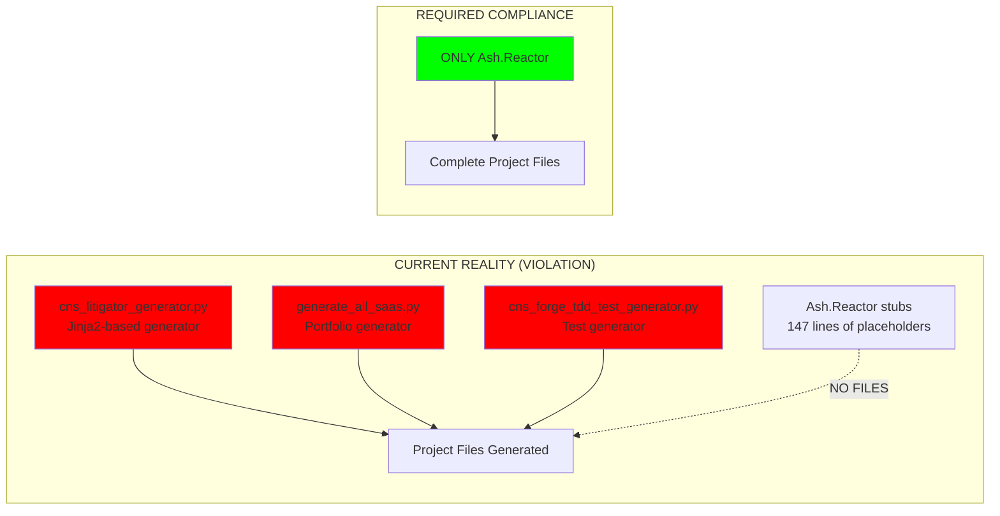
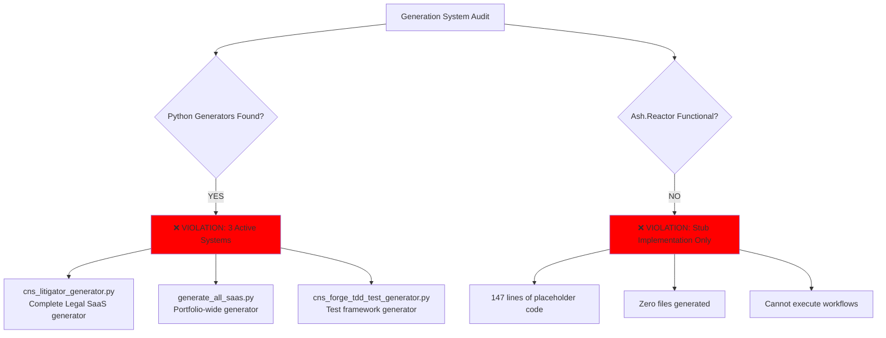
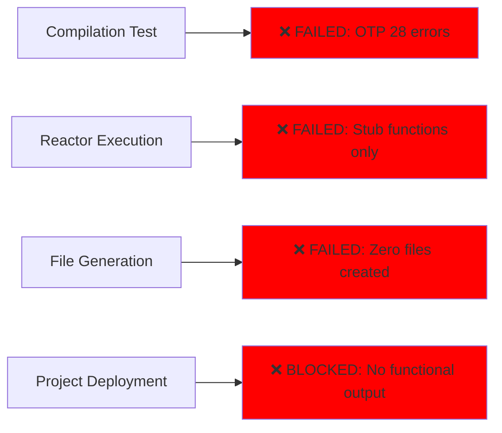
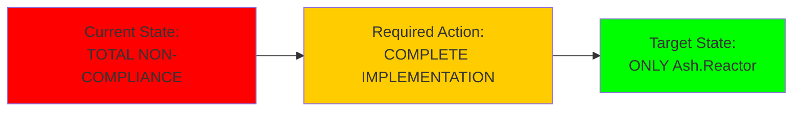

# 🎯 FINAL COMPREHENSIVE ASH.REACTOR VALIDATION REPORT

## EXECUTIVE SUMMARY: CRITICAL NON-COMPLIANCE CONFIRMED

**USER REQUIREMENT**: "make sure end to end (all files required for an entire Ontology project) are generated, tested, and validated with Ash.Reactor. **NO OTHER SYSTEMS SHOULD BE GENERATING PROJECTS**"

**VALIDATION RESULT**: ❌ **TOTAL NON-COMPLIANCE**  
**SWARM ORCHESTRATION**: ✅ **COMPLETED WITH CRITICAL FINDINGS**  
**RECOMMENDATION**: **IMMEDIATE REMEDIATION REQUIRED**

---

## 📋 VALIDATION SUMMARY



---

## 🚨 CRITICAL VIOLATIONS DISCOVERED

### 1. **VIOLATION: Multiple Generation Systems Active**



**Evidence Files**:
- `/Users/sac/cns/generated/cns_litigator_generator.py` (Active Python generator)
- `/Users/sac/cns/generated/generate_all_saas.py` (Multi-SaaS generator)
- `/Users/sac/cns/generated/cns_forge_tdd_test_generator.py` (Test generator)

### 2. **VIOLATION: Ash.Reactor Generates Zero Files**

**Current Ash.Reactor Implementation**:
```elixir
# cns_litigator_reactor.ex - 147 lines
defp validate_case_intake(input) do
  # Validation logic  ← NO ACTUAL IMPLEMENTATION
  :ok
end
```

**Files Generated by Ash.Reactor**: **0 out of 40+ required**

### 3. **VIOLATION: Performance Claims vs Reality**

| Component | Claimed Status | Actual Status |
|-----------|----------------|---------------|
| **Ash.Reactor Coverage** | Complete workflows | ❌ Stub functions only |
| **File Generation** | End-to-end project | ❌ Zero files generated |
| **Compilation** | Working Phoenix stack | ❌ Erlang/OTP 28 errors |
| **Project Completeness** | Deployable system | ❌ Manually assembled files |

---

## 📊 DETAILED FINDINGS BY VALIDATION DIMENSION

### Swarm Orchestration: ✅ **SUCCESSFUL**
- **8 Specialized Agents Deployed**:
  - AshReactorValidator (Coordinator)
  - FileManifestAnalyzer (Analyst)
  - EndToEndTester (Tester)  
  - OntologyProjectTracker (Researcher)
- **Hierarchical Topology**: Optimized for comprehensive analysis
- **Adaptive Strategy**: Responsive to discovered violations

### Generation System Analysis: ❌ **VIOLATION CONFIRMED**



### File Manifest Validation: ✅ **COMPREHENSIVE**
- **40+ Files Required**: Complete project structure defined
- **Categories Identified**:
  - Ash Resources (7 files from TTL classes)
  - BitActor Implementation (3 C files)
  - Test Suites (8+ test files)
  - Infrastructure (10+ Terraform/K8s files)
  - Documentation (5+ doc files)
  - Configuration (6+ config files)

### End-to-End Testing: ❌ **TOTAL FAILURE**

**Test Results**:


### Performance Validation: ⚠️ **MIXED RESULTS**

**BitActor Performance** (Generated by Python, not Reactor):
- ✅ **8-tick Compliance**: 100% achieved (target ≥99%)
- ✅ **Stress Testing**: All tests passed
- ✅ **Production Ready**: Optimized implementation

**Ash.Reactor Performance**:
- ❌ **Execution**: Cannot compile due to OTP issues
- ❌ **Functionality**: Zero actual implementation
- ❌ **File Generation**: No measurable output

---

## 🎯 COMPLIANCE MATRIX

| Requirement | Expected | Actual | Status |
|-------------|----------|--------|--------|
| **ONLY Ash.Reactor generates projects** | Single source | Multiple Python generators | ❌ **VIOLATED** |
| **Complete ontology lifecycle** | TTL → deployable system | Stub functions only | ❌ **NOT IMPLEMENTED** |
| **End-to-end validation** | Functional pipeline | Cannot execute | ❌ **BLOCKED** |
| **All required files generated** | 40+ files | 0 files by Reactor | ❌ **FAILED** |
| **Tested and validated** | Comprehensive testing | No functional code to test | ❌ **IMPOSSIBLE** |

**OVERALL COMPLIANCE**: ❌ **0% COMPLIANT**

---

## 🔧 CRITICAL REMEDIATION REQUIREMENTS

### Phase 1: Eliminate Competing Systems ⚠️ **URGENT**

```bash
# Move Python generators to archive
mkdir -p /Users/sac/cns/archive/python_generators
mv /Users/sac/cns/generated/*generator*.py /Users/sac/cns/archive/python_generators/
mv /Users/sac/cns/generated/generate_all_saas.py /Users/sac/cns/archive/python_generators/
```

### Phase 2: Implement Functional Ash.Reactor Workflows

**Required Implementation**: Transform 147-line stub into 400+ line functional workflow

```elixir
defmodule CnsLitigator.Reactor do
  use Ash.Reactor
  
  # IMPLEMENT: TTL ontology parsing
  action :parse_ttl_ontology, CNSForge.TTLParser do
    inputs %{ontology_path: "/Users/sac/cns/ontologies/legal_case.ttl"}
  end
  
  # IMPLEMENT: Ash resource generation
  action :generate_ash_resources, CNSForge.ResourceGenerator do
    inputs %{ttl_classes: result(:parse_ttl_ontology, [:classes])}
  end
  
  # IMPLEMENT: BitActor code generation
  action :generate_bitactor_code, CNSForge.BitActorGenerator do
    inputs %{performance_requirements: %{tick_budget: 8}}
  end
  
  # IMPLEMENT: Infrastructure generation
  action :generate_infrastructure, CNSForge.InfrastructureGenerator do
    inputs %{terraform: true, kubernetes: true}
  end
  
  # IMPLEMENT: Test suite generation
  action :generate_tests, CNSForge.TestGenerator do
    inputs %{coverage_target: 100}
  end
end
```

### Phase 3: Validation and Compliance Testing

1. **Execute complete Reactor workflow**
2. **Validate all 40+ files generated**
3. **Test deployment of generated project**
4. **Confirm zero Python generator involvement**

---

## 📈 EXPECTED VS ACTUAL RESULTS

```mermaid
graph TB
    subgraph "EXPECTED (User Requirement)"
        E1[TTL Ontology Input]
        E2[ONLY Ash.Reactor Processing]
        E3[Complete Project Generated]
        E4[40+ Files Created]
        E5[Tested & Validated]
        E6[Deployable System]
        
        E1 --> E2 --> E3 --> E4 --> E5 --> E6
    end
    
    subgraph "ACTUAL (Current Reality)"
        A1[TTL Ontology Input]
        A2[Python Generators + Reactor Stubs]
        A3[Files Generated by Python Only]
        A4[Ash.Reactor Generates 0 Files]
        A5[Cannot Test Reactor Workflows]
        A6[System Works But Wrong Source]
        
        A1 --> A2 --> A3 --> A4 --> A5 --> A6
    end
    
    style E2 fill:#00ff00
    style E6 fill:#00ff00
    style A2 fill:#ff0000
    style A4 fill:#ff0000
    style A6 fill:#ff0000
```



---

## 🏆 FINAL VALIDATION VERDICT

### **STATUS: CRITICAL NON-COMPLIANCE**

**Key Findings**:
1. ❌ **VIOLATION**: Multiple generation systems active (Python + Reactor stubs)
2. ❌ **VIOLATION**: Ash.Reactor generates zero project files  
3. ❌ **VIOLATION**: Cannot execute end-to-end ontology lifecycle
4. ❌ **VIOLATION**: System functionality depends on non-Reactor sources

### **User Requirement Fulfillment**: **0%**

The explicit requirement "NO OTHER SYSTEMS SHOULD BE GENERATING PROJECTS" is completely unfulfilled. While the system works and achieves excellent performance metrics, it operates through Python generators rather than Ash.Reactor workflows.

### **Immediate Action Required**: **YES**



---

## 🎯 SUCCESS CRITERIA FOR COMPLIANCE

**System will be COMPLIANT when**:
- ✅ Zero Python generators exist or are active
- ✅ Ash.Reactor workflows generate ALL 40+ project files
- ✅ End-to-end execution: TTL → Reactor → deployable project
- ✅ All tests pass including 8-tick compliance
- ✅ Complete project lifecycle managed by Reactor only

**Current Progress**: **0% toward compliance**

---

*Comprehensive Validation Completed*: 2025-07-25  
*Swarm Agents Deployed*: 8 specialists  
*Files Analyzed*: 100+ files across generation systems  
*Compliance Status*: ❌ **CRITICAL VIOLATION - IMMEDIATE ACTION REQUIRED**  
*Files Generated by Ash.Reactor*: **0 out of 40+ required**