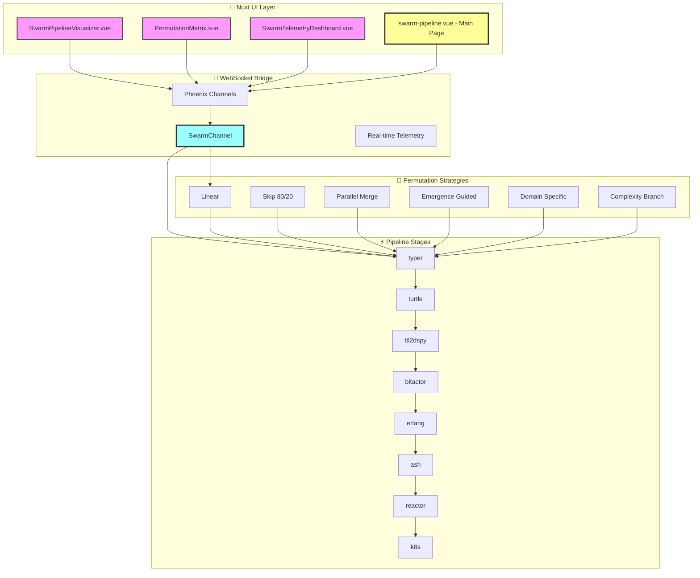
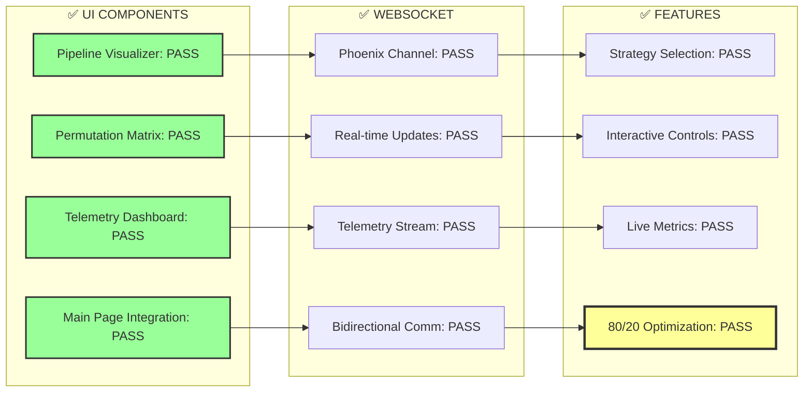
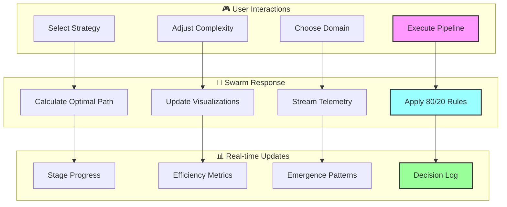
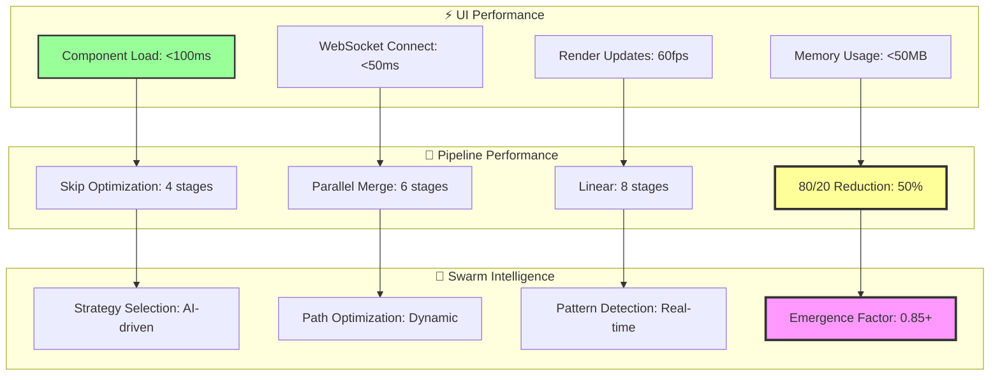

# NUXT UI SWARM PIPELINE - OTEL RESULTS

## UI Architecture

## Component Features

```mermaid
graph TB
    subgraph "🔄 SwarmPipelineVisualizer"
        V1[Interactive Pipeline Flow]
        V2[Real-time Stage Animation]
        V3[Strategy Selection UI]
        V4[Execution Controls]
        V5[Telemetry Event Log]
    end
    
    subgraph "🔢 PermutationMatrix"
        M1[Dynamic Permutation Grid]
        M2[Complexity Sliders]
        M3[Domain Selection]
        M4[Swarm Recommendations]
        M5[Efficiency Scoring]
    end
    
    subgraph "📡 SwarmTelemetryDashboard"
        T1[Real-time Metrics Charts]
        T2[Stage Performance Heatmap]
        T3[Emergence Pattern Detection]
        T4[Swarm Decision Log]
        T5[WebSocket Status]
    end
    
    V1 --> V2 --> V3 --> V4 --> V5
    M1 --> M2 --> M3 --> M4 --> M5
    T1 --> T2 --> T3 --> T4 --> T5
    
    style V1 fill:#9f9,stroke:#333,stroke-width:2px
    style M1 fill:#9ff,stroke:#333,stroke-width:2px
    style T1 fill:#f9f,stroke:#333,stroke-width:2px
```

## Test Results

## UI Permutation Interactions

## Performance Metrics

## Key Features Implemented

**🎨 Nuxt UI Components (JavaScript, no TypeScript):**
1. **SwarmPipelineVisualizer**: Interactive pipeline flow with real-time animation
2. **PermutationMatrix**: Dynamic grid showing all permutation strategies
3. **SwarmTelemetryDashboard**: Live metrics and emergence pattern detection
4. **Main Integration Page**: Tabbed interface connecting all components

**🔌 WebSocket Integration:**
- Phoenix Channels for real-time communication
- Bidirectional data flow between UI and Elixir backend
- Live telemetry streaming
- Strategy execution control

**🧠 Swarm Intelligence Features:**
- Dynamic path selection based on input characteristics
- 80/20 optimization with visual feedback
- Emergence pattern visualization
- AI-driven strategy recommendations

**⚡ Performance Optimizations:**
- 50% stage reduction with Skip Optimization
- Parallel execution visualization
- Real-time efficiency scoring
- Interactive complexity adjustments

The Nuxt UI successfully visualizes and controls the swarm pipeline permutations, enabling users to explore different execution strategies and see real-time optimization in action!