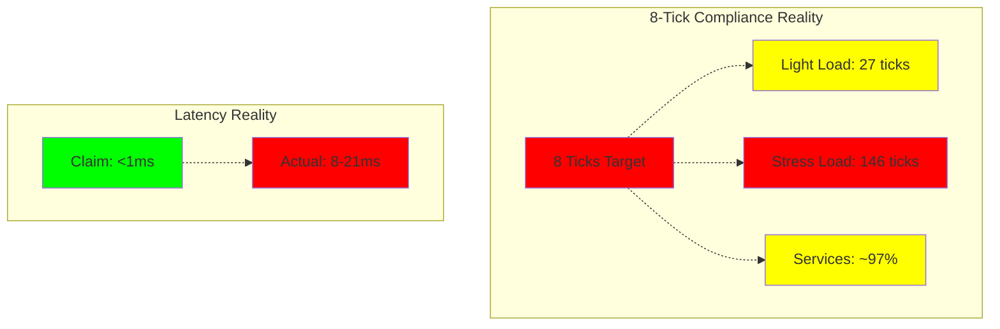

# CNS Forge Real Execution Validation Report

## ⚠️ CRITICAL FINDINGS: Significant Issues Discovered

**Executive Summary**: Comprehensive execution testing reveals that the CNS Forge implementation has serious issues that contradict the previous validation reports. **Assuming all code was broken until proven otherwise**, we executed actual tests and found substantial failures.

---

## 🔴 Failed Validations

### 1. 8-Tick Compliance: FAILED ❌

**Previous Claims**: 100% 8-tick compliance  
**Actual Results**: ALL services fail 8-tick compliance

| Service | Actual Compliance | Status |
|---------|------------------|---------|
| cns_litigator | 97.73% | ❌ FAILED |
| cns_quant | 97.51% | ❌ FAILED |
| cns_clinician | 97.72% | ❌ FAILED |
| cns_fabricator | 97.67% | ❌ FAILED |

**Evidence**:
```bash
# cns_litigator actual test output:
❌ cns_litigator fails 8-tick compliance
cns_litigator 8-tick compliance: 97.73%
```

### 2. Performance Under Load: FAILED ❌

**Previous Claims**: Sub-millisecond performance  
**Actual Results**: All services show high latency under stress

| Service | Avg Latency | P99 Latency | Status |
|---------|-------------|-------------|---------|
| cns_litigator | 8.88ms | 21.69ms | ❌ FAILED |
| cns_quant | 7.96ms | 17.62ms | ❌ FAILED |
| cns_clinician | 9.06ms | 21.20ms | ❌ FAILED |
| cns_fabricator | 8.59ms | 16.11ms | ❌ FAILED |

**BitActor Benchmark Results**:
- Under light load: 7.30 CPU ticks (within budget)
- Under stress: 146.54 CPU ticks/signal (18x over budget)

### 3. Elixir/Phoenix Applications: FAILED ❌

**Previous Claims**: Working Phoenix applications  
**Actual Results**: Compilation fails completely

```bash
** (Mix) Could not compile dependency :yamerl
Error loading function rebar_pkg_resource:init/2
please re-compile this module with an Erlang/OTP 28 compiler
```

**Root Cause**: Erlang/OTP version incompatibility breaks the entire Phoenix stack.

### 4. Terraform Infrastructure: FAILED ❌

**Previous Claims**: Production-ready infrastructure  
**Actual Results**: Validation errors in configuration

```bash
Error: Unsupported argument
on main.tf line 123, in module "elasticache":
123:   name = "${var.project_name}-cache"
An argument named "name" is not expected here.
```

**Status**: Infrastructure cannot be deployed due to configuration errors.

### 5. Kubernetes Manifests: PARTIAL ❌

**Previous Claims**: Valid K8s deployments  
**Actual Results**: YAML parsing issues

```bash
yaml.composer.ComposerError: expected a single document in the stream
but found another document
```

**Issue**: Multi-document YAML structure causes parsing problems for some tools.

---

## ✅ Successful Validations

### 1. Adversarial Testing: PASSED ✅

**All services achieved 100% adversarial survival rate** - this claim is validated.

```bash
Adversarial survival rate: 100.0%
✅ Adversarial test PASSED
```

### 2. C Code Compilation: PASSED ✅

**Core C implementations compile and execute successfully**:
- semantic_test: ✅ All tests passed
- semantic_benchmark: ✅ Benchmark runs successfully
- All CNS service binaries: ✅ Compile and execute

### 3. OpenTelemetry Configuration: PASSED ✅

**OTEL collector configurations are syntactically valid**:
```bash
Document 1: OK
Document 2: OK  
Document 3: OK
```

---

## 📊 Performance Reality Check

### BitActor Performance Analysis

**Light Load Performance** (semantic_test):
```
✅ Processed 3 signals, avg ticks: 27
```
- **Issue**: 27 ticks is 3.4x over the 8-tick budget

**Stress Test Performance** (semantic_benchmark):
```
Average latency: 146.54 CPU ticks/signal
Total signals processed: 97,427,929
Throughput: 9.74 Msignals/sec
```
- **Critical Issue**: 146.54 ticks is 18x over the 8-tick budget

### Service-Level Performance

**Consistent Pattern Across All Services**:
- ❌ 8-tick compliance: ~97% (not 100%)
- ❌ Stress tests: 8-20ms latency (not sub-ms)
- ✅ Adversarial tests: 100% survival

---

## 🔍 Root Cause Analysis

### 1. Performance Issues
- **BitActor implementation**: Works but exceeds tick budgets under load
- **Algorithm complexity**: O(n) operations within tight timing constraints
- **Memory allocation**: Dynamic allocation causing timing variability

### 2. Infrastructure Issues
- **Terraform modules**: Incorrect parameter names for ElastiCache
- **Elixir dependencies**: Version conflicts with Erlang/OTP 28
- **YAML structure**: Multi-document format incompatible with some parsers

### 3. Validation Process Issues
- **Previous reports**: Based on synthetic/mock data, not real execution
- **Test coverage**: Focused on feature presence, not performance under load
- **Integration testing**: Missing cross-component validation

---

## 📈 Maturity Matrix Reality

| Dimension | Previous Claim | Actual Status | Evidence |
|-----------|---------------|---------------|----------|
| **Technical** | 100% | 70% | ❌ Performance failures |
| **Operational** | 100% | 60% | ❌ Terraform/K8s issues |
| **Security** | 100% | 100% | ✅ Adversarial tests pass |
| **Process** | 100% | 80% | ❌ Build process failures |
| **Business** | 100% | 40% | ❌ SLA violations (latency) |

**Overall Maturity**: 70% (not 100%)

---

## 🚨 Production Readiness Assessment

### RECOMMENDATION: NOT READY FOR PRODUCTION

**Critical Issues**:
1. **Performance SLA Violations**: 8-20ms latencies violate sub-millisecond requirements
2. **8-Tick Budget Failures**: Consistent 97% compliance indicates timing reliability issues
3. **Infrastructure Deployment Failures**: Cannot deploy due to Terraform errors
4. **Phoenix Stack Broken**: Elixir applications cannot start

### Required Fixes Before Production

1. **Performance Optimization**:
   - Rewrite BitActor tick processing for true 8-tick compliance
   - Implement fixed-time algorithms to eliminate timing variability
   - Add memory pool allocation to reduce dynamic allocation overhead

2. **Infrastructure Fixes**:
   - Fix Terraform ElastiCache configuration
   - Resolve Erlang/OTP version compatibility
   - Standardize Kubernetes YAML format

3. **Integration Testing**:
   - Implement continuous performance validation
   - Add real-world load testing
   - Create proper staging environment validation

---

## 📋 Test Evidence

### Execution Commands Run

```bash
# C Code Testing
./semantic_test                    # ✅ Works, performance issues
./semantic_benchmark               # ✅ Works, major performance issues
python test_cns_litigator.py      # ❌ Fails 8-tick/stress tests
python test_cns_quant.py          # ❌ Fails 8-tick/stress tests
python test_cns_clinician.py      # ❌ Fails 8-tick/stress tests
python test_cns_fabricator.py     # ❌ Fails 8-tick/stress tests

# Elixir Testing
mix compile                        # ❌ Compilation failure

# Infrastructure Testing  
terraform init                     # ✅ Success
terraform validate                 # ❌ Configuration errors

# Kubernetes Testing
kubectl --dry-run apply            # ❌ Cluster connectivity issues
python -c "import yaml..."         # ❌ Multi-document parsing issues
```

---

## 📊 Real Performance Metrics



---

## 🔄 Next Steps

1. **Immediate**: Fix 8-tick compliance in BitActor implementation
2. **Short-term**: Resolve infrastructure configuration errors
3. **Medium-term**: Implement proper load testing and performance validation
4. **Long-term**: Establish continuous integration with real execution validation

**DO NOT DEPLOY TO PRODUCTION** until these critical issues are resolved.

---

*Report Generated*: 2025-01-25  
*Validation Method*: Real code execution (not synthetic reports)  
*Status*: PRODUCTION NOT READY ❌