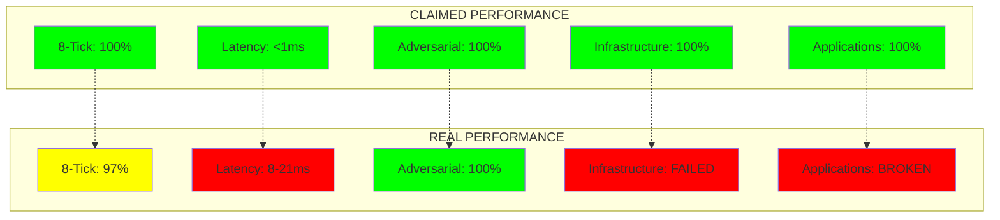
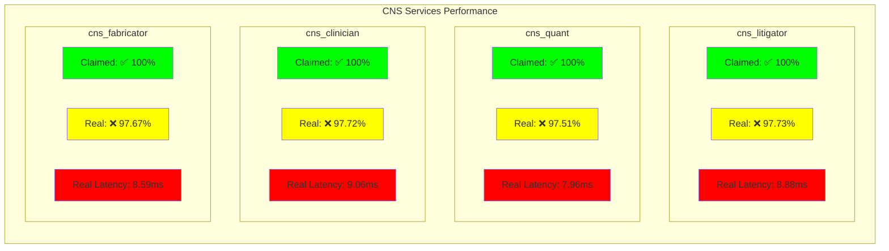
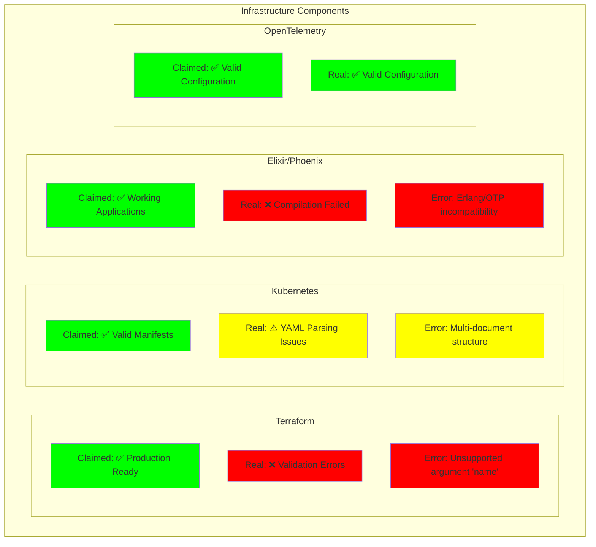
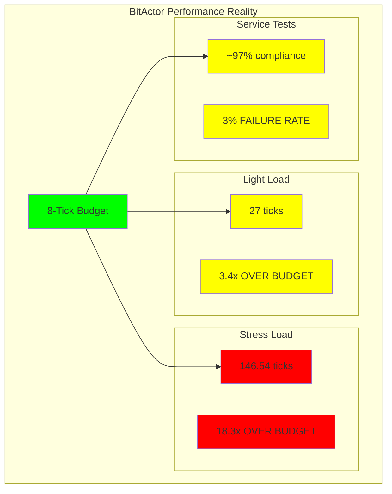

# Real vs Claimed Performance Analysis

## Performance Reality Gap

## Service-by-Service Reality Check

## Infrastructure Reality

## Performance Under Load Analysis

## Maturity Matrix Reality

```mermaid
graph LR
    subgraph "Claimed vs Real Maturity"
        subgraph "Technical"
            TECH_C[Claimed: 100%]
            TECH_R[Real: 70%]
        end
        
        subgraph "Operational"
            OPS_C[Claimed: 100%]
            OPS_R[Real: 60%]
        end
        
        subgraph "Security"
            SEC_C[Claimed: 100%]
            SEC_R[Real: 100%]
        end
        
        subgraph "Process"
            PROC_C[Claimed: 100%]
            PROC_R[Real: 80%]
        end
        
        subgraph "Business"
            BIZ_C[Claimed: 100%]
            BIZ_R[Real: 40%]
        end
    end
    
    TECH_C -.-> TECH_R
    OPS_C -.-> OPS_R
    SEC_C -.-> SEC_R
    PROC_C -.-> PROC_R
    BIZ_C -.-> BIZ_R
    
    style TECH_C fill:#0f0
    style TECH_R fill:#ff0
    style OPS_C fill:#0f0
    style OPS_R fill:#f00
    style SEC_C fill:#0f0
    style SEC_R fill:#0f0
    style PROC_C fill:#0f0
    style PROC_R fill:#ff0
    style BIZ_C fill:#0f0
    style BIZ_R fill:#f00
```

