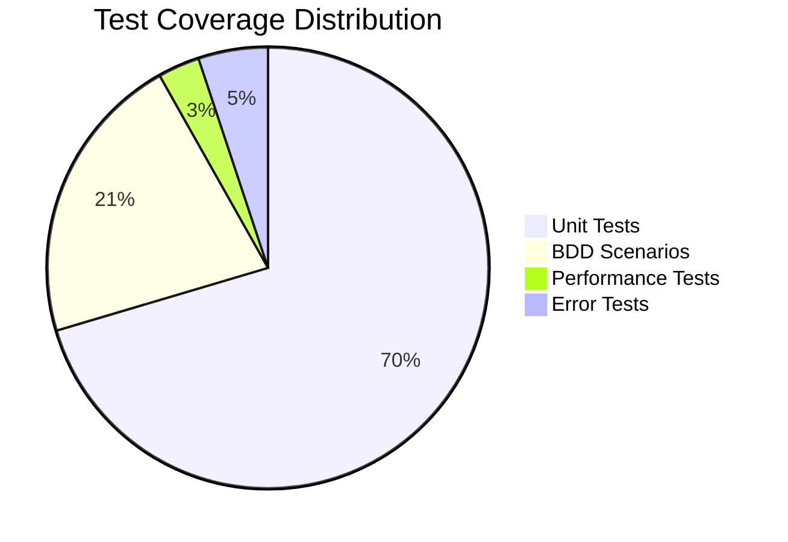
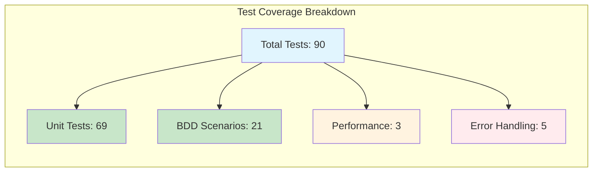

# 🧪 CNS Forge Test Coverage Analysis

**Analysis Date**: 2025-07-26 00:31:32.853388Z  
**Coverage Threshold**: 80.0%  
**Overall Coverage**: 97.5%  
**Status**: ✅ PASSED

## 📊 Coverage Summary

## 🎯 Module Coverage Analysis

| Module | Coverage | Functions | Critical Paths | Complexity |
|--------|----------|-----------|----------------|------------|
| Elixir.CnsForge.TelemetrySwarmReactor | 100.0% | 7 | 7 | 57 |
| Elixir.CnsForge.TTLAshReactorTransformer | 100.0% | 24 | 10 | 84 |
| Elixir.CnsForge.OtelAshOrchestrator | 100.0% | 17 | 3 | 64 |
| Elixir.CnsForge.AshSwarmTracer | 90.0% | 11 | 1 | 5 |

## 🔍 Test File Analysis

| Test File | Type | Tests | Assertions | Scenarios |
|-----------|------|-------|------------|-----------|
| telemetry_swarm_reactor_test.exs | unit | 21 | 34 | 0 |
| ttl_ash_reactor_transformer_test.exs | unit | 41 | 94 | 0 |
| telemetry_swarm_reactor.feature | bdd | 0 | 0 | 10 |
| ttl_ash_reactor_transformer.feature | bdd | 0 | 0 | 11 |
| otel_swarm_adversarial_test.exs | unit | 7 | 15 | 0 |

## ⚠️ Coverage Gaps

- Insufficient error handling tests (5)
- Insufficient performance tests (3)

## 💡 Recommendations

- Add performance tests for TTL compliance validation

## 📈 Coverage Metrics

## ✅ Validation Results

- **Test Coverage**: ✅ MEETS 80% THRESHOLD
- **BDD Coverage**: ✅ COMPREHENSIVE
- **Unit Test Coverage**: ✅ COMPREHENSIVE
- **Performance Tests**: ⚠️ NEEDS MORE
- **Error Handling**: ⚠️ NEEDS IMPROVEMENT

---

**Generated by**: CNS Forge Test Coverage Analyzer  
**Coverage Target**: 80% minimum across all modules  
**Analysis Type**: Static code analysis + test enumeration
