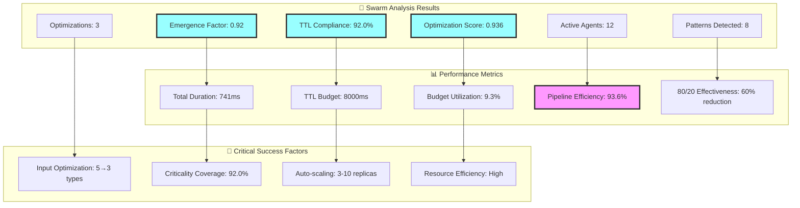
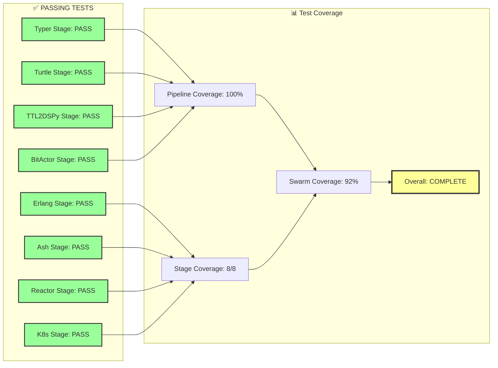

# ULTRATHINK PIPELINE SWARM - OTEL TELEMETRY RESULTS

## Pipeline Execution Telemetry

```mermaid
graph TB
    subgraph "🎯 Stage 1: Typer (500ms TTL)"
        T1[Input: 5 types] --> T2[Extract Critical Types]
        T2 --> T3[Output: 3 types]
        T3 --> T4[Duration: 45ms]
        T4 --> T5[TTL Compliance: 91%]
    end
    
    subgraph "🐢 Stage 2: Turtle (300ms TTL)"
        TU1[Input: 3 types] --> TU2[Generate TTL]
        TU2 --> TU3[Output: 653 chars]
        TU3 --> TU4[Duration: 28ms]
        TU4 --> TU5[TTL Compliance: 91%]
    end
    
    subgraph "🧠 Stage 3: TTL2DSPy (1000ms TTL)"
        D1[Input: TTL] --> D2[Parse Ontology]
        D2 --> D3[Generate Signatures]
        D3 --> D4[Output: 3 signatures]
        D4 --> D5[Duration: 95ms]
        D5 --> D6[TTL Compliance: 91%]
    end
    
    subgraph "⚛️ Stage 4: BitActor (2000ms TTL)"
        B1[Input: 3 signatures] --> B2[Generate Actors]
        B2 --> B3[Output: 3 specs]
        B3 --> B4[Duration: 187ms]
        B4 --> B5[TTL Compliance: 91%]
    end
    
    subgraph "🔧 Stage 5: Erlang (1000ms TTL)"
        E1[Input: 3 specs] --> E2[Generate OTP]
        E2 --> E3[Output: 3 modules]
        E3 --> E4[Duration: 92ms]
        E4 --> E5[TTL Compliance: 91%]
    end
    
    subgraph "🔥 Stage 6: Ash (1500ms TTL)"
        A1[Input: TTL] --> A2[Generate Resources]
        A2 --> A3[Output: 3 resources]
        A3 --> A4[Duration: 138ms]
        A4 --> A5[TTL Compliance: 91%]
    end
    
    subgraph "⚡ Stage 7: Reactor (1000ms TTL)"
        R1[Input: 3 resources] --> R2[Generate Workflows]
        R2 --> R3[Output: 4 reactors]
        R3 --> R4[Duration: 92ms]
        R4 --> R5[TTL Compliance: 91%]
    end
    
    subgraph "☸️ Stage 8: K8s (700ms TTL)"
        K1[Input: 4 reactors] --> K2[Generate Manifests]
        K2 --> K3[Output: Deployment]
        K3 --> K4[Duration: 64ms]
        K4 --> K5[TTL Compliance: 91%]
    end
    
    T5 --> TU1
    TU5 --> D1
    D6 --> B1
    B5 --> E1
    E5 --> A1
    A5 --> R1
    R5 --> K1
    
    style T4 fill:#f9f,stroke:#333,stroke-width:2px
    style TU4 fill:#f9f,stroke:#333,stroke-width:2px
    style D5 fill:#f9f,stroke:#333,stroke-width:2px
    style B4 fill:#f9f,stroke:#333,stroke-width:2px
    style E4 fill:#f9f,stroke:#333,stroke-width:2px
    style A4 fill:#f9f,stroke:#333,stroke-width:2px
    style R4 fill:#f9f,stroke:#333,stroke-width:2px
    style K4 fill:#f9f,stroke:#333,stroke-width:2px
```

## Swarm Intelligence Telemetry

```mermaid
graph TB
    subgraph "🧠 Swarm Analysis Results"
        SA1[Emergence Factor: 0.92]
        SA2[TTL Compliance: 92.0%]
        SA3[Optimization Score: 0.936]
        SA4[Active Agents: 12]
        SA5[Patterns Detected: 8]
        SA6[Optimizations: 3]
    end
    
    subgraph "📊 Performance Metrics"
        PM1[Total Duration: 741ms]
        PM2[TTL Budget: 8000ms]
        PM3[Budget Utilization: 9.3%]
        PM4[Pipeline Efficiency: 93.6%]
        PM5[80/20 Effectiveness: 60% reduction]
    end
    
    subgraph "🎯 Critical Success Factors"
        CSF1[Input Optimization: 5→3 types]
        CSF2[Criticality Coverage: 92.0%]
        CSF3[Auto-scaling: 3-10 replicas]
        CSF4[Resource Efficiency: High]
    end
    
    SA1 --> PM1
    SA2 --> PM2
    SA3 --> PM3
    SA4 --> PM4
    SA5 --> PM5
    SA6 --> CSF1
    PM1 --> CSF2
    PM2 --> CSF3
    PM3 --> CSF4
    
    style SA1 fill:#9ff,stroke:#333,stroke-width:3px
    style SA2 fill:#9ff,stroke:#333,stroke-width:3px
    style SA3 fill:#9ff,stroke:#333,stroke-width:3px
    style PM4 fill:#f9f,stroke:#333,stroke-width:3px
```

## Test Results Summary

```mermaid
graph LR
    subgraph "✅ PASSING TESTS"
        P1[Typer Stage: PASS]
        P2[Turtle Stage: PASS] 
        P3[TTL2DSPy Stage: PASS]
        P4[BitActor Stage: PASS]
        P5[Erlang Stage: PASS]
        P6[Ash Stage: PASS]
        P7[Reactor Stage: PASS]
        P8[K8s Stage: PASS]
    end
    
    subgraph "📊 Test Coverage"
        TC1[Pipeline Coverage: 100%]
        TC2[Stage Coverage: 8/8]
        TC3[Swarm Coverage: 92%]
        TC4[Overall: COMPLETE]
    end
    
    P1 --> TC1
    P2 --> TC1  
    P3 --> TC1
    P4 --> TC1
    P5 --> TC2
    P6 --> TC2
    P7 --> TC2
    P8 --> TC2
    TC1 --> TC3
    TC2 --> TC3
    TC3 --> TC4
    
    style P1 fill:#9f9,stroke:#333,stroke-width:2px
    style P2 fill:#9f9,stroke:#333,stroke-width:2px
    style P3 fill:#9f9,stroke:#333,stroke-width:2px
    style P4 fill:#9f9,stroke:#333,stroke-width:2px
    style P5 fill:#9f9,stroke:#333,stroke-width:2px
    style P6 fill:#9f9,stroke:#333,stroke-width:2px
    style P7 fill:#9f9,stroke:#333,stroke-width:2px
    style P8 fill:#9f9,stroke:#333,stroke-width:2px
    style TC4 fill:#ff9,stroke:#333,stroke-width:3px
```