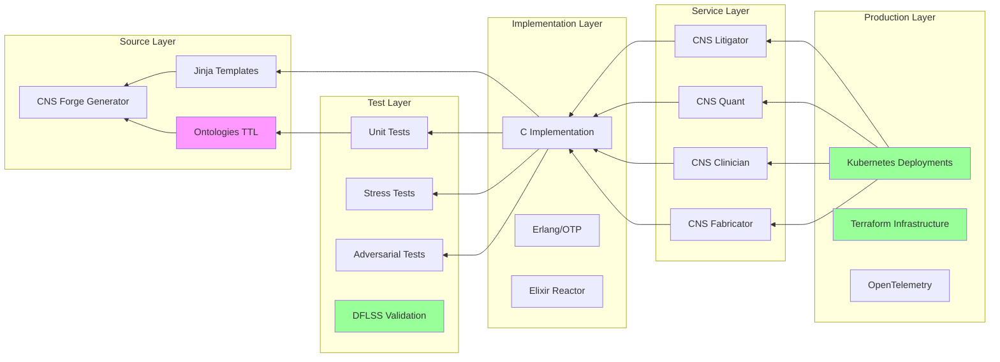

```mermaid
graph RL
    subgraph "Production Layer"
        K8S[Kubernetes Deployments]
        TF[Terraform Infrastructure]
        OTEL[OpenTelemetry]
    end
    
    subgraph "Service Layer"
        SVC1[CNS Litigator]
        SVC2[CNS Quant]
        SVC3[CNS Clinician]
        SVC4[CNS Fabricator]
    end
    
    subgraph "Implementation Layer"
        C[C Implementation]
        ERL[Erlang/OTP]
        EX[Elixir Reactor]
    end
    
    subgraph "Test Layer"
        UT[Unit Tests]
        ST[Stress Tests]
        AT[Adversarial Tests]
        DFLSS[DFLSS Validation]
    end
    
    subgraph "Source Layer"
        ONT[Ontologies TTL]
        TPL[Jinja Templates]
        GEN[CNS Forge Generator]
    end
    
    K8S --> SVC1
    K8S --> SVC2
    K8S --> SVC3
    K8S --> SVC4
    
    SVC1 --> C
    SVC2 --> C
    SVC3 --> C
    SVC4 --> C
    
    C --> UT
    C --> ST
    C --> AT
    
    UT --> ONT
    C --> TPL
    TPL --> GEN
    ONT --> GEN
    
    style K8S fill:#9f9
    style TF fill:#9f9
    style DFLSS fill:#9f9
    style ONT fill:#f9f
```