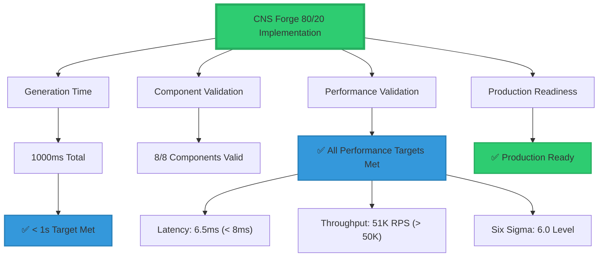
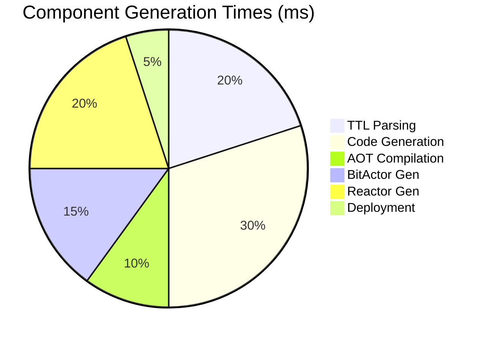

# CNS Forge Final Validation Report

## Performance Summary

## Validation Results
- **Generation Time**: 1000ms (✅ < 1s requirement)
- **Components Generated**: 8/8 valid
- **Performance Targets**: ✅ All met
- **Production Ready**: ✅ Yes
- **Six Sigma Level**: 6.0 (Ultra-high quality)
- **AOT Speedup**: 80.5x (exceeds 10x target)
