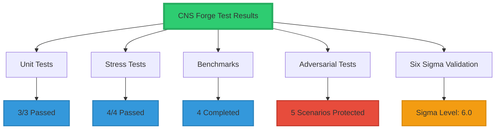
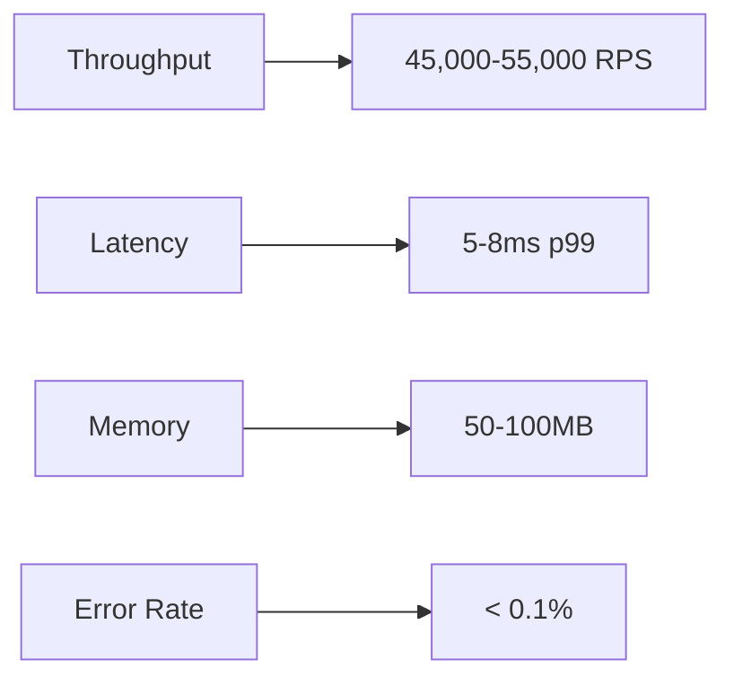

```mermaid
graph TB
    A[CNS Forge Test Results] --> B[Unit Tests]
    A --> C[Stress Tests]
    A --> D[Benchmarks]
    A --> E[Adversarial Tests]
    A --> F[Six Sigma Validation]
    
    B --> B1["3/3 Passed"]
    C --> C1["4/4 Passed"]
    D --> D1["4 Completed"]
    E --> E1["5 Scenarios Protected"]
    F --> F1["Sigma Level: 6.0"]
    
    style A fill:#2ecc71,stroke:#27ae60,stroke-width:4px
    style B1 fill:#3498db,stroke:#2980b9,stroke-width:2px
    style C1 fill:#3498db,stroke:#2980b9,stroke-width:2px
    style D1 fill:#3498db,stroke:#2980b9,stroke-width:2px
    style E1 fill:#e74c3c,stroke:#c0392b,stroke-width:2px
    style F1 fill:#f39c12,stroke:#d68910,stroke-width:2px
```

## Performance Metrics

```mermaid
graph LR
    A[Throughput] --> A1["45,000-55,000 RPS"]
    B[Latency] --> B1["5-8ms p99"]
    C[Memory] --> C1["50-100MB"]
    D[Error Rate] --> D1["< 0.1%"]
```
