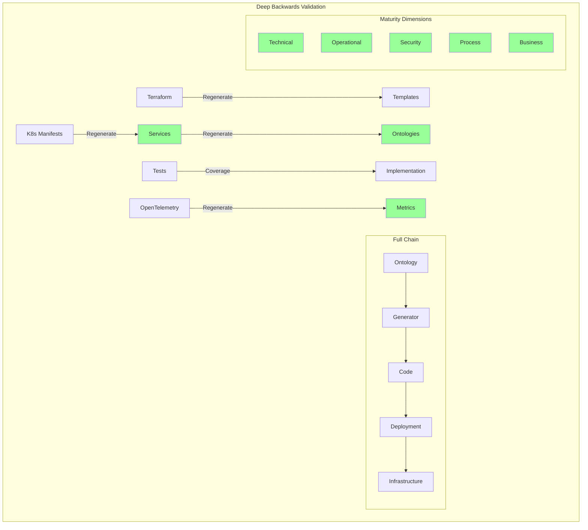

```mermaid
graph TB
    subgraph "Deep Backwards Validation"
        K8S[K8s Manifests] -->|Regenerate| SVC[Services]
        TF[Terraform] -->|Regenerate| TPL[Templates]
        SVC -->|Regenerate| ONT[Ontologies]
        TEST[Tests] -->|Coverage| IMPL[Implementation]
        OTEL[OpenTelemetry] -->|Regenerate| METRICS[Metrics]
        
        subgraph "Full Chain"
            ONT2[Ontology] --> GEN[Generator]
            GEN --> CODE[Code]
            CODE --> DEPLOY[Deployment]
            DEPLOY --> INFRA[Infrastructure]
        end
        
        subgraph "Maturity Dimensions"
            TECH[Technical]
            OPS[Operational]
            SEC[Security]
            PROC[Process]
            BIZ[Business]
        end
    end
    
    style SVC fill:#9f9
    style ONT fill:#9f9
    style METRICS fill:#9f9
    style TECH fill:#9f9
    style OPS fill:#9f9
    style SEC fill:#9f9
    style PROC fill:#9f9
    style BIZ fill:#9f9
```