# 🌌 TTL TO REACTOR UNIVERSE ARCHITECTURE

```mermaid
graph TB
    subgraph "🔍 Phase 1: Discovery"
        TTL1[TTL Files] --> DISC[Ontology Discovery]
        TTL2[RDF Files] --> DISC
        TTL3[OWL Files] --> DISC
        DISC --> OM[Ontology Map]
    end
    
    subgraph "🧬 Phase 2: Analysis"
        OM --> SEM[Semantic Analyzer]
        SEM --> SG[Semantic Graph]
        SG --> CM[Connection Matrix]
    end
    
    subgraph "🏗️ Phase 3: Architecture"
        CM --> ARCH[Universe Architect]
        ARCH --> GAL[Galaxy Topology]
        ARCH --> CON[Constellation Topology]
        ARCH --> NEB[Nebula Topology]
        ARCH --> CLU[Cluster Topology]
    end
    
    subgraph "⚛️ Phase 4: Generation"
        GAL --> RG[Reactor Generator]
        CON --> RG
        NEB --> RG
        CLU --> RG
        RG --> DR[Domain Reactors]
        RG --> RR[Resource Reactors]
        RG --> WR[Workflow Reactors]
        RG --> BR[Bridge Reactors]
    end
    
    subgraph "🧠 Phase 5: Swarm Intelligence"
        DR --> SWARM[Swarm Deployment]
        RR --> SWARM
        WR --> SWARM
        BR --> SWARM
        SWARM --> SA[Swarm Agents]
        SWARM --> EM[Emergence Monitor]
        SWARM --> MC[Meta Coordinator]
    end
    
    subgraph "🌐 Phase 6: Connection"
        SA --> MESH[Communication Mesh]
        MC --> MESH
        MESH --> DS[Discovery Service]
        MESH --> TTL[TTL Coordinator]
        MESH --> NAV[Navigation System]
    end
    
    subgraph "📋 Phase 7: Manifestation"
        DS --> MAN[Manifest Generator]
        TTL --> MAN
        NAV --> MAN
        MAN --> UM[Universe Manifests]
        MAN --> MM[Multiverse Manifest]
        MAN --> VIZ[Visualizations]
    end
    
    style TTL1 fill:#f9f,stroke:#333,stroke-width:2px
    style TTL2 fill:#f9f,stroke:#333,stroke-width:2px
    style TTL3 fill:#f9f,stroke:#333,stroke-width:2px
    style SWARM fill:#ff9,stroke:#333,stroke-width:4px
    style MC fill:#9ff,stroke:#333,stroke-width:4px
```

## 🌌 MULTIVERSE TOPOLOGY

## 🔄 SWARM AGENT INTERACTIONS

## 🌐 CROSS-UNIVERSE COMMUNICATION

## 📊 EMERGENCE PATTERN DETECTION

## 🎯 KEY ARCHITECTURAL PRINCIPLES

1. **Semantic-First Design**: Every connection is based on semantic relationships
2. **Emergent Behavior**: Swarm intelligence creates self-organizing systems
3. **Universe Isolation**: Each universe is self-contained with explicit bridges
4. **TTL-Bounded Execution**: All operations respect time-to-live constraints
5. **Observable Everything**: Comprehensive telemetry at every level

## 🚀 SCALING STRATEGY

```mermaid
graph TB
    subgraph "Current State"
        U1[3 Universes]
        R1[33 Reactors]
        B1[6 Bridges]
    end
    
    subgraph "Growth Phase 1"
        U2[10 Universes]
        R2[200+ Reactors]
        B2[45 Bridges]
    end
    
    subgraph "Growth Phase 2"
        U3[50 Universes]
        R3[2000+ Reactors]
        B3[1225 Bridges]
    end
    
    subgraph "Ultimate Scale"
        U4[∞ Universes]
        R4[∞ Reactors]
        B4[Dynamic Bridges]
    end
    
    U1 --> U2
    U2 --> U3
    U3 --> U4
    
    style U4 fill:#ff9,stroke:#333,stroke-width:4px
```

---

*The architecture enables infinite scaling through semantic discovery and swarm intelligence* 🌌