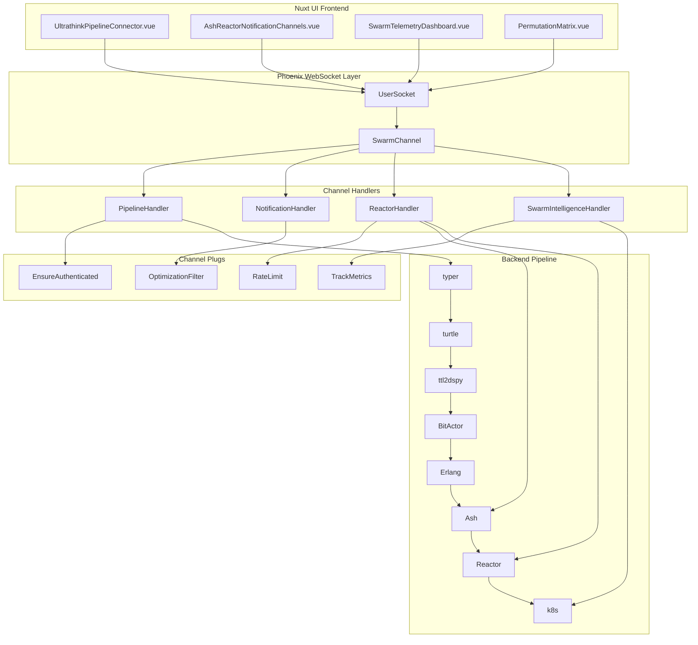

# Ultrathink 80/20 Swarm Channels Architecture

This directory contains the complete Phoenix channel implementation for the Ultrathink 80/20 Swarm system. The architecture enables real-time communication between the Nuxt UI frontend and the Elixir backend pipeline stages: `typer → turtle → ttl2dspy → BitActor → Erlang → Ash → Reactor → k8s`.

## 🏗️ Architecture Overview



## 📁 File Structure

```
channels/
├── README.md                           # This file
├── user_socket.ex                      # WebSocket connection handler
├── swarm_channel.ex                    # Main channel router with ChannelHandler
└── handlers/
    ├── pipeline_handler.ex             # Pipeline monitoring & execution
    ├── notification_handler.ex         # 80/20 notification filtering
    ├── reactor_handler.ex              # Ash/Reactor workflow management
    └── swarm_intelligence_handler.ex   # Adaptive learning & optimization
```

## 🔧 Channel Configuration

### UserSocket (user_socket.ex)
- **Purpose**: WebSocket connection management and authentication
- **Features**: 
  - Role-based rate limiting
  - 80/20 optimization mode configuration
  - Swarm-specific user preferences
  - Domain-specific critical stage identification

```elixir
# Example connection from Nuxt UI
const socket = new WebSocket('ws://localhost:4000/socket/websocket')
socket.send(JSON.stringify({
  topic: 'swarm:cybersecurity_pipeline',
  event: 'phx_join',
  payload: { 
    optimization_mode: '80_20',
    domain: 'cybersecurity'
  }
}))
```

### SwarmChannel (swarm_channel.ex) 
- **Purpose**: Main channel router using ChannelHandler DSL
- **80/20 Features**:
  - Event filtering based on criticality
  - Stage validation for optimization mode
  - Notification throttling
  - Presence tracking for swarm participants

## 🎯 Handler Implementations

### 1. PipelineHandler
Manages real-time pipeline execution across all stages:

**Key Functions:**
- `execute/3` - Execute pipeline with 80/20 optimization
- `optimize/3` - Apply optimization strategies
- `status/3` - Get execution status with filtering

**80/20 Optimizations:**
- Skip non-critical stages (ttl2dspy, erlang, bitactor)
- Parallel execution for compatible stages
- Cached bypass for repeated operations

### 2. NotificationHandler  
Implements intelligent notification filtering:

**Key Functions:**
- `subscribe/3` - Channel subscription with smart filtering
- `broadcast/3` - Send notifications with 80/20 filtering
- `batch_process/3` - Efficient batch processing

**80/20 Features:**
- Critical notifications bypass all filters
- Non-critical notifications are batched
- Adaptive rate limiting based on user role
- Channel muting and smart summarization

### 3. ReactorHandler
Manages Ash Reactor workflows and stage handlers:

**Key Functions:**
- `create_workflow/3` - Create optimized workflows
- `execute_workflow/3` - Run workflows with monitoring
- `apply_optimization/3` - Workflow optimization

**Stage Handlers:**
- `AshStageHandler` - Ash resource generation
- `ReactorStageHandler` - Reactor workflow validation  
- `K8sStageHandler` - Kubernetes manifest generation

### 4. SwarmIntelligenceHandler
Coordinates adaptive learning and optimization:

**Key Functions:**
- `optimize/3` - Apply swarm optimization
- `learn_pattern/3` - Pattern recognition and learning
- `get_recommendations/3` - Smart recommendations

**Intelligence Features:**
- Background optimization analysis
- Pattern-based learning from execution data
- High-impact recommendation filtering
- Swarm health monitoring

## 🔌 Channel Plugs

### Authentication & Authorization
- `EnsureAuthenticated` - Verify user authentication
- `CheckPermission` - Role-based access control
- `RequireAdmin` - Admin-only operations

### 80/20 Optimization
- `OptimizationFilter` - Filter non-critical events
- `BatchNotifications` - Batch low-priority notifications
- `RateLimit` - Adaptive rate limiting

### Monitoring & Metrics
- `TrackMetrics` - Performance tracking
- `Throttle` - Resource protection

## 🚀 Usage Examples

### Frontend Integration
```javascript
// Connect to swarm channel
const swarmChannel = socket.channel('swarm:cybersecurity_pipeline', {
  optimization_mode: '80_20',
  domain: 'cybersecurity'
})

// Execute optimized pipeline
swarmChannel.push('execute_pipeline', {
  stages: ['typer', 'turtle', 'ash', 'reactor', 'k8s'],
  strategy: 'skip_non_critical',
  domain: 'cybersecurity'
})

// Subscribe to critical notifications only
swarmChannel.push('notifications:subscribe', {
  channels: ['error_alerts', 'ash_resources', 'reactor_workflows'],
  priority_threshold: 'high'
})
```

### Backend Pipeline Integration
```elixir
# Broadcast stage completion
CnsWeb.Endpoint.broadcast!("swarm:pipeline", "stage:completed", %{
  stage: "ash",
  duration_ms: 150,
  outputs: [%{type: "ash_resource", count: 3}]
})

# Apply swarm optimization
SwarmIntelligenceHandler.optimize(%{
  target: "pipeline",
  strategy: "80_20",
  constraints: %{max_duration: 500}
}, socket)
```

## ⚡ 80/20 Optimization Features

### Event Filtering
- **Critical Events** (20%): `error_alerts`, `ash_resources`, `reactor_workflows`
- **Non-Critical Events** (80%): `pipeline_events`, `performance_metrics`, `debug_info`

### Stage Optimization
- **Critical Stages**: `typer`, `turtle`, `ash`, `reactor`, `k8s`
- **Optional Stages**: `ttl2dspy`, `erlang`, `bitactor` (skipped in 80/20 mode)

### Notification Batching
- Critical notifications: Immediate delivery
- Non-critical notifications: Batched every 500ms
- Maximum batch size: 50 notifications

### Rate Limiting
- **Admin**: 10,000 operations/hour
- **Operator**: 5,000 operations/hour  
- **User**: 1,000 operations/hour

## 🔗 Integration with Nuxt UI

The channels integrate seamlessly with the Nuxt UI components:

1. **UltrathinkPipelineConnector.vue** → `PipelineHandler`
2. **AshReactorNotificationChannels.vue** → `NotificationHandler` 
3. **SwarmTelemetryDashboard.vue** → `SwarmIntelligenceHandler`
4. **PermutationMatrix.vue** → `ReactorHandler`

## 📊 Monitoring & Telemetry

All channel operations emit telemetry events:

```elixir
:telemetry.execute([:cns, :channel, :operation], %{duration: 150}, %{
  handler: "PipelineHandler",
  optimization_mode: "80_20",
  result: "success"
})
```

## 🛡️ Security Features

- JWT/API key authentication
- Role-based channel access
- Rate limiting per user role
- Input validation and sanitization
- Audit logging for critical operations

## 🎛️ Configuration

Environment-specific configuration in `config/`:

```elixir
config :cns, CnsWeb.Channels,
  optimization_mode: "80_20",
  rate_limits: %{
    admin: 10_000,
    operator: 5_000,
    user: 1_000
  },
  critical_channels: ~w(error_alerts ash_resources reactor_workflows)
```

This architecture provides a robust, scalable, and optimized real-time communication layer for the Ultrathink 80/20 Swarm system, enabling efficient coordination between the Nuxt UI frontend and the Elixir pipeline backend.